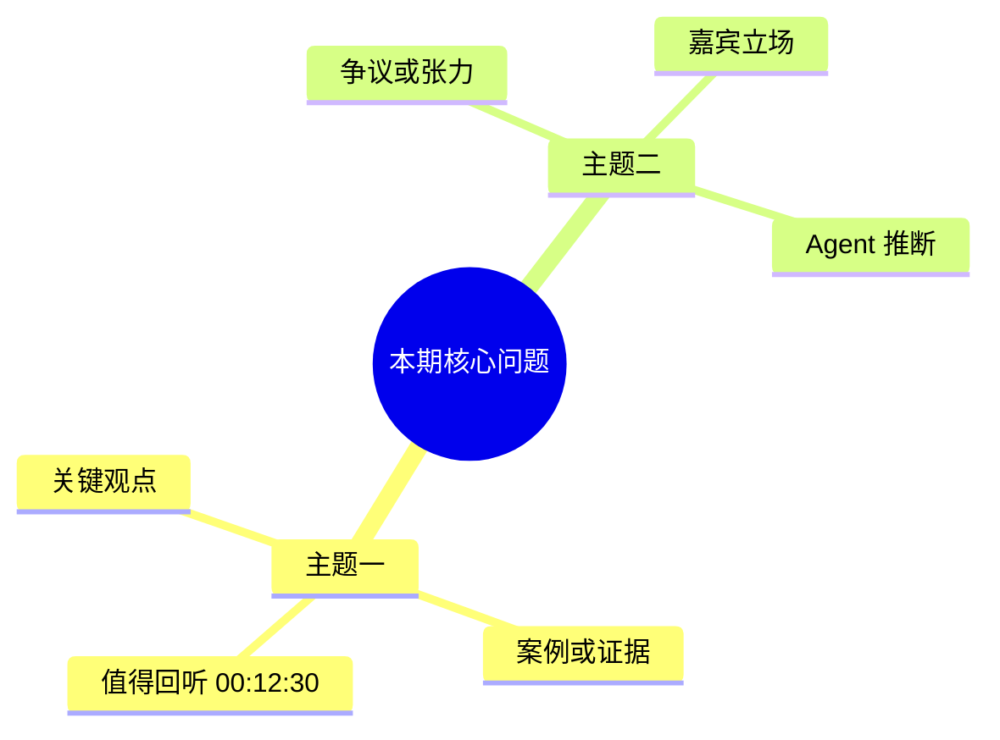

# AI Wiki Cook Podcast

## 目标

把一期 Apple Podcasts 节目 cook 成一篇人可以直接阅读、复习、消化和复用的知识成品。它不是 canonical ingest：默认只写入 `human/inbox/cook-podcast/`，frontmatter 使用 `ingest_policy: on-request`。除非用户明确要求后续 ingest 或 compile，否则不要更新 `index.md`、`log.md`、`sources/`、`human/sources/`、concepts、entities、synthesis、maps 或 questions。

## 输出边界

Obsidian 可见输出：

```text
human/inbox/cook-podcast/YYYY-MM-DD_<中文主题标题>_<英文节目或关键术语>.md
human/inbox/cook-podcast/assets/YYYY-MM-DD_<中文主题标题>_<英文节目或关键术语>/infographic.webp
```

机器缓存：

```text
.codex/cache/cook-podcast/<podcast-id>-<episode-id>/
  episode.json
  audio.<ext>
  transcript.json
  transcript.md
  segment-digest.md
  imagegen-original.*
```

`.codex/cache/` 必须保持 git ignored。完整 transcript 默认只是中间产物，保存在 cache；最终笔记只在有价值时摘录少量高信号片段。`transcript.json` 可以保留 Whisper 原始完整字段；`transcript.md` 是给 Agent 阅读的紧凑中间文件，默认只保留 segment 行。

## 必读上下文

写最终笔记前，读取 `AGENTS.md` 中与 human boundary、`human/inbox/`、`human/raw/` 有关的规则。不要把 cooked note 当作 source note。

## 工作流

1. 解析并可选下载单集音频：

   ```bash
   python3 .codex/skills/ai-wiki-cook-podcast/scripts/resolve_apple_podcast.py \
     "<apple-podcast-url>" \
     --download \
     --json
   ```

   resolver 负责提取 podcast id 和 episode id，调用 Apple lookup metadata，验证音频重定向和 content type，写入 `episode.json`，并把音频下载到 `.codex/cache/cook-podcast/<podcast-id>-<episode-id>/`。

2. 如果 resolver 无法识别音频，使用 browser capture fallback：
   - 当 Apple 把原 storefront 重定向到 `/new` 时，把 URL 归一化到当前环境能打开的 storefront。
   - 开启 HAR/network recording。
   - 打开 Apple 单集页，点击播放，等待 media 请求。
   - 捕获第一个成功的 `audio/*`、`.mp3`、`.m4a`、`.aac` 或 media `206` 请求。
   - 在最终 `Source Manifest` 中记录这次 fallback 路径。

3. 使用本地 Whisper 转写：

   ```bash
   # Agent 先从 episode.json / RSS show note / 用户上下文写入本期 prompt：
   # .codex/cache/cook-podcast/<podcast-id>-<episode-id>/initial-prompt.txt

   python3 .codex/skills/ai-wiki-cook-podcast/scripts/transcribe_local.py \
     .codex/cache/cook-podcast/<podcast-id>-<episode-id>/audio.<ext> \
     --cache-dir .codex/cache/cook-podcast/<podcast-id>-<episode-id> \
     --engine whisper-cpp \
     --language auto \
     --model base \
     --device auto \
     --initial-prompt-file .codex/cache/cook-podcast/<podcast-id>-<episode-id>/initial-prompt.txt \
     --json
   ```

   转写硬规则：
   - 正式 cook 默认模型是 `base` 或 `base.en`，不要为了跑通自动降级到 `tiny`。如果选定模型失败，先解决当前失败；无法解决时 fail fast 并告知用户。
   - 模型和语言由 Agent 根据用户指令、Apple metadata、节目名、单集描述决定，不由脚本硬编码内容判断：
     - 纯英文内容：优先 `--model base.en --language English`。
     - 中文或中英混合内容：优先 `--model base --language auto`，必要时 `--language Chinese`。
     - 不确定：使用 `--model base --language auto`。
   - 如果缺少 `whisper`，脚本会安装开源本地版 `openai-whisper` 后重试。如果缺少 `ffmpeg`，在可行时为用户安装，macOS 通常使用 `brew install ffmpeg`。
   - 不要静默调用付费云端转写 API。
   - 如果模型下载 checksum 失败，脚本会隔离损坏模型文件并重试一次同一模型；仍失败则停止，不切换模型。
   - 每次转写前都要准备热词/术语提示。脚本默认读取 `docs/.hotword.md` 中 `<!-- hotwords:start -->` 到 `<!-- hotwords:end -->` 之间的术语；Agent 还应从 Apple metadata、RSS/单集描述和用户上下文补充本期专名、公司、产品、人名、节目主题和中英混合词，写入 cache 下的 `initial-prompt.txt` 并通过 `--initial-prompt-file` 传入。这不是强制词典，只是 Whisper 的 prompt bias。
   - `initial-prompt.txt` 不要粘贴完整 show note；Agent 应压缩成 300-1000 字左右的转写提示，包含节目名、单集名、嘉宾/主播、主题、时间戳主题摘要和专名写法。
   - `transcript.md` 不输出 `Full Text`，只输出紧凑 segment 行：`[00:00 00:07] 文本`。不要输出毫秒，不要使用 Markdown 列表 `-`，也不要在起止时间之间使用 ` - `；完整字段保留在 `transcript.json`。

   性能说明：
   - macOS 是主工作环境时，推荐引擎优先级是 `whisper.cpp + Core ML/Metal`，其次 `whisper.cpp + Metal`，再次 `openai-whisper + MPS`，最后 `openai-whisper + CPU`。
   - 当前脚本支持 `--engine auto|whisper-cpp|openai-whisper`。本项目在 macOS 上默认显式使用 `--engine whisper-cpp`，这样首次运行也会自动配置推荐路径。`auto` 只在本机已有 `whisper.cpp` 二进制和匹配 ggml 模型时选择 `whisper.cpp`，否则使用 `openai-whisper`。
   - `--engine whisper-cpp` 会在缺少二进制时尝试 `brew install whisper-cpp`，在缺少模型时把 `ggml-<model>.bin` 下载到 `~/.cache/whisper.cpp/`。模型下载源默认优先 ModelScope 国内镜像，其次 `hf-mirror.com`，最后 Hugging Face 官方；也可用 `--whisper-cpp-model-source` 或 `COOK_PODCAST_WHISPER_CPP_MODEL_SOURCES` 覆盖。`.m4a` 等 whisper.cpp CLI 不直接支持的格式会先用本地 `ffmpeg` 转成 16k mono wav，仍保存在 cache。
   - `openai-whisper` 的 `--device auto` 会优先探测 CUDA，其次 macOS Apple Silicon 的 MPS，最后 CPU。
   - CPU 路径可用 `--threads <n>` 调整线程数，但不要牺牲整机可用性。

4. 读取 `episode.json`、`transcript.md` 和单集描述。长播客不要从完整 transcript 一步压成短摘要；先按自然主题或时间窗口整理分段 digest，可写入 cache 下的 `segment-digest.md`，再生成最终笔记。最终正文要同时保留结构、时间锚点、明确说法、Agent 推断和个人启发。

5. 生成信息图。此步骤是必选项：
   - 使用 `imagegen` skill/tool。
   - prompt 应来自已经 cook 过的理解：单集标题、节目名、核心命题、关键洞察、重要概念/实体/工具、张力、关系、对用户的启发。
   - 信息图必须是中文信息图：标题、分组、说明文字默认中文；必要英文术语如 `Claude Code`、`MCP`、`Plan mode` 可保留原文并加中文解释。
   - 不要锁死成固定模板。允许模型选择知识地图、概念网络、因果图、时间线、对比图或系统图。
   - 信息图服务于快速复习和重新理解，不是装饰封面。
   - imagegen 原图保存到 cache。

6. 把信息图压缩到 colocated inbox assets 目录：

   ```bash
   python3 .codex/skills/ai-wiki-cook-podcast/scripts/compress_infographic.py \
     .codex/cache/cook-podcast/<podcast-id>-<episode-id>/imagegen-original.png \
     --output "human/inbox/cook-podcast/assets/<note-stem>/infographic.webp" \
     --json
   ```

7. 最终 Markdown note 由 agent 直接写作。不要使用 note builder 脚本拼模板，以保留表达和编排弹性。
   - 文件名由 Agent 根据 cooked 理解命名，不要机械照搬 Apple episode title。
   - 文件名优先中文可读，英文 podcast 可中英混合；推荐格式是 `YYYY-MM-DD_<中文主题标题>_<英文节目或关键术语>.md`。
   - 英文节目名、原始单集标题、人名和完整 URL 保留在 frontmatter 与 `Source Manifest`，文件名只保留对 Obsidian 回忆有帮助的英文品牌、产品、人名或节目名。
   - 示例：`2026-05-31_Claude Code 创造者访谈_Y Combinator.md`，而不是 `2026-05-31_Y Combinator Startup Podcast_Inside Claude Code With Its Creator Boris Cherny.md`。

## 最终笔记要求

Frontmatter：

```yaml
---
type: cook-podcast
ingest_policy: on-request
inbox_status: unread
inbox_created_at: YYYY-MM-DD
inbox_read_at:
raw_path:
ingested_at:
archive_reason:
source_kind: apple-podcast
podcast: <podcast title>
episode: <episode title>
apple_url: <input URL>
audio_url: <resolved audio URL>
created_at: YYYY-MM-DD
---
```

推荐正文结构：

````markdown
# <episode title>

## 速读

## 内容地图



### 内容索引
| 时间 | 主题 | 作用 |
| --- | --- | --- |
| 00:00-08:30 | <主题> | <这一段在节目中的作用> |

## 关键论点
| 论点 | 类型 | 依据/时间戳 | 置信度 |
| --- | --- | --- | --- |
| <论点> | 节目明确说法 / Agent 推断 / 我的启发 | <时间戳或依据> | 高/中/低 |

## 核心内容

## 关键洞察

## 批判性点评

## 对我的启发

## 值得回听

## 可以继续追的问题

## 发散资源

## 信息图
![[human/inbox/cook-podcast/assets/<note-stem>/infographic.webp]]

## 遗漏与不确定

## Source Manifest

## 转写说明
````

质量规则：

- 正文默认中文，保留必要英文术语。
- 文件标题和一级标题默认中文；英文播客可以中英混合，但中文主题必须是第一信号。
- 把播客转换成用户能消化和复用的知识餐，不要停留在普通摘要，也不要只输出“核心内容”导致节目结构和证据链失真。
- 对 45 分钟以上节目，最终笔记必须是分层压缩：`速读` 负责快速进入，`内容地图` 负责结构记忆，`内容索引` 负责时间锚点，`关键论点` 负责区分证据和推断，`核心内容/洞察/启发` 负责消化。
- `内容地图` 默认使用 Mermaid `mindmap`，放在最终 Markdown 内，不生成额外 Obsidian 文件。节点文本要短，优先 6-18 个字，避免长句、复杂 Markdown、wikilink 和容易破坏 Mermaid 的特殊字符。
- 如果内容更像因果链、流程或决策树，Agent 可以把内容地图改成 Mermaid `flowchart`；如果 Mermaid mindmap 可能无法在当前 Obsidian 渲染，仍要保留 `内容索引` 表作为可读兜底。
- `内容地图` 应保留节目原始展开顺序，覆盖开场问题、主要分支、案例、争议/张力、结论和高价值回听点。长播客通常应有 8-20 个一级或二级主题，不要只画 3-5 个抽象概念。
- `关键论点` 必须区分 `节目明确说法`、`Agent 推断` 和 `我的启发`，并尽量给出时间戳或 transcript 依据；不要把 Agent 的理解伪装成嘉宾原话。
- `批判性点评` 是必选章节，站在第三者角度点评节目内容本身，而不是顺从主播或嘉宾观点。可以指出论证跳跃、证据不足、概念混用、适用边界、缺失反例、叙事诱导、和对用户实践可能造成的误导。点评必须基于 transcript、metadata 或 show note 中可见证据；不确定处写成问题或限制，不要伪装成已核验结论。
- `值得回听` 列 5-10 个高价值时间戳，优先选择定义、案例、观点转折、争议点、方法论、对用户有启发的片段。
- `遗漏与不确定` 必须说明本次压缩牺牲了什么、哪些专名或时间戳可能受转写质量影响、哪些结论只是弱推断。
- 在证据支持时，主动连接用户的 AI wiki、agent workflow、学习方法、产品判断或技术实践。
- 默认外部资源只来自 Apple metadata、RSS/单集描述和 transcript。除非用户要求，不要联网扩写或核验；来自 transcript 的资源要标注 `未联网核验`。
- 默认不把完整 transcript 写进最终笔记。只在 `Source Manifest` 中记录 cache 路径。
- `Source Manifest` 必须列出 input URL、resolver path（`apple_lookup`、`rss` 或 `browser_capture`）、audio URL、重定向后的 final audio URL、cache path、分段 digest 路径、转写引擎、模型、imagegen 状态、信息图路径和已知限制。
- `Source Manifest` 中的转写部分必须记录 language、device、是否使用 hotwords/initial prompt、是否发生模型下载重试，以及 whisper.cpp 模型实际下载源；如果使用了 ModelScope、hf-mirror 或 Hugging Face 官方，也要写清楚。
- 如果 `docs/.hotword.md` 存在，`Source Manifest` 要记录 repository hotwords 已加载；如果本期还使用了 metadata/show-note-derived initial prompt，也要记录 prompt 路径和来源。

## 脚本职责

- `resolve_apple_podcast.py`：确定性处理 Apple URL 解析、metadata lookup、音频探测、cache 写入和可选下载。
- `transcribe_local.py`：处理本地开源 Whisper 探测、安装、转写和 Markdown transcript 渲染。
- `compress_infographic.py`：处理最终信息图缩放和 WebP 压缩。
- browser capture 仍由 agent workflow 执行，因为它依赖当前 browser tool/runtime。
