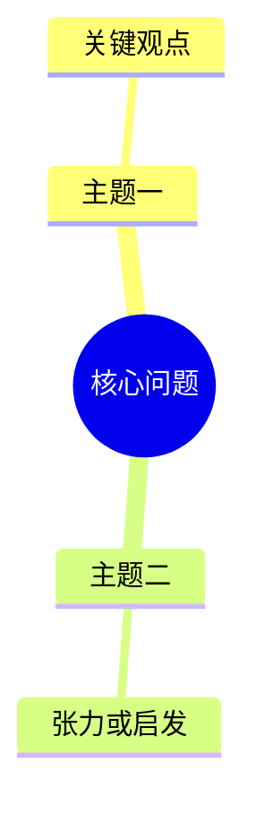

# AI Wiki Cook Tweet

## 目标

把一条 X/Twitter post、thread 或 X article cook 成一篇可以直接阅读、复习和复用的 inbox 笔记。它不是 canonical ingest：默认只写入 `human/inbox/cook-tweet/`，frontmatter 使用 `ingest_policy: on-request`。除非用户明确要求后续 ingest 或 compile，否则不要更新 `index.md`、`log.md`、`sources/`、`human/sources/`、concepts、entities、synthesis、maps 或 questions。

## 输出边界

Obsidian 可见输出：

```text
human/inbox/cook-tweet/YYYY-MM-DD_<中文主题标题>_<英文作者或关键术语>.md
human/inbox/cook-tweet/assets/YYYY-MM-DD_<中文主题标题>_<英文作者或关键术语>/infographic.webp
```

机器缓存：

```text
.codex/cache/cook-tweet/<status-id-or-url-hash>/
  capture.md
  screenshot.png          # 可选，记录 browser-use 当时看到的页面
  imagegen-original.*     # imagegen 原图
```

`.codex/cache/` 必须保持 git ignored。`capture.md` 是 Agent 对可见页面的结构化观察和消费记录，不是完整原文复制。

## 必读上下文

写最终笔记前，读取 `AGENTS.md` 中与 human boundary、`human/inbox/`、`human/raw/` 有关的规则。不要把 cooked note 当作 source note。

## 硬规则

- 只能用 browser-use / agent-browser 这类未登录可见页面浏览器自动化打开和消费 X 页面内容。不要使用 X API、第三方镜像、HTTP 抓取、搜索引擎缓存、Chrome 登录态 fallback、cookie、token 或用户账号密码。
- 如果 browser-use 页面里看不到足够正文，必须 fail fast。不要根据 URL 标题、搜索片段、记忆或猜测生成 cooked note。
- 对 thread 的识别是 visible-page best-effort，不承诺 API-complete。不要把回复区、推荐内容或无关讨论默认并入正文。
- 信息图是必选输出。长 thread / article 生成中文信息图；短 post 内容不足时生成中文观点卡或结构卡。
- 最终笔记按 Obsidian 官方网页嵌入规则直接 embed tweet，不保存完整原文，也不逐条复制 thread 原文。推特内容使用 Markdown 外部图片语法：``，同时保留 `x.com` 原链接作为 fallback。

## 输入类型

- `source_kind: x-post`：单条 post、普通 tweet、media post，或短 thread 入口。
- `source_kind: x-thread`：页面可见并可确认由同一作者连续发布的一组 post。
- `source_kind: x-article`：X article / long-form article，或页面清晰呈现为标题加长文正文。

如果无法判断类型，但可见内容足够，按 `x-post` 处理并在 `Source Manifest` 记录判断不确定。

## Browser-Use 工作流

1. 用 browser-use / agent-browser 打开输入 URL，等待页面稳定。
2. 归一化 canonical URL，优先保留 `https://x.com/<handle>/status/<id>`。如果只能看到 `twitter.com`，保留原 URL 并记录。
   - 如果能解析 `<handle>` 和 `<status-id>`，同时生成 `embed_url: https://twitter.com/<handle>/status/<id>`，用于 Obsidian tweet embed。不要使用 `blockquote`、`script` 或 Twitter widgets JS。
3. 检查页面是否可读：
   - 若出现登录墙、限流、错误页、正文缺失、article 无法展开、或只有无法理解的媒体，停止并向用户说明 fail fast 原因。
   - X 页面偶尔会 transient render 失败。允许同一 URL 最多一次 reload 或 reopen；如果第二次仍不可读，立即 fail fast。不要继续尝试绕过、换工具或找替代来源。
   - 若正文可见但 thread 完整性不确定，可以继续，但必须在 `遗漏与不确定` 和 `Source Manifest` 记录限制。
4. 对 post/thread：
   - 可以点击 `Show this thread`、展开全文、展开入口 post 附近的可见媒体说明等相关控件。
   - 最多滚动 6 屏，或到 thread 明显结束即停止。
   - 只消费入口 post、同作者连续 thread、引用 post、可见媒体文字信息。
   - 不深入点击外链，不展开无关回复，不把推荐内容纳入正文。
5. 对 X article：
   - 进入 article 正文，滚动到正文结束。
   - 不默认打开 article 内外链。
6. 把 browser 观察写入 cache 下的 `capture.md`：
   - input URL、canonical URL、captured_at、source_kind。
   - 页面可见作者、handle、发布时间或可见日期。
   - 可见正文的结构化摘要、关键媒体/引用说明、链接线索。
   - capture 范围、滚动/点击动作、完整性限制。
7. 如果视觉状态对后续复查有价值，保存一张截图到 cache；截图是证据，不进入最终 note 正文。

## Cook 工作流

1. 读取 `capture.md`，围绕用户能复用的知识价值重写内容，不要机械摘要。
2. 区分三类判断：
   - `作者明确说法`
   - `Agent 推断`
   - `我的启发`
3. 生成信息图：
   - 使用 `imagegen` skill/tool 的内置模式。
   - prompt 来自已经 cook 过的理解：核心命题、关键洞察、概念/实体/工具、关系、张力和对用户的启发。
   - 默认中文信息图；必要英文术语如 `Claude Code`、`MCP`、`Agent` 可保留原文并加中文解释。
   - 短 post 可以做成观点卡、结构卡或概念卡，不要硬凑复杂图。
   - built-in imagegen 默认会把图生成到 `$CODEX_HOME/generated_images/...`；必须把选定原图复制到 `.codex/cache/cook-tweet/<status-id-or-url-hash>/imagegen-original.<ext>`，再把最终选定图移动、复制或转换为 `human/inbox/cook-tweet/assets/<note-stem>/infographic.webp`。
4. 最终 Markdown note 由 Agent 直接写作。不要使用 note builder 脚本拼模板。

## 最终笔记要求

Frontmatter：

```yaml
---
type: cook-tweet
ingest_policy: on-request
source_kind: x-post | x-thread | x-article
x_url: <input URL>
canonical_url: <canonical x.com URL if known>
embed_url: <https://twitter.com/.../status/... if known>
author: <display name if visible>
handle: <@handle if visible>
created_at: YYYY-MM-DD
captured_at: YYYY-MM-DDTHH:MM:SS+TZ
---
```

推荐正文结构：

````markdown
# <中文主题标题>

## 速读

## 原文


如果当前 Obsidian 环境不渲染 tweet embed，请打开：<canonical-or-input-url>

## 内容地图



## 关键论点
| 论点 | 类型 | 依据 | 置信度 |
| --- | --- | --- | --- |
| <论点> | 作者明确说法 / Agent 推断 / 我的启发 | <来自可见 post/article 的哪部分> | 高/中/低 |

## 核心内容

## 关键洞察

## 对我的启发

## 可以继续追的问题

## 信息图
![[human/inbox/cook-tweet/assets/<note-stem>/infographic.webp]]

## 遗漏与不确定

## Source Manifest
````

质量规则：

- 正文默认中文，保留必要英文术语。
- 文件标题和一级标题默认中文；英文作者或关键术语可保留在文件名末尾，帮助 Obsidian 回忆。
- `原文` 只放 tweet embed 和可打开 URL，不粘贴完整原文。
- `原文` 的 tweet embed 必须使用 Obsidian 支持的 Markdown 外部图片语法 ``。不要使用 `<blockquote class="twitter-tweet">` 或 `<script src="https://platform.twitter.com/widgets.js">`，因为 Obsidian 笔记不应依赖脚本执行。
- `内容地图` 应覆盖作者的展开顺序、主要论点、例子、张力、结论和对用户有价值的启发。短 post 可以简化，但不要省略结构。
- `关键论点` 必须区分 `作者明确说法`、`Agent 推断` 和 `我的启发`；不要把 Agent 理解伪装成作者原话。
- `遗漏与不确定` 必须说明 browser-use capture 的可见范围、thread 是否 best-effort、article 是否完整、媒体是否未能理解。
- 在证据支持时，主动连接用户的 AI wiki、agent workflow、学习方法、产品判断或技术实践。
- 默认不联网扩写或核验外链；来自 X 可见内容的资源要标注 `未联网核验`。

## Source Manifest 要求

最终 note 的 `Source Manifest` 必须列出：

- input URL。
- canonical URL。
- embed URL。
- source_kind。
- capture method：`browser-use/browser automation visible-page only`。
- browser actions：点击、滚动、展开动作的简要记录。
- cache path：`capture.md`、可选截图、imagegen 原图。
- infographic path。
- capture limitations：登录墙、可见范围、thread best-effort、媒体/外链未展开等限制；没有问题写 `issues: none`。
