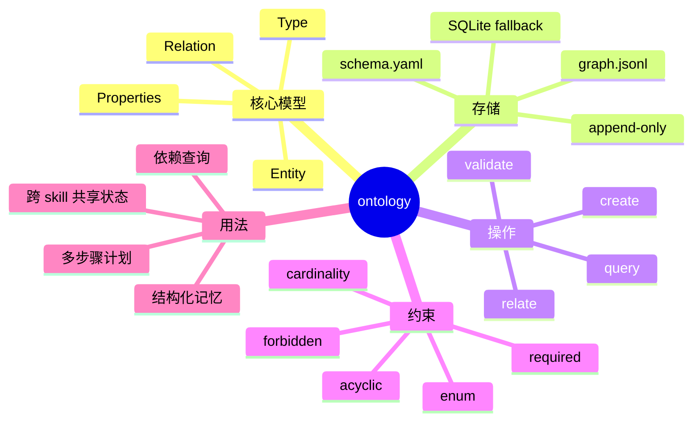

# Ontology：Agent 的结构化记忆与可验证图谱

## 速读

ClawHub 的 `ontology` skill 不是在讲哲学本体论，而是在给 Agent 建一个轻量的“可操作世界模型”：把人、项目、任务、文档、事件、凭据、策略等对象建成有类型的实体，再用有类型的关系连接起来，并通过 schema 约束每次变更是否合法。

它的关键思想是：Agent 的记忆不应该只是自然语言笔记，而应该是能被查询、校验、遍历、复用和审计的结构化图。默认实现很轻，用 `memory/ontology/graph.jsonl` 保存图操作，用 `memory/ontology/schema.yaml` 保存类型和关系约束。复杂后再迁移 SQLite。

对我的启发是：AI Wiki 的 Markdown 页面适合人学习，但 Agent 还需要一层机器可操作的索引层。`ontology` 可以作为 `sources / concepts / entities / synthesis / claims / evidence / review` 之间关系的结构化投影，而不是替代正文笔记。

## 原文

- 原文页面：<https://clawhub.ai/oswalpalash/ontology>
- 页面类型：ClawHub skill detail page
- Owner：`oswalpalash`
- 安装命令：`openclaw skills install ontology`
- 最新版本：`1.0.4`
- License：`MIT-0`
- 捕获时统计：downloads `189217`，current installs `1343`，stars `636`

## 内容地图



## 关键论点

- 作者明确说法：ontology 是一个“类型化词汇 + 约束系统”，用于把知识表示成可验证的图。
- 作者明确说法：每个对象都是 entity，带有 type、properties、relations、created、updated。
- 作者明确说法：每次 mutation 在提交前都要经过类型约束验证。
- 作者明确说法：默认存储是 `memory/ontology/graph.jsonl`，复杂图可以迁移到 SQLite。
- 作者明确说法：已有 ontology 数据和 schema 应该 append/merge，不要覆盖。
- 作者明确说法：schema 可以约束 required field、enum、forbidden properties、relation cardinality 和 acyclic relation。
- 作者明确说法：credential 不直接保存 password、secret、token，而应通过 `secret_ref` 间接引用。
- 作者明确说法：skill 可以声明自己读写哪些 ontology 类型，以及 preconditions / postconditions。
- Agent 推断：这个 skill 的真正目标不是“记更多”，而是让 Agent 的记忆变成可被程序操作的状态层。
- Agent 推断：append-only 是抗误删、抗覆盖和支持审计的设计，不只是文件写入风格。
- 我的启发：它可以补上 AI Wiki 当前“人读很强，机器查询关系还比较弱”的一层结构化索引。

## 核心内容

### 1. 它把记忆拆成实体和关系

`ontology` 的基本单位不是段落，而是实体：

```text
Person
Organization
Project
Task
Goal
Event
Document
Message
Credential
Policy
```

每个实体都有明确类型和属性。关系也是一等公民，例如：

```text
Project --has_owner--> Person
Project --has_task--> Task
Task --blocks--> Task
Document --supports--> Claim
```

这解决了自然语言记忆的一个问题：自然语言需要重新阅读和解释，图结构可以直接查询和遍历。

### 2. 它用 schema 把“能写什么”变成规则

schema 是这个 skill 的护栏。比如 `Task` 必须有 `title` 和 `status`，`status` 只能取固定枚举；`blocks` 关系只能从 Task 指向 Task，且不能成环。

这对 Agent 很关键。没有 schema，Agent 可能今天写 `doing`，明天写 `in_progress`，后天写 `started`，人能理解，但程序无法稳定查询。schema 把语义压成可验证的契约。

### 3. 它采用 append/merge，避免改写历史

skill 明确要求处理既有数据或 schema 时 append/merge，而不是覆盖。这对 Agent 系统尤其重要，因为 Agent 很容易在“整理”时误删旧事实或把新理解覆盖成唯一真相。

append-only 的价值：

- 保留演化历史。
- 方便审计和回滚。
- 降低 Agent clobber 旧定义的风险。
- 让冲突可以显式存在，而不是被自动抹平。

### 4. 它把计划看成图变换

`ontology` 最有意思的地方是 “Planning as Graph Transformation”。多步骤任务不是简单 checklist，而是一组图操作：

```text
CREATE Event
RELATE Event -> has_project -> Project
CREATE Task
RELATE Task -> for_event -> Event
CREATE Task with blocker
```

这意味着 Agent 的行动可以被表示成可验证的状态迁移：每一步先看是否满足约束，不满足就停止或回滚。

### 5. 它让 skill 之间共享状态

原文举了一个跨 skill 通信模式：Email skill 从邮件里创建 Commitment，Task skill 再查询 pending Commitment 并转成 Task。

这比“两个 skill 都读一段聊天上下文”稳定得多。共享状态不再是自然语言，而是有类型对象。

## 关键洞察

第一，`ontology` 的核心不是知识图谱这个名词，而是“让 Agent 对世界的理解可操作”。如果一个事实只能被读，不能被 query、relate、validate，它对 Agent 来说仍然是半结构化上下文。

第二，它把 Agent 记忆从 recall 问题变成 state management 问题。真正难的不是保存 Alice 负责某项目，而是确保 Alice 是 `Person`，项目是 `Project`，`has_owner` 是合法关系，并且后续查询依赖同一套 schema。

第三，它和 AI Wiki 的关系应该是“双层结构”：Markdown 是人类学习层，ontology 是机器操作层。Markdown 负责解释、综合、复习；ontology 负责索引、关系、状态、依赖和证据链。

第四，ontology 还不够，必须配 epistemology。它告诉我们“世界里有什么对象和关系”，但还要回答“这些对象和关系凭什么可信”。对 AI Wiki 来说，这意味着每个 claim 最好关联 source/evidence/proof type。

## 批判性点评

这个 skill 的优点是轻量：`JSONL + YAML schema + CLI` 足以启动，不需要一上来引入 Neo4j、RDF、OWL 或复杂数据库。它对个人知识库和 Agent workspace 很合适，因为维护成本低，失败模式也容易观察。

它的风险是 schema 设计会变成新的瓶颈。类型过少，图谱退化成随手 JSON；类型过多，Agent 和人都会被建模成本拖住。最实际的策略应该是从少量高价值类型开始，例如 `SourceNote`、`Concept`、`Claim`、`Evidence`、`ReviewItem`，等查询需求稳定后再扩展。

另一个风险是“结构化幻觉”。把幻觉写成 JSON 并不会让它更真实。因此 ontology 必须和 evidence 绑定：谁说的、来自哪个 source、是否 explicit、是否 inferred、何时捕获、是否需要复核。

## 对我的启发

我可以把它迁移成 AI Wiki 的一个轻量结构层：

```text
SourceNote -> supports -> Claim
Claim -> compiled_into -> Concept
Concept -> prerequisite_of -> Concept
Synthesis -> uses -> Claim
ReviewItem -> reviews -> Concept
Output -> derived_from -> Synthesis
```

第一阶段不需要改现有 Markdown，只需要生成一个旁路索引：

```text
memory/ontology/graph.jsonl
memory/ontology/schema.yaml
```

可以先约束这些规则：

- `Claim` 必须有 `source_ref`。
- `SourceNote.status` 只能是 `ingested / partial / blocked / needs-review`。
- `Relation.type` 必须来自固定枚举。
- `Question.user_requested` 必须为 true 才允许创建 question 关系。
- `Credential` 禁止保存明文 secret/token/password。

这样 AI Wiki 仍然保持 Obsidian 可读，同时给 Agent 一个更稳的查询入口。

## 可以继续追的问题

- AI Wiki 是否应该维护一个独立的 `memory/ontology/`，还是直接从 Markdown frontmatter 和 wikilinks 生成临时图？
- `Claim`、`Evidence`、`SourceNote`、`Concept` 之间最小可用 schema 应该怎么设计？
- append-only 图谱如何和 Markdown 页面重命名、合并、删除保持一致？
- 哪些查询最值得第一批支持：缺证据 claims、过期 review、partial source 依赖、孤儿 concept，还是 source-to-synthesis 影响分析？
- ontology 层要不要进入 Git 版本控制，还是只作为本地 agent cache？

## 信息图

![[human/inbox/cook-blog/assets/2026-06-13_Ontology：Agent 的结构化记忆与可验证图谱_ClawHub/infographic.webp]]

## 遗漏与不确定

- 当前捕获没有专用浏览器自动化工具，使用公开 HTML 与同站点公开 detail API 作为 fallback。
- 这个页面是 ClawHub skill detail，不是传统博客文章；本次按 cook-blog 处理是因为用户明确要求使用 cook blog 流程。
- 页面提到 `scripts/ontology.py`、`references/schema.md`、`references/queries.md`，但本次没有下载完整包文件，因此对 CLI 实现细节只按页面说明理解。
- 统计数字来自捕获时 ClawHub API 返回值，未做外部核验。
- 没有打开外链或搜索同类项目；所有外链均标记为未核验。

## Source Manifest

- Input URL: `https://clawhub.ai/oswalpalash/ontology`
- Canonical URL: `https://clawhub.ai/oswalpalash/ontology`
- Same-site detail endpoint used for fallback: `https://clawhub.ai/api/v1/skills/ontology`
- Capture method: public HTML plus same-site public skill detail API fallback
- Capture cache: `.codex/cache/cook-blog/43a71a5f7bdf6e60/capture.md`
- Imagegen original: `.codex/cache/cook-blog/43a71a5f7bdf6e60/imagegen-original.png`
- Infographic asset: `human/inbox/cook-blog/assets/2026-06-13_Ontology：Agent 的结构化记忆与可验证图谱_ClawHub/infographic.webp`
- Excluded: navigation, sign-in UI, footer, theme controls, install button UI, unrelated ClawHub chrome, comments, recommendations, external pages.
- Limitations: no login, no external search, no mirror/cache, no package artifact inspection, no independent fact verification.
