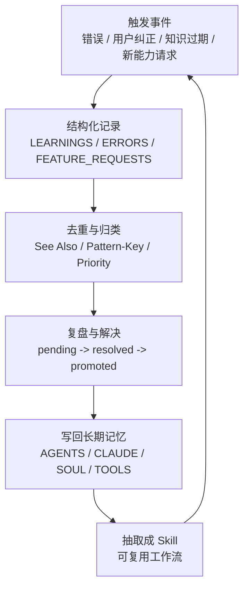

# Self-Improving Agent：把错误变成长期记忆

## 速读

`self-improving-agent` 是一个把 Agent 失误、用户纠正、工具失败、知识过期和新能力请求沉淀成结构化日志的 skill。它不是让 Agent 立即“自我意识觉醒”，而是建立一个可审计的反馈循环：先记录，再去重，再复盘，再推广到长期记忆，最后在足够稳定时抽取成 reusable skill。

它的默认落点是 `.learnings/`：

```text
.learnings/
  LEARNINGS.md
  ERRORS.md
  FEATURE_REQUESTS.md
```

这三个文件分别对应经验、错误和能力缺口。更重要的是，它要求把广泛适用的学习提升到 `AGENTS.md`、`CLAUDE.md`、`.github/copilot-instructions.md`、OpenClaw 的 `SOUL.md` / `TOOLS.md` 等长期上下文文件里。

对我的启发是：Agent 改进不应该停留在“下次我会注意”，而要变成一条工程链路：事件捕获 → 结构化记录 → 复发检测 → 长期记忆写回 → workflow 或 skill 抽取。

## 原文

- 原文页面：<https://clawhub.ai/pskoett/self-improving-agent>
- 页面类型：ClawHub skill detail page
- Owner：`pskoett`
- 安装命令：`openclaw skills install self-improving-agent`
- 最新版本：`3.0.23`
- License：`MIT-0`
- 捕获时统计：downloads `460682`，current installs `6522`，stars `3771`
- 页面可见仓库线索：
  - `https://github.com/peterskoett/self-improving-agent.git`
  - `https://github.com/pskoett/pskoett-ai-skills`
  - `https://github.com/pskoett/pskoett-ai-skills/tree/main/skills/self-improvement`

## 内容地图



## 关键论点

- 作者明确说法：这个 skill 用于捕捉 learnings、errors、corrections，以支持持续改进。
- 作者明确说法：初始化 `.learnings/` 时不能覆盖已有文件；已存在时应无操作。
- 作者明确说法：不要记录 secrets、tokens、private keys、environment variables 或完整源码/配置，除非用户明确要求。
- 作者明确说法：命令失败写入 `ERRORS.md`，用户纠正和知识过期写入 `LEARNINGS.md`，缺失能力请求写入 `FEATURE_REQUESTS.md`。
- 作者明确说法：广泛适用的 learning 应提升到 `CLAUDE.md`、`AGENTS.md`、`.github/copilot-instructions.md`，OpenClaw 还包括 `SOUL.md` 和 `TOOLS.md`。
- 作者明确说法：相似条目要先搜索、建立 `See Also`、提高优先级，并考虑系统性修复。
- 作者明确说法：`simplify-and-harden` 产生的候选模式可以用 `Pattern-Key` 去重，并按复发次数提升。
- 作者明确说法：hook 是 opt-in，用于提醒 session start 或 tool error 后检查是否需要记录。
- 作者明确说法：足够有价值的 learning 可以抽取成独立 skill。
- Agent 推断：`.learnings/` 是 feedback inbox；`AGENTS.md` / `SOUL.md` / `TOOLS.md` / extracted skill 才是编译后的长期行为层。
- Agent 推断：它的核心不是“全量记忆”，而是“只把可复用、可验证、可推广的学习转成持久规则”。
- 我的启发：这和 AI Wiki 的 source → concept → synthesis 很像，只是对象从知识资料变成 Agent 行为经验。

## 核心内容

### 1. 它定义了什么值得记录

这个 skill 不是让 Agent 把所有对话都存下来。它明确列出触发点：

- 命令或操作意外失败。
- 用户纠正 Agent。
- 用户提出当前不具备的新能力。
- 外部 API 或工具失败。
- Agent 发现自己的知识过期或错误。
- 找到一个反复任务的更好做法。

这很实用，因为它把“学习”限定在反馈密度高的位置。Agent 最值得学习的时刻不是一切正常的时候，而是出错、被纠正、遇到能力缺口、发现重复模式的时候。

### 2. 它把不同反馈放进不同文件

`.learnings/` 是一个轻量反馈数据库：

```text
LEARNINGS.md          纠正、洞察、知识缺口、最佳实践
ERRORS.md             命令失败、异常、集成错误
FEATURE_REQUESTS.md   用户希望 Agent 具备的新能力
```

这个拆分很关键。错误、经验、能力请求是三类不同信号：

- error 需要复现、定位和修复。
- learning 需要抽象成原则或规则。
- feature request 需要评估是否值得建设能力。

混在一个文件里会变成流水账，拆开之后才容易后续检索和治理。

### 3. 它用模板让经验可复盘

learning entry 不只是写一句“以后注意”。它要求记录：

```text
ID
Logged timestamp
Priority
Status
Area
Summary
Details
Suggested Action
Metadata
Related Files
Tags
See Also
Pattern-Key
Recurrence-Count
First-Seen / Last-Seen
```

这套结构把“经验”变成可管理对象。尤其是 `Pattern-Key` 和 `Recurrence-Count`，它们让 Agent 可以识别重复问题，而不是每次都把同类错误当成新事件。

### 4. 它区分记录层和长期记忆层

`.learnings/` 是记录层，不是最终形态。广泛适用的 learning 要被 distill 成短规则，再提升到长期上下文：

```text
AGENTS.md       工作流、自动化、Agent 行为规则
CLAUDE.md       项目事实、约定、常见坑
SOUL.md         行为风格、原则、沟通习惯
TOOLS.md        工具能力、调用方式、集成坑
```

这和知识库里的 ingest / compile 很相似：原始记录只是 evidence；长期记忆要经过抽象、去重和压缩。

### 5. 它把高价值经验继续抽取成 skill

当一个 learning 足够稳定、可复用、非显然、已经验证，或者用户明确要求“save this as a skill”，就可以抽取为独立 skill。

这一步把“经验规则”升级为“可调用能力”。也就是说，Agent 的改进路径不是只改 prompt，还可以沉淀成工具化流程。

## 关键洞察

第一，self-improving 的核心是反馈闭环，不是记忆容量。Agent 不需要记住每一句话，它需要知道哪些反馈会改变未来行为。

第二，错误和纠正必须尽快记录。因为刚发生时上下文最完整，晚点再整理就会变成模糊印象。

第三，promote 比 log 更重要。只记录不提升，`.learnings/` 会变成垃圾堆；只有进入 `AGENTS.md`、`TOOLS.md` 或 skill，未来行为才真的改变。

第四，它把“人的纠正”转成系统资产。用户说“不是这样”时，不只是修当前回答，而是捕获一个可复用的边界条件。

第五，安全边界是这个 skill 能否长期使用的前提。不记录 secret、不贴完整源码、不跨 session 乱传 transcript，这些约束避免“记忆系统”变成泄漏系统。

## 批判性点评

这个 skill 的优点是非常工程化：它没有把 self-improvement 写成抽象人格，而是拆成文件、模板、状态、优先级、复发检测和推广机制。它的实现门槛低，只要 Markdown 文件就能跑起来。

它的主要风险是维护成本。如果每次小错误都写长条目，`.learnings/` 很快会噪声过高。所以要控制记录粒度：只记录会改变未来行为的反馈，不记录一次性琐碎事件。

另一个风险是“记录了但没用”。如果没有周期性 review 和 promotion，日志会越来越厚，但 Agent 还是不会变好。这个 skill 真正的价值在后半段：去重、复盘、提升、抽取。

还有一个需要小心的点：把行为规则写回 `AGENTS.md` / `SOUL.md` 是强操作，可能改变所有后续 session 的行为。应该只推广稳定、反复出现、有明确证据的模式，不要把一次性偏好误写成全局规则。

## 对我的启发

这可以直接映射到 AI Wiki 的工作方式：

```text
chat feedback / command error / user correction
  -> .learnings/ 记录层
  -> human/inbox/codex-daily 或 cook-my-mind 复盘层
  -> AGENTS.md / skill / wiki concept 编译层
```

对这个 wiki 来说，我最想借鉴三点：

1. 把用户纠正作为高价值 source，而不是对话里的临时插曲。
2. 给 recurring pattern 一个稳定 `Pattern-Key`，例如 `wiki.source_links.weak_relation`、`cook.imagegen.blocker`、`ingest.xmind.sheet_miss`。
3. 当某个模式出现 3 次以上，就不要继续靠记忆提醒，而要升级成 AGENTS.md 规则、skill helper 或 lint 检查。

它还提示我：AI Wiki 的 `log.md` 是操作时间线，不应该承担 learning database 的角色。真正的经验沉淀应该有独立层，否则操作日志和行为学习会混在一起。

## 可以继续追的问题

- 这个 workspace 是否需要一个 `.learnings/`，还是用现有 `human/inbox/codex-daily` 体系就够？
- 哪些用户纠正应该直接写进 `AGENTS.md`，哪些只适合先放入 learning inbox？
- `Pattern-Key` 的命名规范应该怎么设计，才能长期可 grep？
- learning promotion 是否需要 review gate，避免 Agent 自己过度改写行为规则？
- self-improving-agent 和 ontology 是否可以组合：learning entry 作为实体，promotion / evidence / recurrence 作为关系？

## 信息图

![[human/inbox/cook-blog/assets/2026-06-13_Self-Improving-Agent：把错误变成长期记忆_ClawHub/infographic.webp]]

## 遗漏与不确定

- 当前捕获没有专用浏览器自动化工具，使用公开 HTML 与同站点公开 detail API 作为 fallback。
- 这个页面是 ClawHub skill detail，不是传统博客文章；本次按 cook-blog 处理是因为用户要求 cook。
- 页面提到 GitHub 仓库、hooks、scripts、references 和 assets，但本次没有下载完整包或审计代码。
- 页面统计来自捕获时 ClawHub API 返回值，后续会变化。
- 外部链接只记录可见 URL，均未联网核验。

## Source Manifest

- Input URL: `https://clawhub.ai/pskoett/self-improving-agent`
- Canonical URL: `https://clawhub.ai/pskoett/self-improving-agent`
- Same-site detail endpoint used for fallback: `https://clawhub.ai/api/v1/skills/self-improving-agent`
- Capture method: public HTML plus same-site public skill detail API fallback
- Capture cache: `.codex/cache/cook-blog/b34eccc199cdbbc8/capture.md`
- Imagegen original: `.codex/cache/cook-blog/b34eccc199cdbbc8/imagegen-original.png`
- Infographic asset: `human/inbox/cook-blog/assets/2026-06-13_Self-Improving-Agent：把错误变成长期记忆_ClawHub/infographic.webp`
- Excluded: navigation, sign-in UI, footer, theme controls, install button UI, unrelated ClawHub chrome, comments, recommendations, external pages.
- Limitations: no login, no external search, no mirror/cache, no package artifact inspection, no independent fact verification.
