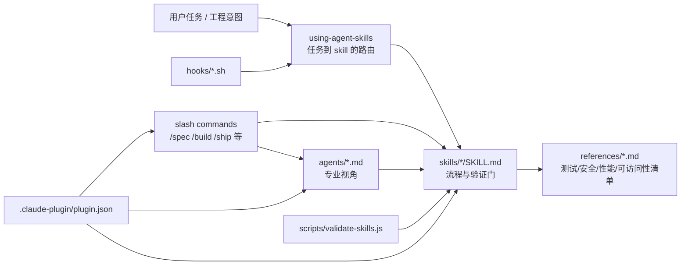
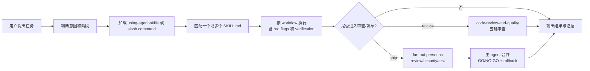

# 工程工作流指令包：agent-skills

## 速读

`addyosmani/agent-skills` 不是一个传统软件应用，而是一套给 AI coding agent 使用的工程流程资产包。它把“定义需求、拆计划、增量实现、测试验证、审查、发布”这些资深工程师常用纪律，写成可被 agent 加载的 `SKILL.md`、slash commands、personas、hooks 和参考清单。

这个仓库的核心价值不在某个算法，而在“把工程习惯产品化”：让 agent 不只是会写代码，还能在合适时机先写 spec、先写失败测试、做五轴 review、用发布前清单和 rollback plan 约束自己。

## 仓库定位

README 给出的定位是 “Production-grade engineering skills for AI coding agents”。从文件结构看，它更准确地说是一套跨工具的 agent workflow pack：

- 给 Claude Code 的 plugin manifest、`.claude/commands/*.md`、`skills/*/SKILL.md` 和 `agents/*.md`。
- 给 Gemini / Antigravity / OpenCode / Cursor / Copilot 等工具的安装说明或命令镜像。
- 给 skill 作者和贡献者的结构规范、验证脚本、CI 检查和 hook 辅助。

它的目标用户不是终端用户，而是经常用 coding agent 交付软件的人：想把 agent 从“即时补全器”升级成“按流程工作的工程合作者”。

## 解决什么问题

AI coding agent 的常见失败不是“不知道语法”，而是跳过工程流程：需求不清就开写、一次改太大、没有失败测试、review 时只看表面、发布时没有 rollback 方案。

`agent-skills` 的解法是把这些流程写成可触发的 Markdown 技能。每个 skill 都强调使用时机、步骤、常见逃避理由、red flags 和 verification。也就是说，它试图把“该慢的时候慢下来”的判断外化成规则，让 agent 在上下文里持续被提醒。

## 项目特性

- **生命周期命令**：`/spec`、`/plan`、`/build`、`/test`、`/review`、`/code-simplify`、`/ship`、`/webperf` 覆盖从定义到发布的主要阶段。
- **24 个 skills**：包括 `using-agent-skills` meta-skill，以及 spec-driven、incremental、TDD、source-driven、doubt-driven、frontend、API、security、performance、observability、shipping 等工程流程。
- **4 类 personas**：`code-reviewer`、`test-engineer`、`security-auditor`、`web-performance-auditor`，用于单视角审查或 `/ship` fan-out。
- **参考清单**：`references/` 下沉淀 testing、security、performance、accessibility 和 orchestration patterns。
- **Hook 增强**：`session-start` 注入 meta-skill；`sdd-cache` 为 source-driven-development 做带 origin revalidation 的 WebFetch 缓存；`simplify-ignore` 用占位符保护不应被简化的代码块。
- **验证脚本**：`scripts/validate-skills.js` 检查 `SKILL.md`、frontmatter、required sections 和 dead cross-skill references。

## 典型使用方式

Claude Code 推荐安装路径是 README 中的 marketplace/plugin 流程：

```text
/plugin marketplace add addyosmani/agent-skills
/plugin install agent-skills@addy-agent-skills
```

本地开发则可以用：

```text
claude --plugin-dir /path/to/agent-skills
```

更通用的方式是把某个 `skills/<name>/SKILL.md` 复制进 agent 的 system prompt、rules file 或会话上下文。`docs/getting-started.md` 特别强调：skills 不是普通参考文档，而是 agent 应该执行的 step-by-step process。

## 主要架构



## 代码地图

- `README.md`：项目门面，解释生命周期、安装方式、skills/personas/references。
- `.claude-plugin/plugin.json`：Claude plugin 的主 manifest，声明 commands、skills、agents。
- `plugin.json`：根目录的极简 manifest，只含名称、版本和描述。
- `skills/*/SKILL.md`：仓库主体。每个 skill 是一个工程流程，而不是运行时代码。
- `.claude/commands/*.md`、`commands/*.toml`、`.gemini/commands/*.toml`：不同 agent harness 的命令入口。
- `agents/*.md`：角色 prompt，定义审查视角、输出格式和组合边界。
- `hooks/*.sh`：会话启动、source-driven doc cache、simplify-ignore 等辅助能力。
- `scripts/validate-skills.js`：贡献/CI 侧的静态检查器。
- `docs/*.md`：安装、getting started、skill anatomy 和平台适配说明。

## 核心模块

**`using-agent-skills` meta-skill** 是总入口。它定义“任务来了先判断属于哪个工程阶段”，并把实现、测试、debug、review、ship 等意图映射到对应 skill。它还规定了通用行为：显式暴露假设、管理困惑、必要时 push back、保持简单、控制 scope、用证据验证。

**`spec-driven-development`** 强制在非平凡工作前写 spec，并要求覆盖目标、命令、项目结构、代码风格、测试策略、边界、成功标准和开放问题。它本质上是在反制“需求不清但先写代码”的 agent 冲动。

**`incremental-implementation` + `test-driven-development`** 构成构建环节。前者强调 thin vertical slices、每个 slice 测试/验证/提交；后者强调 Red-Green-Refactor、bug 的 Prove-It pattern、测试金字塔和 DAMP tests。

**Personas 与 `/ship`** 展示了仓库对多 agent 编排的边界感：persona 是“谁”，skill 是“怎么做”，command 是“何时组合”。`/ship` 是被明确认可的 fan-out 模式：并行跑 code review、security audit、test coverage，再由主 agent 合并成 GO/NO-GO 和 rollback plan。

## 数据流 / 控制流



## 依赖与技术栈

这是一个文档型 / plugin 型仓库，静态阅读未发现 `package.json`。主要文件类型是 Markdown、TOML、JSON、Shell 和一个 Node.js 脚本。`scripts/validate-skills.js` 只用 Node 标准库。

实际使用时的外部依赖来自宿主工具：Claude Code plugin、Gemini CLI、Antigravity CLI、OpenCode、Cursor 或 Copilot。hooks 还依赖常见本地工具如 `jq`、`curl`、`shasum` / `sha256sum`。

## 设计亮点

第一，仓库把“流程”写得像可执行协议，而不是泛泛原则。比如 `/build auto` 不只是说“自动构建”，而是要求先确认 spec、检查 git clean、生成 plan、一次审批、每个 task 单独 RED/GREEN/build/commit。

第二，它对多 agent 编排保持克制。`references/orchestration-patterns.md` 明确反对“router persona”这类会增加信息损耗的模式，只认可直接调用、单 persona command、parallel fan-out with merge、用户驱动的顺序 pipeline 和 research isolation。

第三，它在一些细节上很懂 agent 失败模式。`doubt-driven-development` 针对“自信但错”的问题；`source-driven-development` 配合 cache hook 防止反复拉文档但又不削弱 freshness；`web-performance-auditor` 明确要求不能从静态代码伪造 Core Web Vitals 指标。

## 批判性点评

这个仓库最大的优点也是它的边界：它把工程纪律讲得很完整，但落地效果高度依赖宿主 agent 是否真的遵守这些 Markdown 指令。对于“支持 skill discovery / plugin / subagent / hook”的工具，它能形成比较顺的闭环；对于只支持普通 prompt 的工具，它更像一套人工复制的流程手册。

文档层也有轻微不一致：有些位置说 7 个 slash commands，但仓库里还包含 `/webperf`；根目录 `plugin.json` 比 `.claude-plugin/plugin.json` 薄很多，容易让不同消费者对“哪个 manifest 才是主入口”产生误解。

另外，hooks 并非纯说明性资产。`simplify-ignore` 会在会话中用占位符临时改写文件再恢复，`sdd-cache` 会写 `.claude/sdd-cache`。这类能力很有用，但用户如果以为整个项目只是 prompt pack，就可能低估安装后对本地会话行为的影响。

## 风险与不确定

- 本次只做静态阅读，没有运行仓库脚本、安装 plugin、执行 CI、测试 hook 行为。
- 24 个 skills 只深读了代表性文件，未逐个审查每个 skill 的质量。
- 没有联网核验 README 中提到的平台现状、marketplace 可用性、issue/release 状态。
- imagegen 信息图中有少量 AI 生成小字不完美，但核心结构、模块和风险框可读。
- hooks 的 shell 边界、错误处理和恢复机制值得单独做一次安全/可靠性 review。

## 对我的启发

如果把 AI coding agent 当成“一个会写代码的人”，那真正稀缺的不是更多 API 知识，而是稳定的工作纪律。这个仓库的启发是：prompt/skill 不应只写“你要专业”，而要写清楚“什么时候停下来、什么时候问、什么时候验证、什么证据算完成”。

它也提示了个人 agent 工作流可以产品化：把反复出现的好习惯拆成 skill、command、persona、reference、hook 五层，而不是每次靠人类重新提醒。

## 可以继续追的问题

- 这些 skills 在 Claude Code、Gemini CLI、OpenCode 等不同宿主里的遵循率差异有多大？
- `doubt-driven-development` 这种 fresh-context adversarial review 是否能显著减少真实 PR 缺陷？
- hooks 带来的便利和隐式副作用之间，应该如何设计默认权限和可见性？
- 对个人 wiki/工程仓库而言，哪些本地 skill 最值得从这个项目迁移或改写？

## 信息图

![[human/inbox/cook-github/assets/2026-06-11_工程工作流指令包_addyosmani_agent-skills/infographic.webp]]

## Source Manifest

- Input GitHub URL: `https://github.com/addyosmani/agent-skills`
- Normalized URL: `https://github.com/addyosmani/agent-skills`
- Requested ref: `default`
- Resolved commit: `d187883b7d761265309cdcc0f202cc76b4b3fb06`
- Default branch: `main`
- Clone command: `git clone --depth 1 --no-recurse-submodules "https://github.com/addyosmani/agent-skills" ".codex/cache/cook-github/addyosmani-agent-skills-default/repo"`
- Cloned at: `2026-06-11T11:04:19+08:00`
- Cache path: `.codex/cache/cook-github/addyosmani-agent-skills-default`
- Repo path: `.codex/cache/cook-github/addyosmani-agent-skills-default/repo`
- Repo metadata: `.codex/cache/cook-github/addyosmani-agent-skills-default/repo-metadata.json`
- File inventory: `.codex/cache/cook-github/addyosmani-agent-skills-default/file-inventory.txt`，tracked files: 91
- Exploration report: `.codex/cache/cook-github/addyosmani-agent-skills-default/exploration-report.md`
- 子 Agent: `Pasteur` (`019eb4a3-9d11-7111-9090-86f8347dcc0d`) 已创建并完成；子 Agent 只返回探索报告正文，父 Agent 原样落盘为 `exploration-report.md`。
- 父 Agent 补读关键文件: `README.md`, `AGENTS.md`, `plugin.json`, `.claude-plugin/plugin.json`, `.claude-plugin/marketplace.json`, `docs/getting-started.md`, `docs/skill-anatomy.md`, `commands/*.toml`, `.claude/commands/*.md`, `.gemini/commands/*.toml`, `agents/*.md`, representative `skills/*/SKILL.md`, `references/*.md`, `scripts/validate-skills.js`, `hooks/hooks.json`, `hooks/SDD-CACHE.md`, `hooks/SIMPLIFY-IGNORE.md`.
- imagegen status: built-in `image_gen` succeeded; original copied to `.codex/cache/cook-github/addyosmani-agent-skills-default/imagegen-original.png`; final infographic saved to `human/inbox/cook-github/assets/2026-06-11_工程工作流指令包_addyosmani_agent-skills/infographic.webp`。`sips` WebP conversion failed on this machine, then Pillow conversion succeeded.
- Read-only boundary: 未运行仓库代码，未安装依赖，未执行测试/构建/Docker，未初始化 submodules，未修改 cloned repo 文件。
- Coverage limitations: 未深读全部 24 个 skills，未逐个审查所有平台 setup docs，未执行 hook/test/CI，未联网核验 GitHub stars、issues、PR、releases 或 marketplace 当前状态。
