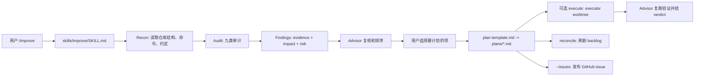

# Agent 审计计划技能：shadcn/improve

## 速读

`shadcn/improve` 是一个 Agent Skill 仓库，不是传统应用或库。它的核心主张是把“判断”和“执行”拆开：更强的模型负责理解代码库、审计机会、复核证据并写出可执行计划；另一个更便宜或更小的 Agent 只按计划在隔离 worktree 里实现。

这个仓库最值得学习的地方不是某段源码，而是一套面向多 Agent 协作的交接协议：计划必须自包含、每步必须有验证命令、必须写清范围边界和 STOP 条件。它把“让 Agent 干活”转化为“先产出能被弱执行器消费的规格文件”。

## 仓库定位

仓库内容主要由 Markdown instructions 组成，入口是 `skills/improve/SKILL.md`，配套 reference 文档包括：

- `audit-playbook.md`：九类审计方向和 finding 格式。
- `plan-template.md`：计划文件和 `plans/README.md` 的结构。
- `closing-the-loop.md`：`execute`、`reconcile`、`--issues` 的后续闭环。
- `examples/001-extract-shadow-config-resolution.md`：一份具体计划样例。

从项目形态看，它更像“Agent 操作系统中的一个流程插件”：它不提供运行时代码，而是通过约束 agent 行为来生成高质量 handoff artifacts。

## 解决什么问题

它试图解决的不是“Agent 会不会改代码”，而是“如何让改代码之前的判断可复用、可转交、可验证”。

常见的 Agent 失败模式是：强模型在聊天里理解了上下文，但交给另一个模型执行时，关键背景只存在于会话记忆里；执行器遇到偏差后即兴发挥；验收标准变成“看起来差不多”。`improve` 的方案是把这些隐性上下文压进 `plans/*.md`，让计划本身成为交付物。

## 项目特性

- 读写边界非常明确：advisor 不直接改源代码，只允许写 `plans/`；执行发生在独立 executor 或 worktree 中。
- 审计覆盖九类：correctness、security、performance、test coverage、tech debt、dependencies、DX、docs、direction。
- 每条 finding 都要求证据、影响、工作量、修复风险、置信度和 fix sketch，避免只有“感觉”的建议。
- advisor 需要复核 subagent 报告，删除误报、校正证据、去重后再展示。
- 计划文件面向“没看过前文的小模型”，因此必须内联路径、现状摘录、约定、验证命令、范围和停止条件。
- 后续闭环包括执行、复核、返工、阻塞、reconcile 和 GitHub issue 发布。

## 典型使用方式

README 给出的入口是：

```bash
npx skills add shadcn/improve
```

常见调用形态包括：

- `/improve`：完整审计、排序、再按用户选择写计划。
- `/improve quick`：较便宜的热点扫描。
- `/improve deep`：更全面的包级覆盖。
- `/improve security`、`/improve perf`、`/improve tests`：聚焦某一类审计。
- `/improve branch`：只看当前分支改动。
- `/improve next`：提出方向型建议。
- `/improve plan <description>`：跳过审计，为一个已知目标写计划。
- `/improve execute <plan>`：派发 executor 并由 advisor 审查结果。
- `/improve reconcile`：刷新、验证或废弃旧计划。
- `/improve ... --issues`：把计划发布为 GitHub issue。

## 主要架构



## 代码地图

- `README.md`：公共说明，解释为什么“plan is the product”，列出安装、用法和硬规则。
- `.claude-plugin/plugin.json`：插件元数据，声明名称、描述、版本、作者、homepage、license 和关键词。
- `skills/improve/SKILL.md`：主 skill contract，包含角色定位、硬规则、四阶段 workflow、调用变体和输出语气。
- `skills/improve/references/audit-playbook.md`：审计手册，定义九类问题和标准 finding 格式。
- `skills/improve/references/plan-template.md`：handoff plan 模板，定义可执行计划应该怎样写。
- `skills/improve/references/closing-the-loop.md`：执行、reconcile、issue 发布的操作规则。
- `examples/001-extract-shadow-config-resolution.md`：以 `shadcn/ui` 为例的样例计划，展示一份计划应包含的粒度。
- `LICENSE.md`：MIT license。

## 核心模块

`SKILL.md` 是“大脑”：它定义 advisor 永远不是 implementer，要求先 recon，再按类别审计，再复核和排序，最后写计划。它也定义了多个 mode，例如 `quick`、`deep`、`branch`、`next`、`execute` 和 `reconcile`。

`audit-playbook.md` 是“观察框架”：它告诉 Agent 在不同类别下看什么，例如 correctness 里的空 catch、异步 hazard、边界条件，security 里的 secret、injection、auth、输入校验，performance 里的 N+1、复杂度和缓存缺口。它的价值是把审计从泛泛“看代码质量”变成有证据的 checklist。

`plan-template.md` 是“交接格式”：它要求计划包含当前状态、命令表、scope、git workflow、步骤、测试计划、done criteria、STOP conditions 和 maintenance notes。这是仓库里最可复用的部分。

`closing-the-loop.md` 是“闭环协议”：它把 executor 的产出当成待 review 的 diff，而不是自动可信结果。advisor 要复跑 done criteria、检查 scope、读 diff、判断是否 approve、revise 或 block。

## 数据流 / 控制流

1. 用户在目标仓库里调用 `/improve` 或某个变体。
2. skill 先做 recon，读取 README、agent docs、配置、CI、目录结构和可用验证命令。
3. 对真实仓库进行审计，必要时把类别分给 read-only subagents。
4. subagents 返回候选 finding；advisor 自己重新打开证据位置复核。
5. 误报被丢弃，重复项被合并，剩余 finding 按杠杆排序。
6. 用户选择要变成计划的 finding；非交互模式下默认写 top 3-5。
7. advisor 使用 `plan-template.md` 写 `plans/README.md` 和 `plans/NNN-*.md`。
8. 如果调用 `execute`，另一个 executor 在隔离 worktree 中执行计划。
9. advisor 按 `closing-the-loop.md` 复跑验证、审查 diff，并给出 approve / revise / block。
10. 后续用 `reconcile` 处理 drift、已完成、阻塞或被其他改动自然修复的计划。

## 依赖与技术栈

这个仓库没有传统 package manifest、lockfile、测试配置或构建配置。它依赖的是宿主 Agent 对 Agent Skills 格式、subagent、git、worktree 和可选 `gh` CLI 的支持。

这意味着它的“运行时”不是代码，而是 agent environment。实际行为质量取决于执行它的 Agent 是否真的遵守只读边界、是否会正确创建 subagent、是否能识别命令副作用，以及是否能把计划写成足够自包含的文档。

## 设计亮点

第一，`improve` 把强模型能力用在高杠杆阶段。审计、取舍、证据复核和计划设计比机械改代码更需要上下文综合能力；而执行阶段可以被切成更窄、更便宜、更可验证的任务。

第二，它把“计划”写成执行器规格，而不是聊天摘要。计划中的 drift check、scope、done criteria 和 STOP conditions 都是在降低弱模型即兴发挥的空间。

第三，它把 subagent 报告明确视为线索，不是事实。advisor 需要亲自复核 cited evidence，这一点很像 code review 中不能只看 CI 或自动审计结论。

第四，它保留 backlog 生命周期。`reconcile` 让计划不是一次性 TODO，而是会被刷新、废弃、验证或绕开阻塞的活文档。

## 批判性点评

这个仓库的表达非常清楚，但它的能力边界也很明显：它主要是 instruction-level artifact，没有可执行测试来证明某个宿主 Agent 一定能遵守这些规则。换句话说，它把“流程规范”写得很强，却把“规范执行”交给外部环境。

另一个隐含假设是：高质量计划足以显著降低执行风险。这个假设大体成立，但在复杂迁移、隐式产品判断、或测试基线薄弱的项目里，计划仍可能变成“看似机械、实际需要判断”的任务。仓库也意识到这一点，所以才强调 STOP 条件和 advisor review。

它对命令副作用的边界需要宿主 Agent 有成熟判断。例如 `tsc --noEmit` 和 check-mode lint 是安全的，但不同生态里的 test、build、audit 命令是否会写文件或联网，并不能只靠模板判断。

如果把它用于真实团队，我会特别关注两点：第一，计划文件是否过长到执行器反而抓不住重点；第二，advisor 的复核是否真的打开了证据，而不是把 subagent 的 finding 重新包装一遍。

## 风险与不确定

- 本次只做静态阅读，没有运行仓库代码、安装依赖、测试、构建或 Docker。
- 仓库没有 package manifest 或自动验证基线，因此无法通过测试确认 skill 行为。
- `execute`、worktree isolation 和 issue publishing 是流程描述，不是本仓库内实现的代码。
- 未联网查看 GitHub stars、issues、PR、release、Actions 或 README 网页渲染状态。
- 由于 clone 使用 depth-1 默认分支，未分析完整 git history。
- 这个 skill 的真实效果高度依赖宿主 Agent 对 rules 的服从度和工具能力。

## 对我的启发

这套设计可以借鉴到 AI wiki 的 Agent 工作流里：当任务要交给下游智能体，不应该只写“做某事”，而要写出重读入口、证据来源、边界、验证命令、停止条件和后续 reconcile 规则。

它也提醒我，复杂任务的关键产物有时不是代码，而是“让另一个执行者不会误解的中间表示”。对长期 wiki 来说，这和 Source Manifest 的精神相同：不要让后续 Agent 只能相信摘要，要让它能回到原始证据。

## 可以继续追的问题

- `improve` 的 plan 模板能否和本 wiki 的 PRD / HAT / Source Manifest 模板合并，形成统一的跨 Agent 交接格式？
- 在没有测试基线的仓库里，`improve` 是否应该优先生成“建立验证基线”的计划？
- 如何自动检查计划是否真的自包含，而不是只在格式上包含了必填章节？
- 对 Agent Skill 这种 instruction-only 仓库，怎样设计验收测试或 simulation harness？

## 信息图

![[human/inbox/cook-github/assets/2026-06-12_Agent审计计划技能_shadcn_improve/infographic.webp]]

## Source Manifest

### Sources

- Input GitHub URL: `https://github.com/shadcn/improve`
- Normalized URL: `https://github.com/shadcn/improve`
- Requested ref: `default`
- Resolved commit: `fff5624f60e467c069b61dc3ce152d399168abcc`
- Default branch: `main`
- Clone command: `git clone --depth 1 --no-recurse-submodules "https://github.com/shadcn/improve" ".codex/cache/cook-github/shadcn-improve-default/repo"`
- Cloned at: `2026-06-12T13:15:25+08:00`
- Cache path: `.codex/cache/cook-github/shadcn-improve-default`
- Repo path: `.codex/cache/cook-github/shadcn-improve-default/repo`
- Repo metadata: `.codex/cache/cook-github/shadcn-improve-default/repo-metadata.json`
- File inventory: `.codex/cache/cook-github/shadcn-improve-default/file-inventory.txt`
- Exploration report: `.codex/cache/cook-github/shadcn-improve-default/exploration-report.md`

### Subagent Exploration

- Subagent created: `019eba42-028d-7ac1-a870-bfa7b5d4fffc` (`Lagrange`), role `explorer`.
- Subagent task: read-only static repository exploration; return Markdown report only; no file writes.
- Subagent completion: completed successfully.
- Report persistence: subagent returned report body; parent Agent wrote it to `.codex/cache/cook-github/shadcn-improve-default/exploration-report.md`.

### Parent Agent Files Read

- `README.md`
- `.claude-plugin/plugin.json`
- `LICENSE.md`
- `skills/improve/SKILL.md`
- `skills/improve/references/audit-playbook.md`
- `skills/improve/references/plan-template.md`
- `skills/improve/references/closing-the-loop.md`
- `examples/001-extract-shadow-config-resolution.md`
- `.codex/cache/cook-github/shadcn-improve-default/repo-metadata.json`
- `.codex/cache/cook-github/shadcn-improve-default/file-inventory.txt`
- `.codex/cache/cook-github/shadcn-improve-default/exploration-report.md`

### Produced Artifacts

- Final note: `human/inbox/cook-github/2026-06-12_Agent审计计划技能_shadcn_improve.md`
- Infographic: `human/inbox/cook-github/assets/2026-06-12_Agent审计计划技能_shadcn_improve/infographic.webp`
- Imagegen original copy: `.codex/cache/cook-github/shadcn-improve-default/imagegen-original.png`

### Imagegen Status

- Mode: built-in `image_gen` tool.
- Generated original: `/Users/ivan/.codex/generated_images/019eba3f-7857-77f1-bab0-d09a8f137fb9/ig_0ef57b5b4863af63016a2b966a504c8191882d899794668320.png`
- Cached original: `.codex/cache/cook-github/shadcn-improve-default/imagegen-original.png`
- Final WebP: `human/inbox/cook-github/assets/2026-06-12_Agent审计计划技能_shadcn_improve/infographic.webp`
- Conversion: `cwebp -q 92`; output verified as WebP `1672x941`.

### Read-only Boundary

- Did not run repository code.
- Did not install dependencies.
- Did not execute repo scripts, tests, builds, Docker, unknown binaries, or submodules.
- Did not modify cloned repository files.
- Did not fetch submodules.
- Did not query GitHub platform state beyond `git clone` of the requested repository.

### Coverage Limitations

- Depth-1 clone of default branch only; full git history was not inspected.
- No remote metadata, issues, PRs, releases, Actions, package registry metadata, or rendered GitHub README state was checked.
- No hidden/generated artifacts outside tracked files were inspected.
- Repository has no package manifest or automated verification setup in the discovered files.
- Runtime behavior depends on host Agent compliance; this was inferred from instructions, not executed.
