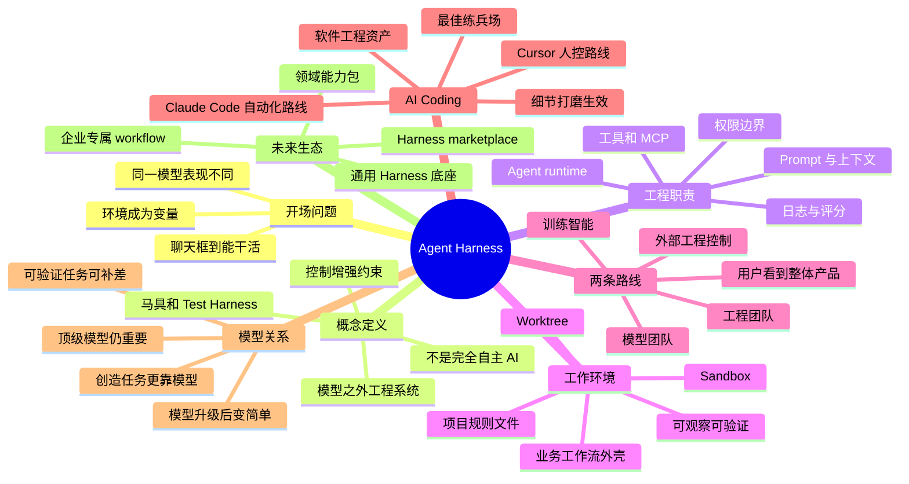

# Agent Harness 工程系统：让模型真正干活

## 速读

这期《硬地骇客》的核心问题是：为什么同一个大模型，放在普通聊天框里只是给建议，放进 Claude Code、Codex、OpenCode 这类环境里，却能读文件、改代码、跑测试、看报错，甚至完成真实任务？

节目的回答是：关键不只是模型，而是模型之外的 Agent Harness。它是一套工程系统，负责把大模型接入真实工作环境，同时提供工具、权限、上下文、执行环境、日志、观察和结果验证。模型提供智能与自主性，Harness 提供边界、环境和反馈闭环。

本期最有价值的判断是：AI Coding 之所以先爆发，不只是模型到了临界点，也因为软件工程本身积累了大量可验证资产，如 Git、测试、编译、日志、浏览器验证、CI、权限模型和 review 流程。可验证任务越多，Harness 对模型能力差距的补足越强。

对我自己的 AI wiki 和 agent workflow 来说，这期可以转成一个实用标准：不要只问“用哪个模型”，还要问“这套 Harness 怎么装配上下文、限制权限、提供工具、验证结果、保留来源、让失败可复现”。真正产品化的不是单个 prompt，而是能持续闭环的工程环境。

## 内容地图

### 内容索引

| 时间 | 主题 | 作用 |
| --- | --- | --- |
| 00:00-00:46 | 开场与赞助 | 引入播客 AI 学习工具和本期主题。 |
| 00:46-01:34 | 从模型强弱切到工作环境 | 提出核心问题：同一模型为何在不同环境里能力不同。 |
| 01:34-05:17 | 什么是 Agent Harness | 给出多种定义、马具比喻和边界澄清。 |
| 05:17-12:03 | 控制反转还是增强约束 | 解释工具调用、prompt、MCP、skills 如何成为外部控制系统。 |
| 12:03-20:07 | Harness 管理什么 | 拆出 runtime、上下文、权限、规则文件、项目/业务外壳。 |
| 20:07-23:30 | Agent 与 Harness 的分工 | 把 Agent 理解为角色/人格，Harness 提供能力和验证环境。 |
| 23:30-28:48 | 模型团队与工程团队 | 区分训练智能与外部工程，说明两条能力路线。 |
| 28:48-33:38 | AI Coding 是练兵场 | 说明软件工程资产为何让 Harness 率先在 coding 场景生效。 |
| 33:38-42:12 | 模型与 Harness 谁更重要 | 讨论可验证任务、模型降级、人类参与和 Harness 简化。 |
| 42:12-49:27 | 未来生态 | 把 Harness 比作操作系统/平台，讨论领域能力包和市场。 |
| 49:27-50:02 | 收尾 | 节目互动和订阅提醒。 |

## 关键论点

| 论点 | 类型 | 依据/时间戳 | 置信度 |
| --- | --- | --- | --- |
| 同一模型在聊天框、Claude Code、OpenCode 等环境里的表现差异，来自模型周围的工作环境。 | 节目明确说法 | 00:59-01:28 | 高 |
| Agent Harness 不是“完全自主 AI”，而是让 Agent 接入真实环境并被控制、增强、约束的工程体系。 | 节目明确说法 | 01:34-03:35 | 高 |
| 工具调用的一大作用是获取环境状态和验证结果，从而约束模型，而不只是让模型向外执行 API。 | 节目明确说法 | 06:08-08:00 | 高 |
| 没有 Harness 时，Agent 同时承担决策、执行、权限管理和审查，权力过大。 | 节目明确说法 | 10:34-12:03 | 高 |
| Harness 的核心能力包括 sandbox/worktree、工具权限、上下文组装、可观察性和可验证性。 | 节目明确说法 | 21:06-22:46 | 高 |
| AI Coding 是 Harness 最好的练兵场之一，因为软件工程已有大量可验证工具资产。 | 节目明确说法 | 28:48-33:38 | 高 |
| 对可验证任务，Harness 能更大程度补足模型差距；对创造性任务仍主要依赖模型智能。 | 节目明确说法 / 说话者推测 | 39:47-40:48 | 中高 |
| 模型越强，Harness 应该卸载不必要约束并变得更简单，而不是成为累赘。 | 节目明确说法 | 35:20-36:59 | 高 |
| 未来机会可能来自通用 Agent/Harness 底座上的领域能力包和企业/个人专属 workflow。 | 节目明确说法 / Agent 推断 | 42:12-49:27 | 中高 |
| 对 AI wiki 来说，Source Manifest、规则文件、HAT、权限边界、可复现检查，本质上都是个人知识工作流的 Harness。 | 我的启发 | 结合 21:06-22:46 与当前 wiki 工作流 | 中 |

## 核心内容

### 1. 关键变量从模型切到工作环境

节目开场先承认：过去讨论 Agent，大家很容易比较 Claude、ChatGPT、国产模型谁更强。但这期真正想问的是：同一个模型被放进不同产品或执行环境，为什么能力差别会这么大。

普通聊天框里的模型更像顾问。它能解释、建议、写片段，但没有稳定的文件系统、工具权限、执行环境和反馈闭环。Claude Code、Codex、OpenCode 这类产品则把模型放进一个能读文件、改代码、运行命令、跑测试、观察结果的环境。模型没有孤立变聪明，周围的工程系统让它能完成任务。

这就是本期对 Agent Harness 的切入：它不是模型参数本身，而是把模型转化成工作系统的那层“马具”。

### 2. Harness 的定义仍在形成

节目里给出几种理解：

- `Agent = 大模型 + Harness`：凡是帮助大模型工作的外部东西，都可以算 Harness。
- `大模型 / Agent / Harness` 三层：大模型提供基础能力，Agent 赋予角色、人格或工作习惯，Harness 给 Agent 提供工具、环境和边界。
- Harness 不等于完全自主 AI。一个 Harness 可以被设计成无人聊天、自主执行，但“完全自主”不是 Harness 的定义。

我更可复用的定义是：

> Agent Harness 是模型之外那层把智能接入真实工作环境、同时控制风险并形成验证闭环的工程系统。

这个定义能解释为什么它会同时包含工具、权限、上下文、日志、评分、执行环境和结果验证。

### 3. 工具调用也是约束，不只是执行

节目反复强调，工具调用不只是模型向外执行 API。很多工具调用的目的，是让模型从外部世界获取状态、数据和上下文，再用这些信息约束自己的判断。

例子包括：

- 编译和测试工具：检查模型写的代码是否真的能运行。
- 设计/PPT skills：把风格规范和工作流写进可执行约束。
- MCP 或工具接口：给模型一个结构化方式去访问外部资源。
- 上下文管理：按任务类型组装文档、错误、历史、diff、失败原因。

所以“控制反转”这个说法并不完全准确。更准确的是：模型智能和外部控制一起演进。早期靠 prompt 控制模型，后来工具调用、MCP、skills、context engineering、Harness 逐步把控制从自然语言提示扩展到工程系统。

### 4. Harness 的权力边界比 Agent 更确定

没有 Harness 的 Agent 很危险，因为它同时扮演：

- 决策者：决定要做什么。
- 执行者：直接修改文件、运行命令、调用外部服务。
- 权限管理员：决定自己能不能做。
- 审查人员：判断自己做得好不好。

节目提到删数据库这类风险案例，背后就是 Agent 权力过大。Harness 的作用是把一部分权力从模型手里拿出来，放进确定性的工程规则里。例如：

- 不能访问 workspace 之外的路径。
- 不能访问敏感文件。
- 修改文件是否需要用户确认。
- 数据库是否只能读不能写。
- 命令执行是否要沙盒隔离。

这些边界不应该交给模型自由判断，而应该由 Harness 硬编码、配置或策略化管理。

### 5. Harness 管理的不只是工具，还有上下文和观察

本期最像 checklist 的段落在 21:06-22:46。节目把 Harness 的关键能力拆成几类：

- 可控环境：sandbox、worktree、并行任务隔离、可丢弃/可回滚执行空间。
- 工具与权限：可调用工具、工具权限、用户确认、敏感操作限制。
- 上下文装配：按任务类型组织代码、文档、需求、失败日志、历史成功 commit、diff。
- 可观察性：执行日志、环境状态、错误输出、浏览器或应用真实画面。
- 可验证性：测试、编译、浏览器验证、静态检查、人工审查、结果回放。

这正好对应当前 AI wiki / agent workflow 的很多规则：Source Manifest 是来源可追溯，AGENTS.md 是行为边界，HAT 是结果验证，cache 是中间证据，human/inbox 与 canonical wiki 的边界是权限和发布规则。

### 6. AI Coding 是最早爆发的练兵场

节目认为 AI Coding 是大模型在现实世界落地的最佳练兵场之一。原因不是程序员特殊，而是软件工程天然有可验证资产：

- 代码可以编译。
- 测试可以运行。
- Git 可以记录 diff。
- CI 可以复现失败。
- 浏览器可以验证 UI。
- 日志可以定位错误。
- review 可以审查行为。

这让 Harness 有足够多的抓手去控制模型、纠错、重跑和收敛。相比之下，开放创作、战略判断、审美输出等任务更难客观验证，Harness 的杠杆就小一些。

节目把 Cursor 和 Claude Code 放在两条路线里理解：Cursor 更像提供好 IDE，让人类更好地控制 LLM；Claude Code 更像探索自动化系统如何控制 LLM。人类本身也是最智能的 Harness，只是精力有限，不能长期、稳定、并发地控制大量任务。

### 7. 模型和 Harness 是互补关系

节目没有把 Harness 说成模型的替代品。更准确的关系是：

- 模型太差，Harness 救不了。
- 模型接近顶级时，好的 Harness 能显著拉开产品效果。
- 可验证任务里，差一点的模型可以通过拆任务、多轮验证、人类更多参与来弥补。
- 创造性和发散性任务里，Harness 的补足较弱，仍然更依赖模型原生智能。
- 模型升级后，好的 Harness 应该能删掉冗余约束，变得更简单自然。

这一点对设计 agent workflow 很有价值：不要把 Harness 做成永远膨胀的规则堆。规则的目标不是控制一切，而是在模型能力不足或任务风险高的地方提供边界和反馈。模型能力变强后，Harness 应该能退场一部分。

### 8. 未来机会：通用底座 + 领域能力包

节目最后把 Agent Harness 比作大模型上的操作系统。这个比喻不是说未来只剩几个平台，而是说会出现类似 iOS/Android 之后 App 生态的机会。

可能的结构是：

- 少数通用 Agent/Harness 底座：提供工具、权限、上下文、执行、观察、验证等基础能力。
- 领域能力包：coding、automation、CRM、ERP、设计、销售、客服等不同场景需要不同能力。
- 企业/个人专属 workflow：把组织知识、权限、流程、验收标准、数据边界接到通用底座上。
- Harness marketplace：未来不只卖 skill，也可能卖 Harness 能力、workflow 包或领域外壳。

这个判断对个人 AI wiki 的启发是：长期资产不是“某个模型怎么问”，而是“我如何把自己的知识、工具、权限、验收、复盘持续装进 Harness”。

## 关键洞察

1. **Harness 是 Agent 产品的工程含金量。**  
   模型决定上限，但 Harness 决定模型能不能稳定进入真实任务。

2. **可验证性是 Harness 杠杆的核心变量。**  
   任务越能测试、运行、回放、审查，Harness 越能用流程补足模型不稳定。

3. **权限管理不是安全附属品，而是产品能力。**  
   一个 Agent 能不能放心使用，很大程度取决于它如何限制自己，而不是它有多会说。

4. **上下文不是越多越好，而是要按任务装配。**  
   Harness 的价值在于把正确上下文送到模型面前，并在失败后补充新的证据。

5. **人类仍是高阶 Harness。**  
   当模型降级或任务模糊时，人类可以通过拆分、确认、验收和纠错补足系统能力；产品化目标是把这些动作逐步工程化。

6. **好的 Harness 会随模型升级而变薄。**  
   如果模型更强后规则仍越堆越厚，说明 Harness 可能把历史补丁当成了永久架构。

## 对我的启发

- 设计 agent 工作流时，先问任务是否可验证。如果可验证，就尽量补齐 run、test、diff、log、artifact、HAT；如果不可验证，就把人类判断点显式放进流程。
- AI wiki 的 ingest/cook/compile 边界本质上也是 Harness：`human/inbox`、`human/raw`、`human/sources`、canonical graph 分层，都是在限制 Agent 不能把临时材料直接写成事实图谱。
- Source Manifest 不只是文档礼貌，而是下游 Agent 重新建立上下文的接口。它让“读摘要”变成“可重读证据”。
- 对项目级 `AGENTS.md`、skills、HAT 指南，不要只写行为规范；要写成能帮助 Agent 获取上下文、约束权限、验证结果的操作系统接口。
- 未来值得沉淀一套自己的“个人 Harness checklist”：权限、上下文、工具、cache、source manifest、验证、回滚、复盘、写回边界。

## 值得回听

- **00:59-01:28**：同一模型在聊天框、Claude Code、OpenCode 中表现不同，差别来自工作环境。
- **01:34-03:35**：Agent Harness 的几种定义，以及马具/Test Harness 比喻。
- **04:08-05:17**：工具、权限、执行、日志、评分等能力从 Agent 概念迁移到 Harness 层。
- **06:08-08:00**：工具调用也在获取环境数据和约束模型。
- **10:34-12:03**：Agent 同时做决策、执行、权限和审查会导致权力过大。
- **14:31-18:54**：runtime、prompt、context、工具权限、规则文件和项目环境。
- **21:06-22:46**：sandbox、worktree、工具权限、上下文组装、可观察性和浏览器/Computer Use 验证。
- **28:48-33:38**：为什么 AI Coding 成为 Harness 爆发的练兵场。
- **35:20-36:59**：模型升级后，Harness 应该卸载冗余约束、变得更简单。
- **42:12-49:27**：Harness 作为操作系统/平台/能力包市场的未来形态。

## 可以继续追的问题

- Agent 与 Harness 的边界如何在文档、代码和产品接口里清晰表达？
- 一个项目级 Harness checklist 应该包含哪些最小必要项，避免变成规则堆？
- HAT、CI、browser verification、human review 哪些属于通用 Harness 能力，哪些应该留给项目定制？
- 对非 coding 任务，如何构造足够客观的验证闭环？
- 当模型能力升级后，如何识别哪些 Harness 规则已经成为冗余补丁？
- 未来 `skills marketplace` 与 `Harness marketplace` 的边界会在哪里？

## 发散资源

以下资源只来自 Apple metadata、show notes 或 transcript，未联网核验：

- Podwise / podwise.ai：show notes 中提到的播客 AI 学习工具。
- hardhacker.com：节目官网。
- book.hardhacker.com：硬地骇客小手册。
- 小宇宙文稿：show notes 提到可在小宇宙查看该单集文稿。
- Claude Code、Codex、OpenCode、Cursor、Grok、MCP、skills marketplace：来自 transcript 的相关产品/概念名，部分 ASR 拼写经过上下文纠正。

## 信息图

![[human/inbox/cook-podcast/assets/2026-05-31_Agent Harness 工程系统_硬地骇客/infographic.webp]]

## 遗漏与不确定

- 本次压缩牺牲了大量口语铺垫、重复比喻、赞助介绍和收尾互动，保留的是对 Agent Harness 可复用的工程观点。
- Whisper `base` 对中文整体可用，但对英文产品名、人名、品牌和术语误写较多；例如 `Claude Code`、`OpenCode`、`Podwise`、`Grok`、`SourceMap`、`Cursor` 等在 transcript 里有多种错写。
- `OpenCloud/OpenClaw/OpenCow` 等 ASR 结果可能在不同上下文中指 OpenCode、Claude Code 或其他 coding agent 产品；本 note 基于上下文做了最大概率纠正，但未联网核验。
- 节目提到“张小珺采访罗福莉/小米模型”等外部事件，未联网核验，只作为节目中的说法记录。
- 信息图由 imagegen 生成，中文文字经目检总体清晰，但仍可能存在细小字体不完美；WebP 是压缩版本，原图保存在 cache。

## Source Manifest

| 字段 | 内容 |
| --- | --- |
| Input URL | `https://podcasts.apple.com/cn/podcast/%E7%A1%AC%E5%9C%B0%E9%AA%87%E5%AE%A2/id1678465783?i=1000767434232` |
| Resolver path | `apple_lookup` |
| Apple lookup URL | `https://itunes.apple.com/lookup?id=1678465783&entity=podcastEpisode&limit=200&country=cn` |
| Podcast | `硬地骇客` |
| Author | `skoowoo` |
| Episode | `EP126 Agent Harness 🏇` |
| Episode ID | `1000767434232` |
| Podcast ID | `1678465783` |
| Release date | `2026-05-12T16:54:56Z` |
| Duration | `3005000 ms` / about `50:05` |
| Audio URL | `https://dts-api.xiaoyuzhoufm.com/track/640ee2438be5d40013fe4a87/6a0358b3e1eb34a939468885/media.xyzcdn.net/640ee2438be5d40013fe4a87/lhpMa_yS1MT_xSaVbgKgRH-95FGu.m4a` |
| Final audio URL | `https://media.xyzcdn.net/640ee2438be5d40013fe4a87/lhpMa_yS1MT_xSaVbgKgRH-95FGu.m4a` |
| Downloaded audio | `.codex/cache/cook-podcast/1678465783-1000767434232/audio.m4a` |
| Download size | `48609181 bytes` |
| Cache dir | `.codex/cache/cook-podcast/1678465783-1000767434232/` |
| Episode metadata | `.codex/cache/cook-podcast/1678465783-1000767434232/episode.json` |
| Transcript JSON | `.codex/cache/cook-podcast/1678465783-1000767434232/transcript.json` |
| Transcript Markdown | `.codex/cache/cook-podcast/1678465783-1000767434232/transcript.md` |
| Segment digest | `.codex/cache/cook-podcast/1678465783-1000767434232/segment-digest.md` |
| Initial prompt | `.codex/cache/cook-podcast/1678465783-1000767434232/initial-prompt.txt` |
| Repository hotwords | `docs/.hotword.md` loaded |
| Transcription prompt | `.codex/cache/cook-podcast/1678465783-1000767434232/transcription-prompt.txt` |
| Transcription engine | `whisper.cpp-local` via `/opt/homebrew/bin/whisper-cli` |
| Selected engine | `whisper-cpp` |
| Model | `base` / `/Users/ivan/.cache/whisper.cpp/ggml-base.bin` |
| Language | `Chinese` / whisper.cpp `zh` |
| Device | `whisper.cpp-auto-gpu`, Metal backend on Apple M2 Pro |
| Threads | script default / whisper.cpp reported `4 / 10` |
| Audio preprocessing | `.m4a` converted to 16k mono WAV at `.codex/cache/cook-podcast/1678465783-1000767434232/audio.whisper-cpp.wav` |
| Model download | `true`, downloaded from ModelScope: `https://modelscope.cn/models/iceCream2025/whisper.cpp/resolve/master/ggml-base.bin` |
| Model download retry | none observed |
| Browser capture fallback | not used |
| Imagegen status | generated with built-in imagegen tool; original copied to cache |
| Imagegen original | `.codex/cache/cook-podcast/1678465783-1000767434232/imagegen-original.png` |
| Infographic WebP | `human/inbox/cook-podcast/assets/2026-05-31_Agent Harness 工程系统_硬地骇客/infographic.webp` |
| Known limits | ASR has English proper noun errors; no external web verification beyond Apple lookup/audio resolution; final note is cooked inbox artifact, not canonical source note. |

## 转写说明

- 转写使用本地开源 `whisper.cpp`，模型为正式 multilingual `base`，语言显式设为 `Chinese`，没有使用 `base.en`、`tiny` 或云端付费转写。
- macOS 路径使用 Homebrew `whisper-cli`，实际运行加载 Metal backend，并把 `.m4a` 转成 16k mono WAV 后识别。
- 转写前加载了仓库热词 `docs/.hotword.md`，并使用本期 metadata/show-notes-derived `initial-prompt.txt`，覆盖节目名、主题、Claude Code、Codex、OpenCode、MCP、Sandbox、Worktree、Eval 等术语。
- `transcript.md` 是 compact segments-only 格式，每行形如 `[00:00 00:07] 文本`，无 `Full Text`、无 `Segments` 标题、无毫秒、无行首列表符号。
- 完整 transcript 不写入本 note，只保存在 cache；本 note 只摘取和消化高信号时间锚点。
- 本 note 未进入 canonical ingest/compile，不更新 `index.md`、`log.md`、`sources/`、`human/sources/`、`concepts/`、`entities/`、`synthesis/`、`maps/` 或 `questions/`。
