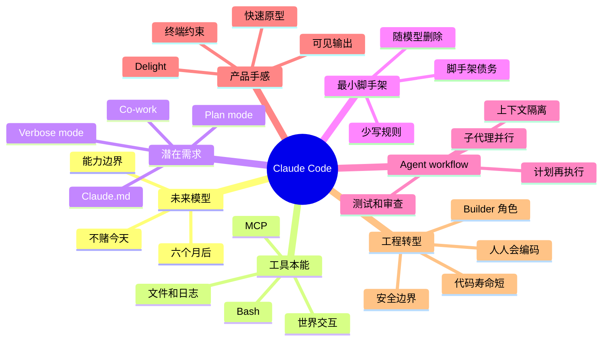

# Inside Claude Code With Its Creator Boris Cherny

## 速读

这期不是普通的 Claude Code 产品访谈，而是一套 AI-native 产品与工程方法论：Boris Cherny 反复强调，Claude Code 的核心不是某个 UI、某个 prompt 技巧或某个固定 agent workflow，而是持续押注“下一个模型会变强”，再用非常短的反馈循环把用户已经在做的事产品化。

本期最有价值的三个判断：

- **为六个月后的模型做产品**：不要只优化今天模型的短板；找到模型马上会够到、但产品还没有承接的边界。
- **latent demand 是产品核心**：Claude.md、plan mode、verbose mode、co-work 都来自用户已经绕路在做的行为，而不是自上而下的大规划。
- **agent workflow 的能力边界在快速移动**：计划、测试、日志、子代理、代码审查、安全审查、issue 分派都在变成 agent 可编排对象；工程师的价值正在从“亲手写代码”转向“定义问题、设计上下文、验证结果、和用户对齐”。

对这个 AI wiki 最直接的启发：`AGENTS.md` / skills / handoff policy 应该保持短、准、可删；重复出现的 agent 操作才沉淀成规则；复杂调试和交付应显式拆成多个证据 lane，而不是让一个上下文窗口线性硬撑。

## 内容地图

### 内容索引

| 时间 | 主题 | 作用 |
| --- | --- | --- |
| 00:00-02:38 | 为未来模型做产品 | 给全期定调：Claude Code 是对模型能力曲线的提前下注。 |
| 02:38-05:38 | 原型起点和 tool use | 解释为什么 terminal + bash 成为最小可行载体。 |
| 05:38-08:49 | Dogfooding 与 Claude.md | 从用户行为里发现 latent demand。 |
| 08:49-13:32 | 最小规则与可见性 | 说明为什么 Claude.md 要短，为什么 verbose output 是信任机制。 |
| 13:32-16:05 | 调试能力重估 | 用日志、heap dump、工具自写说明 agent 能力随模型跃迁。 |
| 16:05-20:40 | 新工程能力画像 | 从 hiring transcript、产品感、测试、系统思维看 AI-native 工程师。 |
| 20:40-25:10 | 多代理与 plan mode | 讨论 Claude Teams、subagents、uncorrelated context windows 和 plan mode 寿命。 |
| 25:10-32:08 | Latent demand 和 agent-first dev tools | 把 plan mode、Slack 提问、form factor 扩展串成产品方法。 |
| 32:08-37:50 | TypeScript 类比和终端 UX | 用 TypeScript 说明实用主义产品如何包住真实用户行为。 |
| 37:50-40:00 | Bitter lesson 与代码短寿命 | 把 scaffolding 定义成会被模型进步淘汰的技术债。 |
| 40:00-46:08 | 生产力、使命与角色变化 | 给出 Anthropic 内部生产力说法，并推演软件工程师角色变化。 |
| 46:08-50:09 | 普及与 co-work | 说明 Claude Code 作为同一 agent 如何扩展给非技术用户。 |

## 关键论点

| 论点 | 类型 | 依据/时间戳 | 置信度 |
| --- | --- | --- | --- |
| Claude Code 的产品方法是“build for the model six months from now”。 | 节目明确说法 | 02:20、37:50 | 高 |
| 早期 CLI 留下不是因为它天然完美，而是因为它是最低成本、最高反馈速度的起点。 | 节目明确说法 | 01:53、03:23、07:04 | 高 |
| Claude.md 的最佳形态不是越长越全，而是能让模型回到轨道的最小规则集。 | 节目明确说法 | 09:02、10:01 | 高 |
| Verbose output 是 agent 产品里的信任与中断机制，不只是噪音。 | 节目明确说法 / Agent 推断 | 12:08、13:00 | 高 |
| 复杂调试正在从“人读所有证据”变成“人设计证据通道，agent 并行调查”。 | Agent 推断 | 13:32、15:20、23:50、24:22 | 中 |
| AI-native 工程师的能力会更像产品型 generalist 或深领域 specialist，而不是平均意义上的手写代码者。 | 节目明确说法 / Agent 推断 | 19:02、45:01 | 中 |
| 子代理的核心价值是 uncorrelated context windows，相当于把更多独立上下文窗口作为 test-time compute。 | 节目明确说法 | 22:06 | 高 |
| Plan mode 的本质很简单：让模型先别写代码；未来可能由模型自己判断何时进入计划状态。 | 节目明确说法 | 25:10、25:36 | 高 |
| 对 dev tool 创业者，模型本身也应被当作用户：观察它想使用什么工具，再降低摩擦。 | 节目明确说法 / Agent 推断 | 31:11 | 高 |
| Scaffolding 默认是技术债，因为下一代模型可能直接吃掉它的价值。 | 节目明确说法 | 38:16、38:40、39:26 | 高 |
| 代码寿命会缩短到数月级，最快的团队会持续重写而不是长期维护旧抽象。 | 节目明确说法 / Agent 推断 | 39:26、39:53 | 中 |
| “软件工程师”会向 builder / product generalist 迁移：写 spec、访谈用户、跨职能 coding。 | 节目明确说法 | 44:45、45:10 | 中 |

## 核心内容

### 1. Claude Code 的起点不是“终端产品”，而是“让模型接触世界”

Boris 的叙述里，Claude Code 的第一版只是为了理解 Anthropic API 的 terminal chat app。真正的转折不是 UI，而是给模型 bash。模型能读文件、运行命令、写 AppleScript 查询系统状态时，Boris 得到的不是“这个 CLI 很酷”，而是“模型想使用工具”。

这点对 agent 产品很关键：产品不要过早替模型决定所有交互边界。先观察模型自然想做什么，再把高频动作产品化。Claude Code 的 terminal-first 不是终局设计，而是一个能快速暴露模型欲望和用户行为的低成本场。

### 2. Latent demand 是贯穿全期的产品算法

本期最反复出现的词其实是 latent demand。几个关键功能都来自同一模式：

- 用户写 Markdown 让模型读，于是有了 Claude.md。
- 用户反复说“先计划，不要写代码”，于是有了 plan mode。
- 用户需要看 bash output 来判断 agent 是否跑偏，于是 verbose / output visibility 成为产品问题。
- 非技术用户绕过 terminal 使用 Claude Code 做植物监控、照片恢复、财务和设计，于是出现更安全、更图形化的 co-work。

这里的产品算法不是“想一个宏大功能”，而是找到用户已经愿意费劲完成的行为，然后消掉摩擦。

### 3. Claude.md / AGENTS.md 应该短，而且应该能被删除

Boris 说自己的个人 Claude.md 只有两条：PR 自动 merge，PR 发到内部 stamp channel。团队共享规则放在 repo 的 Claude.md，并由团队持续维护。对于变得很大的 Claude.md，他建议直接删掉，从头加回真正需要的规则。

这对本 wiki 的 agent 工作流很直接：全局 `AGENTS.md` 不应该把每个类型、每个任务、每个历史 workaround 都堆进去。稳定规则放全局；类型专属规则放 skill；重复出现的可复用动作沉淀；一次性偏好留在 prompt 或 handoff。随着模型能力变化，旧规则要能被移除。

### 4. Plan mode 是一个简单但重要的控制面

节目里最有意思的反转是：plan mode 听起来像复杂功能，本质只是在 prompt 里加一句“please don't code”。它重要不是因为实现复杂，而是因为用户需要一个状态：先想清楚，不要破坏工作区。

Boris 同时认为 plan mode 有寿命。更强模型会自己判断何时需要先计划，什么时候可以执行。但在当前阶段，plan mode 仍然是人类把控风险、生成可审查意图、并行比较方案的有效入口。

### 5. 子代理不是“更多线程”，而是“更多独立上下文”

Claude Teams 和 subagents 的核心解释是 uncorrelated context windows：多个上下文窗口没有彼此污染，可以从不同角度研究问题。对复杂 bug，Boris 会按难度让 3、5 甚至 10 个 subagents 并行调查。

这和当前 Codex / AI wiki 工作很贴：父 agent 应该负责定义问题、约束、合并证据和最终决策；子 agent 负责独立 lane，如日志、代码路径、数据、UI、文档、历史决策。多代理的价值不是并发本身，而是降低单个上下文的盲点。

### 6. Bitter lesson：脚手架要当成会被淘汰的债

Boris 说 scaffolding 可以把某个领域能力提高 10-20%，但下一代模型可能直接把这段收益抹平。Claude Code 团队因此不断删除工具、重写代码、替换旧架构。他甚至说没有哪部分 Claude Code 是六个月前留下来的。

这不是说不要写工具，而是写工具时要有删除预期：它是在当前模型能力和当前工作流下的临时杠杆，不是永久地基。

### 7. 工程师角色的下一个名字可能是 builder

后半段的判断很激进：Boris 说对他个人而言 coding 已经 practically solved，他不再手写代码；Anthropic 内部很多团队 70-90% 甚至 100% 的代码由 Claude Code 生成；PM、设计、EM、finance 都在 code。

即便这些数字需要外部核验，方向很清晰：工程师的稀缺性不再主要来自“能不能敲出代码”，而来自能否定义正确问题、写好 spec、设计验证、理解用户、驾驭 agent，并在安全边界内交付。

## 关键洞察

- **Agent 产品的用户有两个：人和模型。** 人要控制、信任、回放、审查；模型要工具、上下文、文件、日志、外部世界。
- **规则越长，越可能是在补旧模型的短板。** 长规则不一定错，但要定期问：这是稳定偏好，还是过期 scaffolding？
- **可见性不是低级模式。** 对 agent 来说，输出可见性是人类及时纠偏的接口；隐藏细节只有在模型足够可靠时才成立。
- **Plan 是交付物，不只是思考过程。** 一份好计划能被比较、审查、分派给 subagents，也能成为 HAT / handoff 的上游证据。
- **多代理的关键不是“让它们都去做”，而是“让它们互不污染地看问题”。** 这解释了为什么 cross-review、独立 worktree、source manifest 都有价值。
- **最快团队的代码可能没有长期主义美感。** 如果代码寿命只有几个月，架构重点会从“永远稳定”转向“可替换、可验证、可迁移”。

## 对我的启发

1. 对 AI wiki：`AGENTS.md` 应继续作为硬边界和路由入口，不应把每种 source 的细节都塞进去。类型逻辑进入 skill，source manifest 负责让下游 agent 重读原始来源。
2. 对 Codex 工作流：复杂 bug 或 ingest 质量问题可以显式使用 subagent lane，例如“原始材料核对”“wiki 链接核对”“最终读者体验核对”，父 agent 只合并证据和做决策。
3. 对个人学习：看 agent transcript 可能是判断一个人 AI-native 工程能力的好材料。比看最终代码更能看到计划、纠偏、测试和风险意识。
4. 对产品判断：不要问“这个模型今天能不能完美做”，而要问“如果三个月后它能做 80%，我现在应该给它准备什么工具、上下文和控制面？”
5. 对规则维护：当一条 prompt rule 很久没触发或只是在补旧模型短板，应像删除代码一样删除它。

## 值得回听

- 02:20 - Anthropic 的“为六个月后的模型构建”原则。
- 05:15 - bash + AppleScript 的第一次强烈 tool-use 体验。
- 07:49 - Claude.md 从用户自写 Markdown 里长出来。
- 10:01 - Claude.md 太长时，直接删掉重建。
- 12:08 - 为什么隐藏 bash output 会让用户反感。
- 15:20 - Claude Code 写工具分析 heap dump，比人更快找到内存泄漏。
- 17:41 - 用 agent coding transcript 做招聘信号。
- 20:07 - 先给 agent 一个测试工具，再让 agent 写功能。
- 22:06 - uncorrelated context windows 作为 test-time compute。
- 25:36 - plan mode 的本质只是“please don't code”。
- 31:11 - dev tool 要思考模型想做什么。
- 38:16 - bitter lesson：不要赌模型不会变强。
- 39:26 - Claude Code 不断重写，没有六个月前的部分。
- 44:45 - coding generally solved 与 software engineer 角色变化。
- 48:11 - co-work 来自非技术用户已经在绕路使用 Claude Code。

## 可以继续追的问题

- 如果 Claude.md / AGENTS.md 要“短而可删”，什么指标说明某条规则该删除？
- 多代理 topology 如何落到可复现工程协议：父 agent、子 agent、review agent、HAT agent 的职责边界如何写？
- 当代码寿命缩短到几个月，架构文档应该记录什么：稳定接口、迁移策略、还是验证方法？
- Agent transcript 作为招聘或 review 材料时，哪些行为最能预测真实交付质量？
- “为六个月后的模型构建”如何避免变成无证据的未来主义？

## 发散资源

- Apple metadata: Y Combinator Startup Podcast / Lightcone, `Inside Claude Code With Its Creator Boris Cherny`。
- Transcript 中提到但未联网核验：The Bitter Lesson、TypeScript、Claude.md、MCP、Claude Teams、Asana、Slack、Steve Yegge、Dario、Ben Mann、Mercury、SemiAnalysis、NASA Perseverance、co-work。
- 对本 wiki 可复用的内部连接方向：agent workflow、handoff policy、Source Manifest、HAT、multi-agent review、AGENTS.md/skill 分层。

## 信息图

![[human/inbox/cook-podcast/assets/2026-05-31_Y Combinator Startup Podcast_Inside Claude Code With Its Creator Boris Cherny/infographic.webp]]

## 遗漏与不确定

- 本笔记是分层压缩，不包含完整 transcript。对话中的细节笑点、主持人插话、个别产品小特性被压缩掉。
- Whisper `base.en` 对专名误识别明显：`Claude Code` 多次转成 `Quadcode/quad code`，`Lightcone` 转成 `Litecone`，`Boris Cherny` 转成 `Boris Churney`。正文按 Apple metadata 和上下文修正，但时间戳附近的逐字引用仍以 cache transcript 为准。
- 节目里关于 Anthropic 内部生产力、公开 commit 占比、NASA 使用、Mercury / SemiAnalysis 统计等说法未联网核验，只作为节目内容记录。
- 节目发布时间是 2026-02-17，里面的“今年”“六个月后”“现在”都应按节目语境理解，不自动当作 2026-05-31 的当前事实。
- 信息图是 AI 生成的复习图，服务结构记忆，不是节目官方图或精确数据图。

## Source Manifest

- Input URL: `https://podcasts.apple.com/cn/podcast/y-combinator-startup-podcast/id1236907421?i=1000750220847`
- Resolver path: `apple_lookup`
- Lookup URL: `https://itunes.apple.com/lookup?id=1236907421&entity=podcastEpisode&limit=200&country=cn`
- Podcast: `Y Combinator Startup Podcast`
- Episode: `Inside Claude Code With Its Creator Boris Cherny`
- Release date from Apple metadata: `2026-02-17T21:59:09Z`
- Duration from Apple metadata: `3010000` ms, about `50:10`
- Audio URL: `https://anchor.fm/s/8c1524bc/podcast/play/115653502/https%3A%2F%2Fd3ctxlq1ktw2nl.cloudfront.net%2Fstaging%2F2026-1-17%2F418300903-44100-2-3b34acb10f169.mp3`
- Final audio URL after redirect/probe: `https://d3ctxlq1ktw2nl.cloudfront.net/staging/2026-1-17/418300903-44100-2-3b34acb10f169.mp3`
- Audio content type: `audio/mpeg`
- Audio bytes downloaded: `48162689`
- Cache path: `.codex/cache/cook-podcast/1236907421-1000750220847/`
- Episode metadata: `.codex/cache/cook-podcast/1236907421-1000750220847/episode.json`
- Audio file: `.codex/cache/cook-podcast/1236907421-1000750220847/audio.mp3`
- Transcript JSON: `.codex/cache/cook-podcast/1236907421-1000750220847/transcript.json`
- Transcript Markdown: `.codex/cache/cook-podcast/1236907421-1000750220847/transcript.md`
- Segment digest: `.codex/cache/cook-podcast/1236907421-1000750220847/segment-digest.md`
- Imagegen original: `.codex/cache/cook-podcast/1236907421-1000750220847/imagegen-original.png`
- Infographic WebP: `human/inbox/cook-podcast/assets/2026-05-31_Y Combinator Startup Podcast_Inside Claude Code With Its Creator Boris Cherny/infographic.webp`
- Imagegen status: generated with built-in `image_gen`, copied to cache, compressed to WebP.
- Known limitation: no external web verification beyond Apple lookup/RSS metadata and resolved audio; transcript-derived external references remain unverified.

## 转写说明

- Engine: `whisper.cpp-local`
- Binary: `/opt/homebrew/bin/whisper-cli`
- Model: `base.en`
- Language: `English`
- Device: `whisper.cpp-auto-gpu`, Metal backend on Apple M2 Pro; Core ML not used.
- Threads: script default, `0`; whisper.cpp runtime reported 4 threads.
- Audio preprocessing: none needed; source MP3 was accepted directly by whisper.cpp, no ffmpeg conversion.
- Repository hotwords: loaded from `docs/.hotword.md`.
- Episode initial prompt: `.codex/cache/cook-podcast/1236907421-1000750220847/initial-prompt.txt`, derived from Apple metadata, episode title/description, and expected Claude Code terms.
- Combined prompt used by script: `.codex/cache/cook-podcast/1236907421-1000750220847/transcription-prompt.txt`.
- Model setup: `whisper-cpp` was installed through Homebrew during this run. Official Hugging Face model download for `ggml-base.en.bin` failed with `curl: (18) transfer closed`; the same `ggml-base.en.bin` model was then downloaded from a Hugging Face mirror to `~/.cache/whisper.cpp/ggml-base.en.bin`. No downgrade to `tiny`, no cloud transcription API, and no alternate model was used.
- Transcript format: compact segments only, one line per segment as `[MM:SS MM:SS] text` or `[HH:MM:SS HH:MM:SS] text`; no `Full Text`, no `Segments` heading, no milliseconds, no Markdown list bullets.
