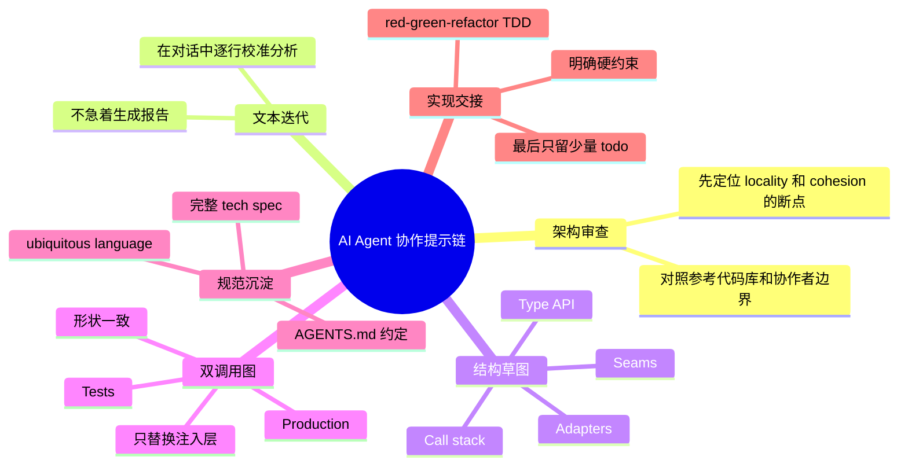

# AI Agent 协作提示链

## 速读

这条 post 的价值不在于某个单独 prompt，而在于把 agent 协作拆成一条可迭代链路：先让 agent 做架构审查，再把设计变成可比较的类型、接口、调用栈、seams 和 adapters，最后沉淀成 spec 并交给 TDD 实现。

它特别适合用在“我不确定是否该局部修补，还是该重建这个设计”的时刻。真正的判断材料不是泛泛的设计建议，而是 production/test 两套调用图是否同形、注入层是否清楚、命名和团队约定是否能被落到 `AGENTS.md` 或 spec。

## 原文

如果当前 Obsidian 环境不渲染 tweet embed，请打开：https://x.com/MrSanders/status/2060487209375990205

## 内容地图

## 关键论点

| 论点 | 类型 | 依据 | 置信度 |
| --- | --- | --- | --- |
| 让 agent 先做 anchored architecture review，比直接让它改代码更适合发现设计边界问题。 | 作者明确说法 | 可见 post 的 P1 要求围绕文件/模块、协作者、参考代码库审查 locality/cohesion。 | 高 |
| 设计讨论先留在聊天文本中迭代，可以减少过早产出文件造成的返工。 | 作者明确说法 | 可见 post 的 P2 明确要求不要生成报告或文件，而是在消息中逐行迭代。 | 高 |
| 好的实现计划应该包含类型接口、调用栈、seams 和 adapters，而不是只写自然语言任务列表。 | 作者明确说法 | 可见 post 的 P3；引用 Dillon 的可见 post 也强调 types/interfaces、composition、boundaries 和 call stacks。 | 高 |
| Production 和 Tests 的调用图同形，是判断抽象是否适合测试替身和依赖注入的关键检查。 | Agent 推断 | 可见 post 的 P3-bis 要求两套调用图形状一致，只替换 injected layers/adapters。 | 中 |
| 把命名、反模式和团队约定写入 spec 或 `AGENTS.md`，能把一次对话变成后续 agent 可复用的操作规则。 | Agent 推断 | 可见 post 的 P6/P7 要求重命名并持久化跨切面 convention。 | 中 |
| 这条链路可以作为 AI wiki/agent workflow 的验收模板：先要求结构证据，再进入实现或交接。 | 我的启发 | 结合本 wiki 对 Source Manifest、handoff 和可重读证据的偏好。 | 中 |

## 核心内容

作者把一次 agent 协作拆成 P1 到 P8。前半段负责让 agent 解释设计问题：它要锚定具体文件或模块，比较协作者边界和参考代码库，指出 locality、cohesion、composition 这些设计质量在哪里破裂。

中段要求 agent 把分析变成可操作结构。最关键的是 P3 和 P3-bis：每个候选方案都要用伪代码 sketch 出 public interface、调用栈、seams、production adapter 和 test/in-memory adapter；再把 Production 与 Tests 的调用图并排展示，要求形状一致，只替换注入层。

后半段进入沉淀和交接。P4 用定点 review 约束 agent 不要整篇重写；P5 把共识合成完整 tech spec；P6 修正 ubiquitous language；P7 把跨切面约定写进 `AGENTS.md`；P8 才让 agent 用 red-green-refactor TDD 实现，并在结束时只报告少量剩余 todo。

## 关键洞察

这条链路把“让 agent 写代码”前移成“让 agent 证明它理解边界”。如果 agent 画不出调用路径、说不清 seam 在哪里、无法让 production/test 调用图保持同形，就说明实现风险还没被消化。

它也把 prompt 从一次性命令变成协议：每一步都限制输出形态，避免 agent 过早生成大报告、过度改写、或者在实现阶段重开已经达成的设计共识。

## 对我的启发

- 做复杂改造前，可以先要求 agent 输出 Production/Test 双调用图，把测试替身和真实 adapter 的替换点说清楚。
- `AGENTS.md` 不应该只写宏观原则；当某个反模式反复出现时，可以把“不要做 X，应该做 Y”的具体 convention 固化进去。
- Handoff 产物的价值在于下游 agent 能重放设计依据。spec 里应包含接口、调用栈、约束和少量未完成 todo，而不是只写结论。

## 可以继续追的问题

- 哪些代码改造场景适合强制要求 P3-bis 双调用图？
- `AGENTS.md` 中的 convention 应该如何避免膨胀成项目知识垃圾场？
- 对不同语言和框架，`seam`、`adapter`、`public interface` 的最小可接受描述是什么？

## 信息图

![[human/inbox/cook-tweet/assets/2026-06-01_AI_Agent协作提示链_MrSanders/infographic.webp]]

## 遗漏与不确定

- 本 note 只基于 browser-use 可见页面，不使用 X API、HTTP 抓取、搜索缓存、第三方镜像或登录态。
- 这是单条 post 加可见 quote，不按 thread 处理。
- 引用 post 的图片没有打开或识别；如果图片包含额外信息，本 note 未覆盖。
- `@dillon_mulroy` 的原帖没有打开，只消费了当前页面可见的 quote 文本。
- 互动数据是 capture 时可见状态，可能随后变化。

## Source Manifest

- input URL: `https://x.com/MrSanders/status/2060487209375990205`
- canonical URL: `https://x.com/MrSanders/status/2060487209375990205`
- embed URL: `https://twitter.com/MrSanders/status/2060487209375990205`
- source_kind: `x-post`
- capture method: `browser-use/browser automation visible-page only`
- browser actions: opened URL in isolated browser automation session; captured accessibility snapshot with link URLs; saved visible-page screenshot; no reload/reopen because content was readable; did not click replies, recommendations, analytics, profiles, media, or external links.
- cache path: `.codex/cache/cook-tweet/2060487209375990205/capture.md`
- screenshot path: `.codex/cache/cook-tweet/2060487209375990205/acceptance-screenshot-post.png`
- imagegen original path: `.codex/cache/cook-tweet/2060487209375990205/imagegen-original.png`
- infographic path: `human/inbox/cook-tweet/assets/2026-06-01_AI_Agent协作提示链_MrSanders/infographic.webp`
- capture limitations: visible quote image/media was not interpreted; quoted status was not opened; X sidebar/login/register UI ignored; issues: none for main post readability.
