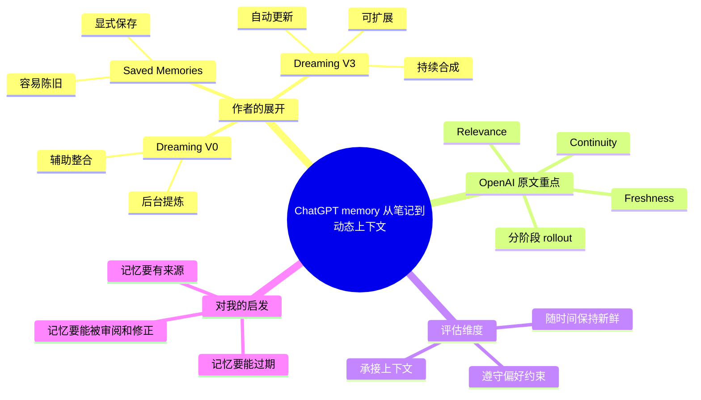

# ChatGPT 记忆进入 Dreaming V3

## 速读

这条 X post 是对 OpenAI 原文《Dreaming: Better memory for a more helpful ChatGPT》的中文重写和解读。核心不是“ChatGPT 多记一点东西”，而是 OpenAI 正在把 memory 从用户显式保存的笔记，推进到后台合成、持续更新、可审阅的上下文状态。

对 AI wiki 和 Agent workflow 的启发很直接：长期有用的记忆不应该只是堆积事实，而要能标记来源、发现过期、允许修订，并在下一次任务中自动变成可行动上下文。

## 原文

如果当前 Obsidian 环境不渲染 tweet embed，请打开：https://x.com/shao__meng/status/2062690152569614572

OpenAI 原文：https://openai.com/index/chatgpt-memory-dreaming/

## 内容地图

## 关键论点

| 论点 | 类型 | 依据 | 置信度 |
| --- | --- | --- | --- |
| Dreaming V3 的重点是让 ChatGPT memory 更能处理陈旧性、准确性和可扩展性问题。 | 作者明确说法 | X post 开头对 OpenAI 更新的概括；OpenAI 原文标题和导语强调 freshness、continuity、relevance。 | 高 |
| OpenAI 把 memory 演进描述为从 Saved Memories 到 Dreaming，再到更可独立、更高效的 Dreaming V3。 | OpenAI 原文 | 原文 “How memory has evolved” 与作者三阶段总结相互对应。 | 高 |
| 这次更新不是单纯扩大记忆容量，而是改变 memory 的运行方式：从离散条目变成后台合成的 memory state。 | Agent 推断 | OpenAI 原文强调 background process、synthesize memory state、stay current over time。 | 高 |
| 约 5x 计算效率提升的意义在于让 dreaming-based memory 能向 Free 用户扩展，同时提升 Plus/Pro 的 memory capacity。 | OpenAI 原文 | 原文 “A more scalable foundation for the future” 部分。 | 高 |
| 对个人 wiki 来说，好的长期记忆也应具备可追溯、可修订、会过期三个属性。 | 我的启发 | 从 OpenAI 的 reviewable summary、staleness、time-aware memory 机制迁移到 AI wiki 知识维护。 | 中 |

## 核心内容

作者把这次 OpenAI 更新命名为 “ChatGPT 推出记忆合成系统 Dreaming V3”，并抓住了三个关键方向：记忆会在后台持续合成，记忆会随时间更新，记忆系统要能服务更大规模用户。

OpenAI 原文更谨慎。它没有把 Dreaming V3 说成所有人已经同时获得的新能力，而是说 Plus 和 Pro 用户在美国先行，更多国家以及 Free、Go 用户会在未来几周 rollout。原文也把目标拆成三类可评估能力：新对话承接旧上下文，长期遵守偏好和约束，以及在时间流逝后淘汰过期信息。

最值得注意的是 “staying current over time”。这不是普通检索能自然解决的问题。系统不仅要知道“用户曾经说过要去新加坡”，还要根据日期和后续对话把它修正为“已经去完新加坡”，否则 memory 反而会制造错误上下文。

## 关键洞察

1. Memory 的核心风险是“过期后仍被信任”。当 AI 系统开始主动记住用户，陈旧记忆比没有记忆更危险，因为它会让回答显得个性化却基于错误前提。

2. Dreaming 更像后台维护的用户上下文模型，不只是 saved memory list。它需要合成、压缩、更新、淘汰和暴露摘要，性质上接近一个持续维护的知识层。

3. 可审阅性是关键控制面。OpenAI 原文提到 memory summary page，用户可以看到 ChatGPT 对自己的认知摘要，并补充、更新或限制主题。这一点比“自动记住更多”更重要，因为它把隐性个性化重新拉回可检查状态。

4. 对 Agent workflow 来说，长期上下文不能只靠 session summary。更好的结构是：来源清单保留证据，memory 层保留当前判断，review/doctor 机制定期发现过期或冲突。

## 批判性点评

作者的中文 post 抓住了大方向，但有一个表达需要谨慎：它容易让人读成 Dreaming V3 已经“覆盖所有用户层级”。OpenAI 原文的当前事实是分阶段 rollout，Plus/Pro 美国先行，更多国家与 Free/Go 用户在未来几周扩展；Team、Enterprise、Edu 等层级也不能从这条中文总结里直接推断为已经同等可用。

OpenAI 原文的论证强项是评估维度清楚，尤其是把 memory 分成承接上下文、遵守偏好、时间新鲜度。弱点是它公开的是产品和研究叙事，不是完整系统说明；关于“后台合成”如何处理隐私边界、错误纠正、冲突合并、跨项目隔离，原文只给控制面方向，没有足够细的机制细节。

另一个实践风险是：用户可能把 memory 当成无成本的长期上下文外包。实际上，越自动的记忆越需要维护界面、过期策略和来源可追溯，否则它会把历史偶然信息固化成未来推荐的默认前提。

## 对我的启发

这条内容可以反过来校准 AI wiki 的设计：`human/inbox` 像未消化的临时输入，`sources/` 和 `human/sources/` 像可追溯证据层，`concepts/`、`entities/`、`synthesis/` 才是经过合成的 memory state。真正可靠的长期知识系统不应该跳过来源层，直接把摘要当事实。

对 Codex/Agent 工作流也一样。持久化报告、handoff、HAT 产物和 Source Manifest 的价值，不只是“让下一个 agent 看摘要”，而是让它能重读来源、修订判断、发现上下文已过期。这和 Dreaming V3 的方向一致：记忆要服务未来行动，就必须能被审阅和更新。

## 可以继续追的问题

- OpenAI 的 memory summary page 会暴露到什么粒度：只给用户画像摘要，还是能定位到支撑来源？
- Dreaming 如何处理互相冲突的用户偏好，尤其是不同时间、不同项目、不同语境下的偏好？
- Memory 的时间过期策略是基于显式日期、对话事件，还是有更一般的时序推断？
- 对企业和团队场景，个人 memory 与项目 memory、组织 policy 的优先级如何排序？
- AI wiki 是否应该为 synthesis 页面引入更明确的 `stale_after` 或 `review_after` 机制？

## 信息图

![[human/inbox/cook-tweet/assets/2026-06-05_ChatGPT记忆DreamingV3_OpenAI/infographic.webp]]

## 遗漏与不确定

- X 页面通过未登录 `agent-browser` 可见页面捕获，入口 post 和 quoted OpenAI post 可读；未登录页面不保证 thread/API 完整性。
- 这次可见内容表现为单条长 post 加 OpenAI 引用帖，没有确认同作者连续 thread。
- X post 的附图没有单独 OCR 展开；正文和 OpenAI 原文链接已足够支持本次 cook。
- OpenAI 官方页在 `agent-browser` 中触发 Cloudflare 验证，文章正文改从官方 OpenAI URL 的 web retrieval 读取；未使用第三方镜像。
- OpenAI 原文中的外链和 FAQ 没有继续展开核验。

## Source Manifest

- input URL: https://x.com/shao__meng/status/2062690152569614572
- canonical URL: https://x.com/shao__meng/status/2062690152569614572
- embed URL: https://twitter.com/shao__meng/status/2062690152569614572
- article URL: unavailable
- OpenAI original URL: https://openai.com/index/chatgpt-memory-dreaming/
- source_kind: x-post
- capture method: visible-page browser automation only for X
- browser actions: opened X status in fresh unauthenticated `agent-browser` session; waited for network idle; captured snapshot, body text, and full-page screenshot; did not open replies or recommendations.
- OpenAI original actions: opened official OpenAI URL in separate `agent-browser` session; browser hit Cloudflare verification; read official OpenAI URL through web retrieval, not a third-party mirror.
- cache path: `.codex/cache/cook-tweet/2062690152569614572/capture.md`
- screenshot path: `.codex/cache/cook-tweet/2062690152569614572/screenshot.png`
- imagegen original path: `.codex/cache/cook-tweet/2062690152569614572/imagegen-original.png`
- infographic path: `human/inbox/cook-tweet/assets/2026-06-05_ChatGPT记忆DreamingV3_OpenAI/infographic.webp`
- capture limitations: X visible page best-effort; no X API, login state, third-party mirror, search-cache rewrite, cookies, or user credentials; OpenAI article external links not opened; issues: OpenAI official page blocked `agent-browser` with Cloudflare challenge.
