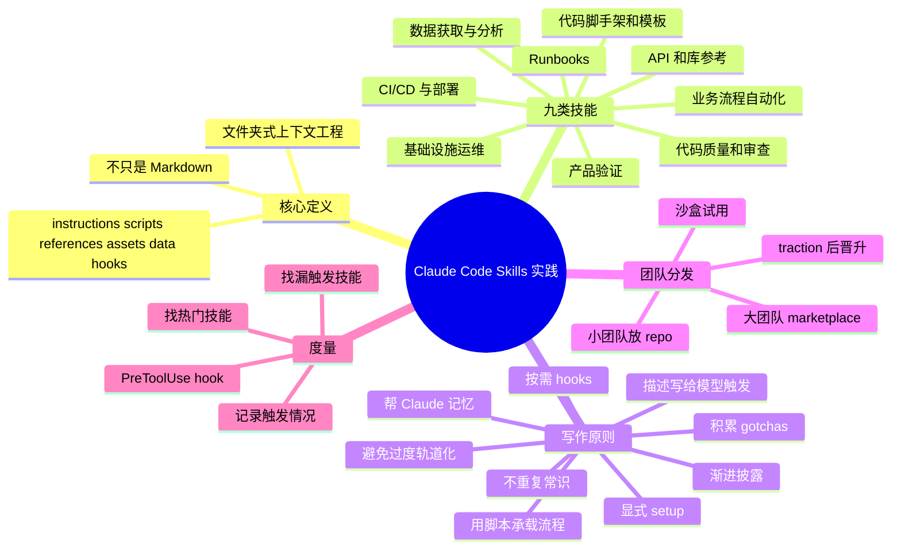

# Claude Code 团队如何使用技能

## 速读

这篇文章不是在介绍“怎么写一个 Markdown 指令文件”，而是在给出 Anthropic 内部规模化使用 Claude Code Skills 后的实践框架：技能应该被当成 Agent 可发现、可调用、可组合的操作包，里面可以有说明、脚本、参考资料、模板、数据、hooks 和持久化记忆。

最有价值的三点是：第一，Anthropic 把内部技能归纳成九类，可以直接用来检查自己的 skill library 缺口。第二，文章把高质量技能的核心放在 failure shaping 上，也就是通过 gotchas、渐进披露、脚本和验证工具减少 Agent 常见失败。第三，团队化分发不应该一开始就中央集权，先在 repo 或沙盒中试用，再按 traction 晋升到 marketplace，更符合技能从真实边缘案例中长出来的规律。

我的快速判断：这篇是非常实用的 skill 设计清单，但它带有 Claude Code 生态视角。迁移到 Codex 或其他 Agent runtime 时，原则可以复用，具体机制要映射到本地的 skill 触发、工具权限、hook 能力、持久化目录和团队分发方式。

## 原文

- 原文标题：Lessons from building Claude Code: How we use skills
- 原文 URL: https://claude.com/blog/lessons-from-building-claude-code-how-we-use-skills
- Canonical URL: https://claude.com/blog/lessons-from-building-claude-code-how-we-use-skills
- 站点：Claude / Anthropic
- 作者：Thariq Shihipar，Anthropic technical staff，负责 Claude Code 相关工作
- 发布日期：2026-06-03
- 阅读时间：页面显示 5 min
- 外链状态：只记录正文可见链接，未打开、未搜索、未核验

## 内容地图

## 关键论点

- 作者明确说法：Skills 已经成为 Claude Code 最常用的扩展点之一，Anthropic 内部有数百个技能在活跃使用。
- 作者明确说法：技能不是“just markdown files”，而是包含 instructions、scripts、assets、data 等内容的文件夹，Agent 可以发现、探索和操作这些材料。
- 作者明确说法：Anthropic 内部技能可以归成九类；好技能通常能清楚落在一类里，试图覆盖太多类别的技能容易让 Agent 困惑。
- 作者明确说法：Product verification 类技能对 Claude 输出质量的内部可测影响最大，值得专门投入工程师时间打磨。
- 作者明确说法：Gotchas section 是技能中最高信号的部分，应该从 Claude 反复踩坑的失败点中持续积累。
- 作者明确说法：渐进披露很重要，`SKILL.md` 应该指向更具体的参考文件、脚本、示例或模板，而不是把所有上下文一次塞给模型。
- 作者明确说法：技能 description 不是给人看的摘要，而是给模型判断“这个请求是否需要触发该技能”的路由描述。
- 作者明确说法：技能可以用持久化文件保存记忆，让下次执行知道上次发生了什么。
- 作者明确说法：脚本和库能让 Claude 把注意力放在组合和决策上，而不是重新造样板代码。
- 作者明确说法：按需 hooks 适合只在某些会话中启用的强约束，例如生产环境保护或冻结编辑范围。
- 作者明确说法：Anthropic 的 marketplace 不是中央团队预先决定，而是先让技能在 sandbox / Slack 等渠道自然试用，再由 owner 判断 traction 后提 PR 晋升。
- 作者明确说法：Anthropic 使用 PreToolUse hook 记录技能使用情况，用来发现热门技能或低于预期的漏触发技能。
- Agent 推断：这篇文章真正讨论的是 Agent 的“操作可靠性基础设施”，不是提示词技巧；技能的价值在于把团队知识、工具调用、验证路径和失败经验变成可复用执行环境。
- Agent 推断：最好的技能不是最完整的文档，而是能在正确时刻暴露正确上下文、并把常见错误挡在执行路径之外的路由层。
- 我的启发：写 Codex skill 时应该先问“它帮 Agent 少踩哪个已知坑、少重建哪个脚本、少遗漏哪个验证步骤”，而不是问“我能把多少背景知识塞进去”。

## 核心内容

文章开头先澄清 skills 的定位：它们是 Claude Code 的重要扩展点，灵活、易创建、易分发，但正因为太灵活，团队很容易不知道什么值得做、怎么组织、什么时候共享。Anthropic 的经验来自内部大量使用和维护数百个活跃技能。

第一层是定义。Skills 不是单个 Markdown，而是一个文件夹，可以包含指令、脚本、资源、数据、参考资料和配置；Claude Code 里还可以注册动态 hooks。作者强调，有效技能往往善用 folder structure 和配置能力，让 Agent 在需要时按需发现材料。

第二层是分类。Anthropic 把内部技能归成九类：库/API 参考、产品验证、数据获取与分析、业务流程自动化、代码脚手架、代码质量与审查、CI/CD 与部署、runbooks、基础设施运维。这个分类的实用之处在于它能帮助团队盘点缺口，也能提醒 skill owner 不要把一个技能写成跨多个语义域的大杂烩。

第三层是写作原则。作者反复强调不要写 Claude 默认就会做的常识，而要写会把 Claude 推离默认错误路径的信息。Gotchas 是最高密度材料，因为它来自真实失败。渐进披露则把上下文拆成可按情境读取的文件，例如 API 细节、stuck jobs、模板资产或脚本目录。

第四层是 agent 自主性的边界。文章提醒不要 railroading Claude：技能应该提供信息和约束，但不能把所有场景都写死。相反，需要在 setup、配置、用户提问、持久化记忆和 on-demand hooks 上给 Agent 留出适配空间。

第五层是团队化分发。小团队可以把技能放在 repo 里，但每个 repo skill 都会增加一点模型上下文；规模变大后，内部 plugin marketplace 可以让团队按需安装。Anthropic 的做法是先让 owner 在 GitHub sandbox、Slack 等地方试用，得到 traction 后再提 PR 进入 marketplace。

最后，文章讨论组合和度量。技能之间没有原生 marketplace 依赖管理，但可以在文本中引用其他技能名，由模型在安装可用时调用。度量方面，Anthropic 用 PreToolUse hook 记录技能使用，观察哪些技能受欢迎、哪些低于预期触发。

## 关键洞察

- 技能的单位应该是“可执行上下文包”，不是“知识摘要页”。文件系统、脚本和模板是技能能力的一部分。
- 技能分类本身就是一种团队操作架构：每一类对应一个 Agent 高频失败面或重复执行面。
- Product verification 被特别强调，说明 Agent 工程的核心质量杠杆不是生成速度，而是验收路径是否具体、可重复、可观察。
- Gotchas 是从真实失败中长出来的，因此高质量技能需要持续运营，不是一次写完。
- 渐进披露解决的是上下文预算和触发精度的矛盾：入口文件要短，但要能把 Agent 指向正确的深层材料。
- Description 是模型路由接口。写给人看的漂亮简介，反而可能让模型在该触发时不触发。
- On-demand hooks 是技能和权限/安全边界连接的地方，适合临时强化约束，而不是把所有保护都做成全局噪音。
- Marketplace 的关键不是“集中收藏”，而是降低安装和发现成本，同时避免所有技能都常驻上下文。

## 批判性点评

这篇文章的强项是实践密度高。它没有停留在“写清楚说明”这种泛泛建议，而是把技能拆到分类、gotchas、progressive disclosure、setup、memory、scripts、hooks、distribution、measurement 这些可操作层面。

但文章的证据主要来自 Anthropic 内部经验，尤其是“verification skills measurable impact 最大”这个判断，页面没有披露测量口径、样本范围或对照实验。因此在引用时应把它当成 Anthropic 的内部经验陈述，而不是跨团队已验证定律。

它也天然服务于 Claude Code / Claude plugin ecosystem。迁移到 Codex 时，需要重新映射几个点：Claude 的 dynamic hooks 对应什么；持久化目录在哪里；skill description 的触发机制是否相同；工具权限和用户确认如何表达；marketplace 是否存在；多 skill composition 是否有稳定协议。

文章没有深入讨论技能之间的冲突治理。例如多个技能同时触发、hook 规则冲突、同类技能重复、旧技能过时、skill memory 污染、团队 marketplace 权限边界等问题。对于真正大规模的 agent workflow，这些可能比“怎么写第一个好技能”更难。

## 对我的启发

- 本 wiki 的 skill 可以继续强化 gotchas：把每次 agent 犯过的路径边界错误、目录误用、frontmatter 遗漏、限流恢复方式沉淀到触发技能里。
- 对 `ai-wiki-*` cook / ingest 技能，入口 `SKILL.md` 应保持短而强，细节规则放到脚本、模板和 references，避免把所有上下文一次塞满。
- 验证类技能值得单独投资。比如 raw diff、Obsidian doctor、vault sync、HAT runner 这些不是附属工具，而是 Agent 可靠性的主要抓手。
- 技能 description 应该优先写触发场景和反触发场景，而不是写“这个技能很强大”。这和本 repo 当前的 DSL-backed skill contract 方向一致。
- 团队共享技能时，可以借鉴 sandbox -> traction -> marketplace 的路径：先让具体 workflow 经受真实任务，再决定是否全局安装。

## 可以继续追的问题

- Codex skill 的 description / activate_when / do_not_activate_when 与 Claude Code skill description 在触发机制上有哪些差异？
- 对 `ai-wiki-*` 技能，哪些 gotchas 应该留在 AGENTS.md，哪些应该下沉到类型专属 skill？
- 验证类技能的“measurable impact”在本 repo 可以怎么量化：减少返工次数、减少违规路径、减少缺失 frontmatter，还是提高一次成功率？
- 多个技能同时适用时，应该如何定义优先级、组合顺序和冲突解决？
- Skill memory 应该放在哪里，如何防止把一次性项目状态污染成长期规则？
- 对团队 marketplace，什么样的 traction 足以证明一个技能应该晋升？

## 信息图

![[human/raw/inbox/cook-blog/assets/2026-06-05_Claude_Code团队如何使用技能_Anthropic/infographic.webp]]

## 遗漏与不确定

- 正文外链未打开、未搜索、未核验；这里只记录为可见线索。
- 文章提到 Anthropic 内部有数百个 active skills，并称 verification skills 内部影响最大；note 只作为作者明确说法记录，未做外部事实核验。
- 页面没有暴露完整内部技能样本、衡量方法或 hook 记录 schema；这些属于未公开实现细节。
- 信息图是基于 cooked understanding 生成的复习辅助图，不是原文图表复刻。
- 本 note 没有进入 canonical ingest / compile；如果后续要沉淀到 `human/raw` 或 `concepts/`，需要另行按 human inbox workflow 流转。

## Source Manifest

- Input URL: https://claude.com/blog/lessons-from-building-claude-code-how-we-use-skills
- Canonical URL: https://claude.com/blog/lessons-from-building-claude-code-how-we-use-skills
- Capture method:
  - Browser first: `agent-browser --session cook-blog-0270e620 open`, `wait --load networkidle`, `snapshot -i -u -c`, `get text 'main'`.
  - Same-page DOM extraction: `agent-browser eval --stdin` for canonical URL, metadata, headings, visible body links, images, and code-like examples.
  - No login, no account state, no search, no external links opened.
- Capture cache:
  - `.codex/cache/cook-blog/0270e620d0fc2b1d/capture.md`
  - `.codex/cache/cook-blog/0270e620d0fc2b1d/browser-first-viewport.png`
  - `.codex/cache/cook-blog/0270e620d0fc2b1d/imagegen-original.png`
- Infographic:
  - `human/inbox/cook-blog/assets/2026-06-05_Claude_Code团队如何使用技能_Anthropic/infographic.webp`
- Exclusions:
  - Excluded navigation, login, sales CTA, pricing CTA, footer, newsletter signup, global product/resource menus, social links, and related post cards.
  - Did not open body links, related posts, mirrors, search results, third-party caches, or account-gated pages.
- Limitations:
  - External links are visible article references only and are not verified.
  - Internal Anthropic metrics and judgments are preserved as article claims, not independently fact-checked.
