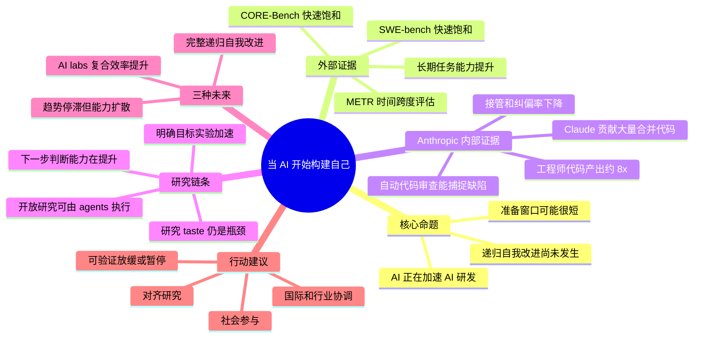

# 当 AI 开始构建自己

## 速读

Anthropic Institute 这篇文章的核心不是简单宣称“递归自我改进已经发生”，而是提出一个更实际的判断：AI 已经显著加速 AI 研发链条，尤其是编码、实验执行、调试和批量探索；如果这种趋势继续，完整递归自我改进可能比多数机构准备得更早到来。

文章最值得保留的点有三个。第一，作者把“AI 构建 AI”拆成可观察的中间阶段，而不是只讨论终局。第二，文章用了 Anthropic 内部工程和研究数据来说明 AI 已经改变研发组织的吞吐。第三，作者认为瓶颈正在从“谁来做”转向“谁来定方向、审查、验证、协调”，这也是安全与治理问题变难的地方。

我的快速判断：这是一篇强立场文章，既是能力趋势报告，也是治理倡议。它的证据很密，但很多关键数据来自 Anthropic 内部，需要按“作者披露”而不是“外部共识”来使用。

## 原文

- 原文标题：When AI builds itself
- 原文 URL: https://www.anthropic.com/institute/recursive-self-improvement
- 站点：Anthropic
- 作者信息：正文末尾说明 Marina Favaro 和 Jack Clark 共同撰写，并列出编辑、视觉、数据和反馈贡献者。
- 发布日期：页面主体和同 URL metadata 中未捕获到明确发布日期。
- 外链状态：正文和脚注中的外链只记录为可见线索，未打开、未搜索、未核验。

## 内容地图

## 关键论点

- 作者明确说法：AI 系统已经在加速 AI 系统自身的开发，但完整递归自我改进还没有到来，也并非必然。
- 作者明确说法：公共基准显示 AI 可独立完成任务的时间跨度在快速增长，文章引用的说法是大约每四个月翻倍。
- 作者明确说法：Anthropic 内部工程数据表明，Claude 已经贡献了大量合并到生产代码库的代码；文章给出的数字是超过 80%。
- 作者明确说法：文章称 2026 年第二季度典型工程师每天合并的代码量约为 2024 年的 8 倍，但也承认用代码行衡量生产率会高估真实收益。
- 作者明确说法：Claude 在明确目标的实验优化任务上，从约 3x 加速提升到约 52x；这说明“执行既定实验”的部分正在快速自动化。
- 作者明确说法：开放式研究仍保留关键的人类角色：选择问题、制定评分、判断结果是否可信。
- 作者明确说法：未来可能不是单一路径，而是至少三种情形：趋势放缓但扩散、AI labs 复合效率提升、完整递归自我改进。
- Agent 推断：文章真正关心的不是“AI 会不会写代码”，而是“研发组织里的 Amdahl 瓶颈会迁移到哪里”。当执行成本下降后，目标选择、验证和治理成为新的稀缺资源。
- Agent 推断：这篇文章把 Anthropic 的内部效率跃迁用作公共治理论证：如果领先实验室内部已经出现复合加速，那么社会协调机制需要提前设计，而不能等终局信号出现。
- 我的启发：观察 AI 研发自动化时，不应该只看模型基准，还要看组织指标：人均可 steering 的任务数、审查积压、实验吞吐、错误发现速度、方向选择质量。

## 核心内容

文章先把递归自我改进放在一个连续谱上：早期 Claude 研发主要由人写代码；随后聊天机器人辅助生成片段；再到编码 agent 能写文件、改代码、运行工具；今天的 agent 已经能运行代码并把数小时工作委派给其他 agent；未来如果闭环完成，Claude 这样的系统可能持续改进自己的后继版本。

外部证据部分依赖三个方向。第一是 METR 式长期任务能力：AI 独立可靠完成任务的时长在增长。第二是 SWE-bench：模型在真实开源代码库修 bug 的表现快速提升。第三是 CORE-Bench：模型复现实验研究结果的能力快速提升。作者用这些基准说明模型能力不只是在短问答上增强，而是在更长、更真实的工程和研究任务上增强。

内部证据是文章最有信息量的部分。Anthropic 把前沿模型研发拆成工程和研究两类工作。工程里，Claude 正从“给出方法建议”转向“在目标不完整的情况下自己找方法”。研究里，Claude 已经很擅长执行一个被清楚定义的实验，但在决定什么问题值得研究、什么结果可信、什么时候该放弃路线方面仍有差距。

文章列了几组内部数字：超过 80% 的合并生产代码可归因于 Claude；典型工程师代码合并量约 8x；内部调研中研究人员估计 Mythos Preview 带来约 4x 输出；Claude 曾完成大规模 API 错误修复；开放任务成功率大幅提升；自动 Claude reviewer 回看历史变更时能捕捉一部分后来导致事故的缺陷。

研究侧的关键点是“执行加速”和“方向判断”之间的分离。给定明确目标和评估指标，Claude 可以通过写代码、运行实验、计时、迭代来获得很大加速。更开放的研究任务里，Claude agent 也能提出假设、测试、并行共享发现，但文章承认人类仍然选择问题和评分边界。也就是说，AI 已经很强地自动化 perspiration，但 inspiration / taste / judgment 还没有完全自动化。

随后文章讨论工作形态变化。人类角色正在从亲自写代码、亲自跑实验，转向设定目标、审查结果、验证可信度、判断哪些问题值得做。这个迁移会制造新瓶颈：如果 Claude 生成代码和实验结果的速度远超人类审查能力，组织的整体速度仍会被审查、验证和协调卡住。

最后，文章给出三种未来：趋势可能放缓但能力扩散到经济中；AI labs 可能继续获得复合效率提升，由人类设方向、AI 大规模执行；也可能出现完整递归自我改进，AI 系统能够设计并改进自己的后继系统。作者认为第二种最可能，但最担心后两种会给社会留下很少准备时间。

## 关键洞察

- 递归自我改进不是突然出现的魔法事件，而可能是研发流程中一个个环节自动化后的闭环结果。
- “AI 写了多少代码”不是最好的终局指标，但它是组织形态变化的早期信号：人类从 maker 变成 reviewer / director。
- 文章把研究 taste 视为当前人类比较优势，但也暗示它可能像其他“软能力”一样被模型逐步追上。
- 如果执行成本接近零，人类时间会集中到更上游的判断；这会让错误目标、错误评估和治理失败的代价更大。
- Amdahl's law 是理解 AI 组织变革的好框架：局部环节提速后，系统速度由未提速的瓶颈决定。
- 治理难点不只是“是否暂停”，而是“如何验证别人也暂停”。训练运行比传统军控对象更难发现、更难归因，也更容易秘密继续。

## 批判性点评

这篇文章的优点是把宏大问题拆成了可观察的中间证据：代码归因、产出速度、接管率、实验优化、开放研究 agent、审查瓶颈。这比单纯讨论 AGI 时间线更有操作性。

但它也有明显立场。内部数据来自 Anthropic 自身，读者很难复核定义、抽样、归因 pipeline、工作负载变化和组织激励。比如“超过 80% 合并代码可归因 Claude”和“8x 代码产出”很有冲击力，但真实生产率、代码质量、维护成本、事故率、审查负担是否同比例改善，文章没有给出同等强度的外部验证。

文章对“研究 taste 可能被模型追上”的推断也值得谨慎。它给出的证据说明模型下一步建议能力在改善，但这和长期自主地提出有价值问题、识别世界模型缺口、建立新范式之间还有距离。作者承认这种不确定性，但整体叙事倾向于把自动化执行的复合效应视为足够强的准备信号。

治理建议部分也有张力。作者认为可验证暂停选项有价值，但同时承认多国、多实验室验证极难、时间又不够。这个结论会自然导向“现在就要做协调研究”，但具体机制仍然偏抽象。真正困难的问题可能在于：谁有权定义触发暂停的阈值，谁能检查算力和训练活动，如何防止验证机制本身泄露敏感能力或成为地缘工具。

## 对我的启发

- 做 AI 研发效率观察时，要把“代码生成能力”升级为“研发闭环自动化程度”：目标设定、任务分解、实现、运行、评估、审查、修复、复盘分别到了哪一步。
- 对个人和团队来说，能力杠杆可能从“我能不能写得更快”变成“我能不能提出更好的任务、设计更好的检查、识别 agent 输出的风险”。
- 对 AI wiki 来说，这篇可以作为“Agent 时代研发组织变化”的重要素材，但如果后续进入 canonical ingest，需要把 Anthropic 自述、外部 benchmark、治理主张分开建证据链。
- 读类似文章时要保留三层标注：作者披露的数据、作者基于数据做的趋势推断、我自己的行动启发。混在一起会把宣传、研究和决策建议揉成一团。

## 可以继续追的问题

- “Claude 贡献大量合并代码”中的 attribution pipeline 如何定义？自动生成、修改、重构、复制、review suggestion 分别怎么算？
- 代码行数 8x 背后，缺陷率、回滚率、审查时长、维护成本和 incident rate 有没有同步变化？
- “研究 taste”能否被拆成可测子能力，例如问题选择、实验设计、结果解释、负结果识别、路线放弃？
- 如果 AI 研发速度主要受审查和验证瓶颈限制，最有效的安全投资是自动审查、形式化验证、组织流程，还是外部治理？
- 可验证暂停机制在技术上需要哪些观测信号？算力、能耗、模型权重、训练数据、实验日志，哪一种最可行？
- 对普通知识工作者来说，100 人公司做 1000 人甚至 10000 人工作的说法成立时，管理、责任和协作结构会怎么改？

## 信息图

![[human/raw/inbox/cook-blog/assets/2026-06-05_当 AI 开始构建自己_Anthropic/infographic.webp]]

## 遗漏与不确定

- 页面没有捕获到明确发布日期；note 使用的是本次 capture 时间。
- 页面没有暴露 canonical URL；Source Manifest 中保持为空。
- 文章正文和脚注链接未打开、未搜索、未核验。
- 文中大量关键数据来自 Anthropic 内部披露；本 note 只把它们作为作者明确说法记录，不当作外部已验证事实。
- 信息图是基于 cooked understanding 生成的复习辅助图，不是原文图表复刻；精确数字仍以原文为准。

## Source Manifest

- Input URL: https://www.anthropic.com/institute/recursive-self-improvement
- Canonical URL: not visible in same-URL browser/HTML capture.
- Capture method:
  - Browser first: `agent-browser open`, `agent-browser wait --load networkidle`, `agent-browser snapshot -i -u -c`, `agent-browser get text 'main'`.
  - Browser environment note: Node Playwright attempt failed because local `playwright` module was not installed.
  - Same-URL fallback: Python standard library fetched only the input URL to inspect public metadata.
- Capture cache:
  - `.codex/cache/cook-blog/9e5e9682128d06c8/capture.md`
  - `.codex/cache/cook-blog/9e5e9682128d06c8/browser-first-viewport.png`
  - `.codex/cache/cook-blog/9e5e9682128d06c8/imagegen-original.png`
- Infographic:
  - `human/inbox/cook-blog/assets/2026-06-05_当 AI 开始构建自己_Anthropic/infographic.webp`
- Exclusions:
  - Excluded navigation, footer, product/resource menus, social links, recommendation or promotional page chrome, and unrelated page structure.
  - Did not open body links, footnotes, external references, mirrors, search results, third-party caches, or account-gated pages.
- Limitations:
  - Published date and canonical URL were not available from captured page surface.
  - External links are visible article references only and are not verified.
  - Internal Anthropic metrics are preserved as article claims, not independently fact-checked.
