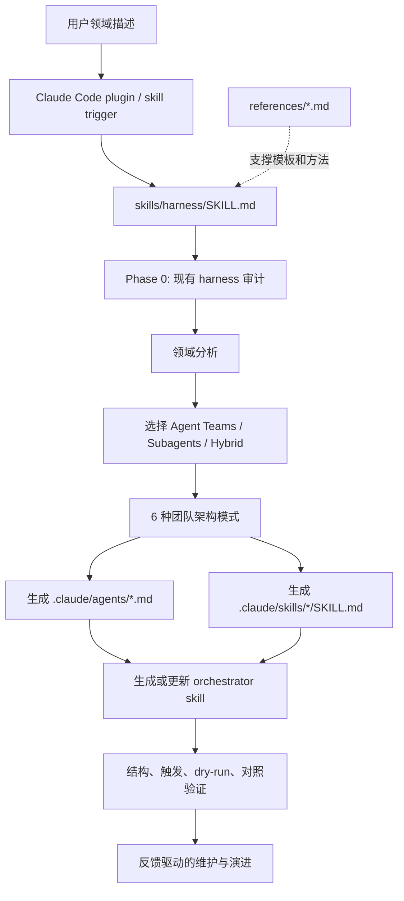

# Harness 团队架构工厂

## 速读

Harness 是一个给 Claude Code 用的 meta-skill / plugin。它的目标不是执行某个业务任务，而是根据一句领域描述，生成一套可在目标项目中复用的 agent team、skills 和 orchestrator。

这个仓库更像“团队架构生成器的说明书和模板包”，不是传统应用代码库。核心资产集中在 `skills/harness/SKILL.md` 和 `skills/harness/references/`，配套有 plugin manifest、quickstart、experimental Agent Teams 依赖说明、静态官网和 GitHub issue/PR 模板。

## 仓库定位

README 把 Harness 放在 Claude Code 生态的 L3 Meta-Factory / Team-Architecture Factory 层：它生成其他 harness，而不是自己作为业务 harness 运行。它强调的差异点是“团队架构”，也就是如何选择 Pipeline、Fan-out/Fan-in、Expert Pool、Producer-Reviewer、Supervisor、Hierarchical Delegation 等模式，并把这些模式落成 `.claude/agents/` 与 `.claude/skills/`。

`plugin.json` 中的定位也一致：Harness 是把 domain description 转成 agent team 和 skills 的 team-architecture factory，版本为 `1.2.0`，license 为 `Apache-2.0`。

## 解决什么问题

普通 agent 工作流经常停留在“单个提示词 + 一次性任务分解”。Harness 试图把这一步产品化：先分析项目/领域，再决定 agent team 结构，再生成明确的 agent 定义、skill 文件、orchestrator skill 和验证流程。

它解决的不是“某类项目怎么写代码”，而是“如何为一个领域搭出可持续演进的 agent 协作系统”。这对复杂任务有价值，因为复杂任务常常需要多角色协作、跨阶段产物传递、质量复核和后续维护。

## 项目特性

- 支持 6 种预定义团队架构模式：Pipeline、Fan-out/Fan-in、Expert Pool、Producer-Reviewer、Supervisor、Hierarchical Delegation。
- 默认使用 Claude Code Agent Teams，强调 `TeamCreate`、`SendMessage`、`TaskCreate` 的团队通信和任务状态管理。
- 支持 Subagents 作为轻量替代，但在核心 skill 中把 Agent Teams 作为优先默认。
- 输出以 Markdown 文件为主：`.claude/agents/*.md`、`.claude/skills/*/SKILL.md` 和 orchestrator skill。
- 参考资料采用 Progressive Disclosure：主 `SKILL.md` 负责流程，`references/` 按设计模式、orchestrator 模板、skill 写法、测试、QA、团队示例拆分。
- 文档内置验证思路，包括 trigger verification、dry-run、with-skill vs baseline、assertion 评分和反馈迭代。

## 典型使用方式

README 和 quickstart 给出的主路径是：

```bash
claude plugin marketplace add revfactory/harness
claude plugin install harness@harness
export CLAUDE_CODE_EXPERIMENTAL_AGENT_TEAMS=1
claude "build a harness for a fintech risk-assessment team"
```

另一条路径是把 `skills/harness` 复制到 `~/.claude/skills/harness/`，作为全局 skill 使用。Quickstart 预期结果是在当前项目生成 3-5 个领域 agent 文件和对应 skill 目录，然后用一个真实任务触发团队执行。

## 主要架构



## 代码地图

- `.claude-plugin/plugin.json`: Claude Code plugin manifest，定义名称、描述、版本、作者、license 和 keywords。
- `.claude-plugin/marketplace.json`: marketplace 包装信息，声明 `harness` package。
- `skills/harness/SKILL.md`: 核心工作流，从现状审计到领域分析、团队设计、agent/skill 生成、编排、验证和演进。
- `skills/harness/references/agent-design-patterns.md`: Agent Teams vs Subagents、6 种模式和 agent 分离/复用规则。
- `skills/harness/references/orchestrator-template.md`: Agent team、subagent、hybrid 三类 orchestrator 模板。
- `skills/harness/references/skill-writing-guide.md`: skill description、Progressive Disclosure、schema 和复用设计。
- `skills/harness/references/skill-testing-guide.md`: with-skill vs baseline、assertion、trigger eval 和迭代改进。
- `skills/harness/references/qa-agent-guide.md`: QA agent 设计，重点是跨边界一致性检查。
- `skills/harness/references/team-examples.md`: 研究、小说、webtoon、代码审查、迁移等团队配置示例。
- `docs/quickstart.md`: 5 分钟安装和首次生成流程。
- `docs/experimental-dependency.md`: Agent Teams experimental flag 的依赖、风险场景和维护承诺。
- `index.html` / `privacy.html`: 静态官网和隐私说明。

## 核心模块

`skills/harness/SKILL.md` 是主控文件。它先做 Phase 0 审计，检查目标项目已有 `.claude/agents/`、`.claude/skills/` 和 `CLAUDE.md`，再决定是新建、扩展还是维护。这个设计避免每次都从零生成，也把 harness 当成会演进的系统。

`agent-design-patterns.md` 和 `orchestrator-template.md` 是架构层核心。前者提供团队模式选择，后者把模式落成可执行的 orchestrator 结构，包括团队创建、任务分配、通信、错误处理和测试场景。

`skill-writing-guide.md`、`skill-testing-guide.md` 和 `qa-agent-guide.md` 是质量层核心。它们把 skill 写作、触发、验证、QA 边界检查和迭代改进变成可复用流程，而不是只靠一次性 prompt。

## 数据流 / 控制流

1. 用户给出领域描述或“build a harness”类请求。
2. Claude Code 触发 `harness` plugin / skill。
3. `SKILL.md` 审计目标项目已有 harness 状态，决定新建、扩展或维护。
4. skill 分析领域任务类型，选择团队模式和执行模式。
5. 生成 agent definitions、agent 使用的 skills，以及 orchestrator skill。
6. orchestrator 通过团队通信、任务状态或文件产物组织协作。
7. 验证阶段检查结构、trigger、dry-run 和对照效果。
8. 后续反馈进入演进机制，更新 agent、skill、orchestrator 或 `CLAUDE.md` 指针。

## 依赖与技术栈

仓库没有传统语言包依赖清单，未发现 `package.json`、`pyproject.toml`、`Cargo.toml`、`go.mod` 或 lockfile。它主要由 Markdown、JSON、YAML、HTML/CSS/JavaScript 和图片组成。

真正的运行依赖是 Claude Code v2.x、Claude Code plugin system 和 Agent Teams API。`docs/experimental-dependency.md` 明确说明 `TeamCreate`、`SendMessage`、`TaskCreate` 都需要 `CLAUDE_CODE_EXPERIMENTAL_AGENT_TEAMS=1`。这也是项目最大的外部接口风险。

## 设计亮点

- 它把“agent 团队设计”从口头经验变成文件化模板和流程。
- 主 skill 明确区分新建、扩展、维护，说明作者把 harness 当成长生命周期系统，而不是一次生成物。
- `references/` 拆分合理，符合 Progressive Disclosure：常用流程在主文件，长模板和方法论按需读取。
- QA 指南强调 boundary mismatch，避免只做“文件存在/模块存在”的浅层检查。
- 设计-time 使用路径适合受监管团队：先在 sandbox 生成 Markdown artifacts，再提交到生产 repo。

## 风险与不确定

- 本次没有联网核验 README/docs 中的外链、stars、SLA、生态定位或外部项目关系。
- Agent Teams API 仍由 experimental flag 控制；如果上游接口变化，Harness 的核心协作路径会受影响。
- 仓库主要是 Markdown 指令体系，静态阅读未发现随仓库固定的可执行测试或 schema validator。
- `docs/experimental-dependency.md` 提到一些计划路径或未来产物，例如 compatibility matrix、nightly compat workflow；当前 tracked file inventory 未看到对应文件。
- README 有英文、韩文、日文三语版本；本次只深入读取英文 README，没有比较多语言一致性。
- 静态网站含大量内联 JS/CSS，本次未做浏览器渲染验证。

## 对我的启发

Harness 的价值点不是“多 agent 越多越好”，而是把团队模式、角色定义、skill 触发、验证和演进写成可重读的 contract。对自己的 agent 工作流来说，值得借鉴的是：先把团队模式选择显性化，再把 agent/skill/orchestrator 的职责边界写进文件，最后用验收和反馈机制让系统持续修正。

它也提醒一个风险：如果工作流依赖某个 agent runtime 的实验接口，必须在文档和 Source Manifest 中把这个依赖写清楚。否则后续 agent 只看到“团队架构很好”，却不知道运行时前提可能已经漂移。

## 可以继续追的问题

- Harness 的 Agent Teams 依赖在当前 Claude Code 版本中是否仍需要 experimental flag？
- README 中提到的相邻项目和 benchmark 是否有可核验证据？
- `docs/experimental-dependency.md` 中提到但仓库缺失的 compatibility matrix / nightly workflow 是计划中还是遗漏？
- 这套 Harness 模式能否迁移到 Codex 的 skill / thread / subagent 体系？
- 对本 AI wiki 的长期 ingest/compile 工作流，是否可以抽象出类似的 repo-local orchestrator skill？

## 信息图

![[human/raw/inbox/cook-github/assets/2026-06-01_Harness团队架构工厂_revfactory_harness/infographic.webp]]

## Source Manifest

### Sources

- Input GitHub URL: `https://github.com/revfactory/harness`
- Normalized URL: `https://github.com/revfactory/harness`
- Requested ref: `default`
- Resolved commit: `b8fb858ea9209d6b0d9000e551d3dedbbacb88aa`
- Default branch: `main`
- Clone command: `git clone --depth 1 --no-recurse-submodules "https://github.com/revfactory/harness" ".codex/cache/cook-github/revfactory-harness-default/repo"`
- Cloned at: `2026-06-01T15:39:37+08:00`
- Cache path: `.codex/cache/cook-github/revfactory-harness-default/`
- Repo path: `.codex/cache/cook-github/revfactory-harness-default/repo/`
- Repo metadata: `.codex/cache/cook-github/revfactory-harness-default/repo-metadata.json`
- File inventory: `.codex/cache/cook-github/revfactory-harness-default/file-inventory.txt`
- Exploration report: `.codex/cache/cook-github/revfactory-harness-default/exploration-report.md`

### Sub Agent

- Low-effort 子 Agent 实际创建: yes.
- First sub Agent: Codex exec session `019e8220-53b8-7631-92b1-f95421cd3997`; completed read-only exploration but failed to write `exploration-report.md` because sandbox rejected the cache path.
- Second sub Agent: Codex exec session `019e8226-90f4-7202-92ae-3dfb4101031b`; completed read-only static exploration and wrote `.codex/cache/cook-github/revfactory-harness-default/exploration-report.md`.
- 子 Agent 边界: did not write final Obsidian note, did not generate image, did not modify cloned repo.

### Parent Files Read

- `AGENTS.md` human boundary and `human/inbox` rules.
- `/Users/ivan/.agents/docs/agents/workflows.md`
- `/Users/ivan/.agents/docs/agents/handoff-policy.md`
- `.codex/skills/ai-wiki-cook-github/SKILL.md`
- `.codex/cache/cook-github/revfactory-harness-default/exploration-report.md`
- `.codex/cache/cook-github/revfactory-harness-default/repo/README.md`
- `.codex/cache/cook-github/revfactory-harness-default/repo/.claude-plugin/plugin.json`
- `.codex/cache/cook-github/revfactory-harness-default/repo/docs/quickstart.md`
- `.codex/cache/cook-github/revfactory-harness-default/repo/docs/experimental-dependency.md`
- `.codex/cache/cook-github/revfactory-harness-default/repo/skills/harness/SKILL.md`

### Imagegen

- imagegen status: completed with built-in imagegen tool.
- imagegen original source: `/Users/ivan/.codex/generated_images/019e821d-44ca-7e33-be36-dafc23e35898/ig_084869e923a75d59016a1d3a0dea8081918c07428b9cd670f7.png`
- imagegen-original path: `.codex/cache/cook-github/revfactory-harness-default/imagegen-original.png`
- infographic path: `human/inbox/cook-github/assets/2026-06-01_Harness团队架构工厂_revfactory_harness/infographic.webp`
- conversion: `cwebp -quiet -q 92`

### Read-only Boundary

- 未运行 cloned repo 代码。
- 未安装依赖。
- 未执行 repo scripts、tests、builds、Docker、unknown binaries。
- 未初始化 submodules。
- 除 `git clone` 获取指定代码版本外，未联网补充 GitHub platform 状态，也未联网核验 stars、issues、PR、releases、Actions 或 README 网页渲染。

### Coverage Limitations

- 未覆盖 `.git/` 内部对象。
- 未深入读取 `_workspace/` 的全部历史 launch / audit 材料。
- 未读取图片二进制内容。
- 未比较 README_KO.md / README_JA.md 与 README.md 的内容一致性。
- 未浏览器渲染 `index.html`。
- 外部链接均未联网核验。
