# 近30天多源研究技能

## 速读

`mvanhorn/last30days-skill` 是一个面向 Agent Skills 生态的研究技能：用户在宿主 Agent 里调用 `/last30days <topic>`，技能通过一份很长的 `SKILL.md` 约束宿主模型如何规划、调用 Python 引擎、综合输出，再由 `skills/last30days/scripts/last30days.py` 和 `scripts/lib/` 中的模块去做多源近 30 天检索、归一化、融合排序、聚类和渲染。

它的核心主张不是“再做一个搜索引擎”，而是把 Reddit upvotes、X likes、YouTube/TikTok engagement、Hacker News 讨论、Polymarket 赔率、GitHub activity、Web citation 等分散信号统一给 Agent 使用，让 Agent 读到“人们最近真正讨论和下注的东西”。

静态阅读下，我更愿意把它理解为一个“Agent 契约驱动的研究管线”：产品价值在多源覆盖和 engagement-aware ranking，工程价值在 source adapter + 统一数据模型 + weighted RRF/rerank/cluster 的流水线，主要风险在外部平台依赖、credential surface 和超长 skill contract 对宿主 Agent 遵循度的要求。

## 仓库定位

这个仓库同时承载三层东西：

- Agent skill：`skills/last30days/SKILL.md` 是宿主模型必须遵守的运行契约，包含输出格式、预检、规划、引擎调用和合成规则。
- Python engine：`skills/last30days/scripts/last30days.py` 是 CLI 入口，`scripts/lib/` 里是规划、检索、排序、渲染、存储等核心模块。
- 分发和验证：`.claude-plugin/`、`.agents/plugins/`、`gemini-extension.json`、`.github/workflows/`、`tests/` 让它可以被 Claude Code marketplace、Agent Skills CLI 和其他宿主环境安装/验证。

## 解决什么问题

传统 Web 搜索更适合找权威网页和长期稳定资料，但很难回答“过去 30 天里，真实用户、开发者、创作者和市场在怎样反应”。这个仓库试图把这些分散平台变成 Agent 可调用的一次性研究动作。

它解决的问题可以拆成三层：

- 信息源问题：Reddit、X、YouTube、TikTok、HN、Polymarket、GitHub 等平台各有 API、auth、格式和噪声，单个 LLM 通常无法直接同时访问。
- 排序问题：单纯关键词相关性不够，项目把 engagement、freshness、source quality、rerank、fun score 和 cluster 合并，尝试把“有社会信号的证据”排到前面。
- 输出问题：宿主 Agent 不能只 dump raw results，需要按固定 voice contract 综合成简报，并保留 footer、citation、HTML brief 或 SQLite store 等后续复用入口。

## 项目特性

- 多源近实时检索：README 和 `SKILL.md` 都强调 Reddit、X、YouTube、TikTok、Instagram、Threads、HN、Polymarket、GitHub、Web、Bluesky、Truth Social、Perplexity 等来源。
- 零配置基础源：README 声称 Reddit、HN、Polymarket、GitHub 可立即工作；其他源依赖 API key、CLI、cookies 或环境变量。
- query planning：命名实体和比较类查询要求宿主模型生成 `--plan` JSON，让 engine 不只按原始关键词搜。
- cross-source cluster：同一事件或观点跨多个来源出现时，合并成 cluster，而不是机械分 source 展示。
- HTML brief：支持保存自包含、可分享的 HTML brief 到 `LAST30DAYS_MEMORY_DIR`。
- store/watchlist/briefing：`--store` 可把 findings 写入 SQLite，`watchlist.py` 和 `briefing.py` 提供 recurring monitoring 的雏形。

## 典型使用方式

README 中给出的安装入口：

```bash
/plugin marketplace add mvanhorn/last30days-skill
/plugin install last30days
```

或者面向 Codex、Cursor、Copilot、Gemini CLI 等 Agent Skills host：

```bash
npx skills add mvanhorn/last30days-skill -g
```

运行时的典型心智模型是：

```bash
/last30days OpenClaw --emit=html
```

但这不是普通 shell CLI 使用说明那么简单。`SKILL.md` 明确要求宿主 Agent 读契约、做 preflight、在命名实体场景生成 plan，并把 engine 输出转化为符合固定 voice law 的最终回答。

## 主要架构

```mermaid
flowchart LR
  User["用户调用 /last30days"] --> Skill["SKILL.md 宿主模型契约"]
  Skill --> Plan["宿主 Agent 生成 --plan 或 engine fallback"]
  Plan --> CLI["last30days.py CLI"]
  CLI --> Env["env / auth / source availability"]
  Env --> Pipeline["pipeline.run"]
  Pipeline --> Fanout["ThreadPoolExecutor 多源并发检索"]
  Fanout --> Sources["Reddit / X / YouTube / TikTok / HN / Polymarket / GitHub / Web"]
  Sources --> Normalize["normalize / signals / dedupe / snippets"]
  Normalize --> Fusion["weighted RRF"]
  Fusion --> Rerank["rerank + fun score"]
  Rerank --> Cluster["cluster candidates"]
  Cluster --> Report["schema.Report"]
  Report --> Render["compact / md / json / html"]
  Report --> Store["optional SQLite store"]
```



## 代码地图

- `README.md`：产品叙事、安装方式、v3 特性和示例。
- `skills/last30days/SKILL.md`：运行时契约，是 Agent 行为的 source of truth。
- `skills/last30days/scripts/last30days.py`：CLI parser、Python 版本检查、输出保存、engine 调用。
- `skills/last30days/scripts/lib/pipeline.py`：核心编排，包含 source availability、并发检索、thin-source retry、fusion、rerank、cluster、warnings。
- `skills/last30days/scripts/lib/schema.py`：核心 dataclass，包括 `QueryPlan`、`SourceItem`、`Candidate`、`Cluster`、`Report`。
- `skills/last30days/scripts/lib/planner.py`：LLM-first query planning 和 deterministic fallback。
- `skills/last30days/scripts/lib/fusion.py`：weighted reciprocal rank fusion、URL normalization、per-author cap、source diversity。
- `skills/last30days/scripts/lib/render.py` 和 `html_render.py`：compact/md/html 渲染，包含 badge、evidence envelope、pass-through footer。
- `skills/last30days/scripts/lib/*` source adapters：Reddit、X、YouTube、TikTok、GitHub、Polymarket、HN、Web 等检索实现。
- `skills/last30days/scripts/store.py`、`watchlist.py`、`briefing.py`：持久化、监控、简报辅助入口。
- `tests/`：覆盖 pipeline、planner、source adapter、render、setup、credential、regression 等的大量 pytest。

## 核心模块

`pipeline.py` 是最值得读的核心文件。它先根据 config、requested sources 和本机 CLI 判断可用 source，再通过 planner 得到 subqueries。之后使用 `ThreadPoolExecutor` 并行跑每个 `(subquery, source)` 检索任务，并且处理 429 rate limit、transient retry、thin-source retry 和 GitHub person/project mode 等特殊逻辑。

`schema.py` 的数据模型把多平台结果压成统一形态。`SourceItem` 是检索后的证据项，`Candidate` 是跨 query/source 融合后的候选，`Cluster` 是最终分组，`Report` 是渲染和存储的统一出口。这个模型让 source adapter 可以扩展，而后续排序和渲染逻辑不用理解每个平台的细节。

`fusion.py` 使用 weighted RRF 把多个 ranked stream 合并，并加入 URL normalization、tracking param stripping、每作者最多 3 条、每 source 多样性保留等规则。这个设计说明项目不是只靠 LLM rerank，前置排序也承担了一部分“防单源/单作者霸屏”的工程约束。

`SKILL.md` 本身也是核心模块。它定义输出 LAW、badge、footer pass-through、`--plan` 责任、citation 形态和错误模式。这种“用超长契约约束宿主模型”的设计很有意思，也暴露了项目的主要脆弱点：如果宿主 Agent 没读完或没遵守，Python engine 再强也可能输出不符合产品预期的结果。

## 数据流 / 控制流

1. 用户在支持 Agent Skills 的宿主环境调用 `/last30days <topic>`。
2. 宿主 Agent 读取 `SKILL.md`，根据 topic 做 preflight 和 query quality 判断。
3. 对命名实体、人物、产品、比较类主题，宿主 Agent 应生成 `--plan` JSON，避免 engine 只做 deterministic fallback。
4. `last30days.py` 解析参数、加载 env、选择输出模式，并调用 `pipeline.run`。
5. `pipeline.run` 判断可用 source，包括无需 key 的源、需要 CLI 的源、需要 API/cookie 的源。
6. 多个 subquery/source 组合并发检索，raw items 进入 normalize/signals/dedupe/snippet。
7. Pipeline 做 supplemental entity search、thin-source retry、weighted RRF、rerank、fun scoring、GitHub star enrichment、cluster。
8. `Report` 被渲染成 compact/md/json/html；可选写入 SQLite store。
9. 宿主 Agent 从 compact evidence 中综合用户可读简报，并保留 engine footer。

## 依赖与技术栈

- Python：`>=3.12`。
- 包管理：`uv`。
- runtime Python dependencies：`pyproject.toml` 中为空，项目主要使用 stdlib 和外部 CLI/API。
- dev dependencies：`pytest`、`pytest-cov`。
- 外部 CLI：`gh`、`yt-dlp`、`digg-pp-cli`、`node` 等按源启用。
- 外部服务：ScrapeCreators、xAI、OpenRouter、Brave/Exa/Serper/Parallel、Bluesky、TruthSocial、Codex/OpenAI/Gemini auth 等。
- 持久化：SQLite + FTS5。
- CI：GitHub Actions `validate.yml` 使用 `uv run pytest`；`release.yml` 构建 `.skill` release asset；`security.yml` 做 advisory-first security checks。

## 设计亮点

- 把 Agent 契约和 Python engine 分开：`SKILL.md` 负责“宿主模型应该怎样思考和输出”，Python 负责“可复现的数据采集和排序”。
- source adapter 可扩展：多源检索差异封装在 adapter，统一模型落在 `SourceItem`、`Candidate`、`Report`。
- 排序不只靠 LLM：normalize、signals、dedupe、weighted RRF、per-author cap、source diversity 都在 rerank 前提供工程约束。
- 对 Agent 失误有显式 backstop：`SKILL.md` 和 `render.py` 中都能看到针对历史 failure mode 的注释和输出边界，比如 evidence envelope、pass-through footer、degraded warning。
- 输出形态兼顾即时回答和复用：compact 给宿主模型合成，HTML brief 给人分享，SQLite store/watchlist 给长期监控。

## 批判性点评

这个仓库的表达非常有冲击力，README 把“Google 搜 editor，/last30days 搜 people”这个定位说得很清楚；但它也带有强烈产品宣言色彩，部分 claim 需要运行验证才知道实际可靠性，例如 README 中的测试数量、source 覆盖稳定性、不同宿主环境是否都能严格执行 `SKILL.md` 契约。

从架构上看，最值得欣赏的是它没有把“Agent 能力”神秘化：规划、检索、融合、聚类、渲染都有清晰模块。但最不稳定的部分也正是 Agent 层。`SKILL.md` 太长且高度规定化，里面有很多针对历史失败的 LAW 和 self-check，这说明项目正在用 prompt contract 纠正宿主模型漂移。短期有效，长期可能需要更多 machine-checkable contract 或更薄的宿主侧协议。

外部依赖边界也很宽。一个“多源社会化搜索”产品天然依赖平台 API、cookie、CLI、rate limit、scraper 服务和付费 key；仓库有 diagnose、env、secret masking、permission warnings，但这类系统的可用性很难只靠静态代码保证。对个人研究工具来说这是可接受的权衡；对团队生产环境，则需要把 credential hygiene、source failure handling 和合规边界单独设计。

## 风险与不确定

- 本次只做静态阅读，没有运行代码、安装依赖、执行测试、构建或 Docker，因此没有验证 README 的通过测试 claim 和实际 source 可用性。
- 多个 source 依赖外部平台和 credential，真实效果会随 API、cookies、rate limit 和本机 CLI 状态波动。
- `SKILL.md` 的 contract 很长，宿主 Agent 若跳读或偏离，最终输出可能不符合项目要求。
- security workflow 当前是 advisory-first，`continue-on-error` 意味着它提供可见性，但未必阻断风险。
- vendored Bird/X client 只做了目录级了解，没有深入审计。
- 本次没有逐个阅读所有 source adapter 和测试文件，coverage 是代表性而非穷尽式。

## 对我的启发

这个项目很适合作为“Agent 技能产品化”的案例：真正的产品不是某一个 Python API，而是一组可被宿主模型正确调用的行为契约、一个可复现的数据引擎、一套输出格式约束，以及围绕失败模式持续收紧的 guardrails。

对 AI wiki 来说，它也提醒我：如果要记录“最近 30 天的社会信号”，不能只依赖单一网页搜索。很多有价值的判断来自跨平台对齐：社区讨论、代码提交、视频长讲解、短视频传播、市场赔率、GitHub issue/PR、新闻引用之间互证或冲突，才是高价值的学习材料。

## 可以继续追的问题

- `SKILL.md` 这种超长 contract 有没有更可维护的 DSL 或 schema 化表达？
- 多源社会信号排序中，engagement、freshness、source quality、LLM rerank 的权重如何校准？
- 这种工具在 Codex/Claude/Cursor/Gemini 等不同宿主上，实际 contract compliance 差异有多大？
- 对个人研究和团队情报系统，哪些 source 应默认开启，哪些必须显式 opt-in？
- SQLite store/watchlist 能否演化成持续知识图谱输入，而不只是一次性 briefing？

## 信息图

![[human/raw/inbox/cook-github/assets/2026-06-09_近30天多源研究技能_mvanhorn_last30days-skill/infographic.webp]]

## Source Manifest

- Input GitHub URL: `https://github.com/mvanhorn/last30days-skill`
- Normalized URL: `https://github.com/mvanhorn/last30days-skill`
- Requested ref: `default`
- Resolved commit: `122158415ae421da83e739f2668032f6bc78d39c`
- Default branch: `main`
- Clone command: `git clone --depth 1 --no-recurse-submodules "https://github.com/mvanhorn/last30days-skill" ".codex/cache/cook-github/mvanhorn-last30days-skill-default/repo"`
- Cloned at: `2026-06-09T16:38:38+08:00`
- Cache path: `.codex/cache/cook-github/mvanhorn-last30days-skill-default`
- Repo path: `.codex/cache/cook-github/mvanhorn-last30days-skill-default/repo`
- Repo metadata path: `.codex/cache/cook-github/mvanhorn-last30days-skill-default/repo-metadata.json`
- File inventory path: `.codex/cache/cook-github/mvanhorn-last30days-skill-default/file-inventory.txt`
- Exploration report path: `.codex/cache/cook-github/mvanhorn-last30days-skill-default/exploration-report.md`
- 子 Agent: created and completed (`019eab89-2f51-7301-b5d1-df130f68adc5`); 子 Agent 只返回 Markdown 探索报告，父 Agent 将报告落盘到 cache。
- 父 Agent 补读关键文件: `README.md`, `pyproject.toml`, `skills/last30days/SKILL.md`, `CONFIGURATION.md`, `skills/last30days/scripts/last30days.py`, `skills/last30days/scripts/lib/pipeline.py`, `skills/last30days/scripts/lib/fusion.py`, `skills/last30days/scripts/lib/render.py`, `skills/last30days/scripts/lib/schema.py`, `skills/last30days/scripts/lib/planner.py`, `tests/test_pipeline_v3.py`。
- Imagegen status: built-in imagegen completed.
- Imagegen original path: `.codex/cache/cook-github/mvanhorn-last30days-skill-default/imagegen-original.png`
- Infographic path: `human/inbox/cook-github/assets/2026-06-09_近30天多源研究技能_mvanhorn_last30days-skill/infographic.webp`
- Read-only boundary: 未运行仓库代码，未安装依赖，未执行测试、构建、Docker、未知二进制或 submodule 初始化。
- Coverage limitations: 未逐个阅读所有 source adapter、vendored Bird/X client、fixtures、media、全部 tests 和 release docs；未查询 GitHub stars、issues、PR、releases、Actions 当前状态；issues: none。
