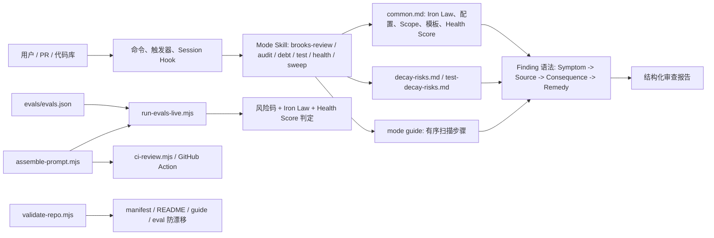

# brooks-lint：AI 审查 Slop 治理

## 速读

`brooks-lint` 解决的不是传统 linter 的问题，而是 AI 代码审查里的 **slop**：泛泛而谈、缺少证据、引用漂浮、严重度随心情变化、修复建议先于诊断、以及今天能指出明天又漏掉的模型输出漂移。

它的核心办法不是写一个 AST 静态分析器，而是把“好审查”做成一套 Agent Skill 协议：固定风险词表、固定诊断链、固定输出模板、固定误报护栏、固定 eval 回归、固定跨平台安装布局。换句话说，它把模型的自由发挥压进一个可检查的工程框架里。

我最值得带走的一句话：**brooks-lint 把 slop 从“模型品味问题”改造成“协议、证据和回归测试问题”。**

## 仓库定位

README 把它定位为“植根于十二本经典工程著作的 AI 代码审查”。它提供多个 Agent Skills，用于 PR review、架构审计、技术债评估、测试质量审查、健康仪表盘和全量 sweep。

这不是 ESLint / Pylint 那类规则引擎。它更像一套给 Claude、Codex、Gemini 等 coding agent 使用的审查操作系统：当用户要求 review、audit、debt、test quality 时，agent 先加载 skill，再按 Markdown 里的步骤读代码、归类风险、生成报告。

## 解决什么问题

它主要在治四类 AI 审查 slop：

1. **泛泛建议**：例如“这里可以优化一下”“建议增加错误处理”，没有说清楚问题、来源、后果和具体动作。
2. **引用 slop**：随口提 Clean Architecture / DDD / Refactoring，但没有把观察到的症状映射到具体原则或 smell。
3. **误报 slop**：AI 看到相似形状就套规则，比如把合理的 composition root 误判为依赖倒置问题。
4. **漂移 slop**：同样输入下，不同时间、不同模式、不同平台给出风格和标准都不一致的审查结果。

`brooks-lint` 的解法是把这些弱点拆成可控环节：触发边界、扫描步骤、风险词表、严重度阈值、报告格式、false-positive guard、eval runner、repo validator。

## 项目特性

- **十二本书做来源锚**：README 和 `source-coverage.md` 将 Brooks、Fowler、McConnell、Martin、DDD、Ousterhout、Google Testing 等经典来源映射到风险维度。
- **六类生产代码衰退风险**：R1-R6，覆盖认知过载、变更扩散、知识重复、偶发复杂度、依赖失序、领域模型失真。
- **六类测试衰退风险**：T1-T6，覆盖测试晦涩、脆弱测试、测试重复、mock 滥用、覆盖率幻觉、测试架构错配。
- **Iron Law**：`skills/_shared/common.md` 明确要求每个 finding 必须遵循 `Symptom -> Source -> Consequence -> Remedy`，并且不能先给 fix 再补诊断。
- **What Not to Flag**：每个风险定义都有“不要误报”的反例护栏，专门抑制过度自信的 AI 审查。
- **同一 prompt 组装入口**：`scripts/assemble-prompt.mjs` 同时供 CI review 和 live eval 使用，避免 CI 和 eval 的规则源分叉。
- **eval 回归**：`evals/evals.json` 包含正例和 clean case，`run-evals-live.mjs` 用风险码、Iron Law 字段和 Health Score 对模型输出做自动判定。
- **repo 自检**：`validate-repo.mjs` 检查版本、manifest、README、风险数量、guide step、eval 数量等，防止 skill 包自身腐烂。

## 典型使用方式

交互式使用时，用户不直接背风险表，而是调用命令或触发 skill：

```text
/brooks-review   -> PR 级审查
/brooks-audit    -> 架构审计
/brooks-debt     -> 技术债评估
/brooks-test     -> 测试质量审查
/brooks-health   -> 健康仪表盘
/brooks-sweep    -> 扫描并尝试修复
```

CI 使用时，GitHub Action 或 `scripts/ci-review.mjs` 会读取 git diff，组装同一套 shared framework 和 mode guide，然后调用模型生成 JSON 报告，提取 Health Score，并可按阈值失败。

项目也支持 `.brooks-lint.yaml`，用于关闭某些风险、只聚焦某些风险、覆盖严重度、忽略生成文件、记录 suppression，甚至定义项目特有的 `Cx` 风险。

## 主要架构



## 代码地图

- `skills/_shared/common.md`：中心契约，定义 Iron Law、scope detection、报告模板、Health Score、配置、triage 和 history。
- `skills/_shared/decay-risks.md`：R1-R6 生产风险，每个都有症状、来源、严重度和误报护栏。
- `skills/_shared/test-decay-risks.md`：T1-T6 测试风险，专门治理“看起来像测试但不保护行为”的 AI 测试 slop。
- `skills/_shared/source-coverage.md`：书目到原则的证据表，降低“假引用”和“名词贴纸”风险。
- `skills/brooks-review/pr-review-guide.md`：PR review 的具体扫描顺序，先看变更扩散，再看认知负荷、重复、偶发复杂度、依赖、领域建模和快速测试检查。
- `skills/brooks-audit/architecture-guide.md`：架构审计，要求先画 Mermaid 依赖图，再把节点严重度着色。
- `skills/brooks-debt/debt-guide.md`：技术债用 `Pain x Spread` 做优先级排序，把“感觉很烂”转成还债路线图。
- `scripts/assemble-prompt.mjs`：把 shared files 和 mode guide 拼成系统提示，是 CI 和 eval 的共同入口。
- `scripts/eval-utils.mjs`：用风险码、Iron Law 字段、Health Score 和 false-positive 标记分类输出。
- `scripts/validate-repo.mjs`：meta-lint，防止这个 lint skill 自己发生规则漂移。

## 核心模块

### Iron Law

`common.md` 里的 Iron Law 是 anti-slop 的第一道闸门：

```text
NEVER suggest fixes before completing risk diagnosis.
EVERY finding must follow: Symptom -> Source -> Consequence -> Remedy.
```

这个约束把“我觉得可以优化”变成四段证据链：你必须说明看到什么症状、来自哪个原则或 smell、不修会导致什么后果、应该怎么改。AI 最容易滑向空泛建议，而 Iron Law 刚好卡住这个滑坡。

### 风险词表

R1-R6 和 T1-T6 是统一 vocabulary。它让不同 agent、不同模式、不同报告都围绕同一组名字讨论质量问题，而不是一会儿叫 complexity、一会儿叫 maintainability、一会儿叫 smell。

这点很关键：slop 往往来自词汇不稳定。词汇稳定以后，审查结果才有可能累积、比较、回归。

### 误报护栏

每个风险都有 `What Not to Flag`。例如：composition root 里依赖具体实现，不自动等于 DIP violation；薄 wrapper 如果是在吸收 vendor churn，也不自动是 middle-man。

这套反例比正例还重要。没有它，AI review 很容易变成“看到模式就扣帽子”的过拟合机器。

### eval 与 validator

`evals/evals.json` 不只写“应该发现 R1/R2”，还写 clean case：当代码已经清晰、架构依赖方向正确、测试意图明确时，不应误报对应风险。

`run-evals-live.mjs` 的判定不是完美语义评审，但它抓住了几个 slop 指标：有没有风险码、有没有 Iron Law 字段、有没有 Health Score、有没有在 clean case 乱报。`validate-repo.mjs` 则保护 skill 包本身：版本、描述、书目数量、风险数量、guide step、eval 数量不能悄悄漂移。

## 数据流 / 控制流

1. 用户发起 review/audit/debt/test/health/sweep。
2. Agent 平台通过命令或 `SKILL.md` 触发对应 skill。
3. Skill 要求先读 `_shared/common.md`、`source-coverage.md`、风险定义和 mode guide。
4. Agent 读取 `.brooks-lint.yaml`，应用 disable/focus/severity/ignore/suppress/custom risks。
5. Mode guide 决定扫描顺序和 scope。
6. Agent 读 diff、文件、imports、测试或目录结构。
7. 每条发现都必须落到 Iron Law 四段式。
8. 严重度根据风险文件里的阈值校准。
9. Health Score 按 severity 扣分。
10. 报告按固定模板输出；CI / eval 通过同一 prompt assembly 复现这套流程。

## 依赖与技术栈

它的技术栈很轻：

- Markdown Agent Skills 是主体。
- Node.js ESM scripts 做 prompt 组装、CI 调用、eval、repo validation、安装和版本辅助。
- `@anthropic-ai/sdk` 用于 live eval 和 CI review。
- Mermaid 用于架构图和报告可视化。
- Shell hook / installer 用于跨 Claude、Codex、Gemini 等环境分发。

更准确地说，它把“审查能力”存在 Markdown 协议里，把“防漂移能力”存在 Node 脚本和 eval 里。

## 设计亮点

第一，**它没有把 slop 归咎于模型不够聪明**。README 里直接说差距不是 Claude 能不能发现，而是能否每次稳定发现、引用、标严重度、给 remedy。这个判断很成熟：模型能力不是瓶颈，流程约束和回归机制才是瓶颈。

第二，**它把 book citation 做成约束，而不是装饰**。真正有用的不是“引用了 Fowler”，而是 `Symptom -> Source -> Consequence -> Remedy` 中的 Source 必须对应 observed symptom。否则引用就只是权威贴纸。

第三，**它把 false positive 当一等公民**。很多 AI quality 工具只追求“多发现”，brooks-lint 明确写了 `What Not to Flag` 和 clean evals，说明作者知道 slop 也包括过度诊断。

第四，**它有 meta-lint**。`validate-repo.mjs` 检查 skill、README、manifest、eval、guide 是否同步，这对一个 Markdown 驱动的插件尤其重要，因为这种项目最容易规则散落、文档过期、触发边界变模糊。

## 批判性点评

它的强项是把 agent 行为协议化，但它不是确定性静态分析器。核心诊断仍然依赖模型遵守 Markdown 指令、正确阅读代码、正确映射风险。所以它降低 slop，不是消灭 slop。

live eval 的自动判定也偏浅：`eval-utils.mjs` 主要看风险码、Iron Law 字段和 Health Score。这能抓格式漂移和明显漏判，但不能完全证明诊断语义正确。也就是说，它是一套很好的“契约测试”，但还不是完整的 oracle。

另外，书目引用本身是二次总结。`source-coverage.md` 帮助减少假引用，但没有为每个 finding 提供可验证页码级证据。对内部工程使用足够，对严肃研究引用则还需要更强来源链。

最后，`brooks-sweep` 的自动修复模式风险最高。它写了 consent gate 和 fix classification，但真正安全仍依赖项目测试、agent 判断和人类 review。这里适合当“带刹车的执行协议”，不该当无监督修复器。

## 风险与不确定

- 未运行仓库代码、未安装依赖、未执行 tests/build/Docker，因此没有验证脚本实际通过。
- 没有联网核验 README 外链、GitHub stars、issue、release 或 Actions 状态。
- 仓库是 shallow clone 默认分支，未初始化 submodules。
- 子 Agent 和父 Agent 都是静态阅读，可能遗漏大文档深处或历史设计讨论。
- 图片信息图是二次表达，适合辅助复习，不应替代正文证据。

## 对我的启发

如果我要治理自己的 agent / skill slop，brooks-lint 给出的不是“写更强 prompt”，而是这些工程动作：

- 给问题域建立固定 taxonomy，别让 agent 临场发明分类。
- 每条输出都要求 evidence chain，而不是只要建议。
- 为每个规则写反例护栏，防止模型过拟合。
- 把交互式 skill 和 CI/eval 共用同一个 prompt assembly。
- 给 clean case 写 eval，专门测试“不该说话时闭嘴”。
- 给 skill 仓库本身写 validator，防止文档、manifest、guide、eval 互相漂移。

## 可以继续追的问题

- 能否把 live eval 从“风险码+字段检查”升级成 semantic grader，检查 finding 是否真的引用了对应代码症状？
- 能否把 `What Not to Flag` 变成更多 clean eval，而不是只停留在文档约束？
- 对于大型代码库，如何把 prompt/rubric 工作流和 AST / dependency graph / coverage 数据结合，减少模型凭阅读推断的误差？
- `brooks-sweep` 的 Safe / Extended-Safe / Residual 分类能否沉淀为更强的 HAT 或人类确认协议？

## 信息图

![[human/raw/inbox/cook-github/assets/2026-06-10_AI审查Slop治理_brooks-lint_hyhmrright_brooks-lint/infographic.webp]]

## Source Manifest

### Sources

- Input GitHub URL: https://github.com/hyhmrright/brooks-lint
- Normalized URL: https://github.com/hyhmrright/brooks-lint
- Requested ref: default
- Resolved commit: `0e92503911f28ff091b14c017d4345f7a2dd8817`
- Default branch: `main`
- Clone command: `git clone --depth 1 --no-recurse-submodules "https://github.com/hyhmrright/brooks-lint" ".codex/cache/cook-github/hyhmrright-brooks-lint-default/repo"`
- Cloned at: `2026-06-10T12:10:34+0800`
- Cache path: `.codex/cache/cook-github/hyhmrright-brooks-lint-default`
- Repo path: `.codex/cache/cook-github/hyhmrright-brooks-lint-default/repo`
- Repo metadata: `.codex/cache/cook-github/hyhmrright-brooks-lint-default/repo-metadata.json`
- File inventory: `.codex/cache/cook-github/hyhmrright-brooks-lint-default/file-inventory.txt`
- Exploration report: `.codex/cache/cook-github/hyhmrright-brooks-lint-default/exploration-report.md`

### Child Agent

- 子 Agent: completed.
- 子 Agent 任务: 对 cloned repo 做 read-only 静态探索，聚焦 `brooks-lint` 如何治理 AI-agent / skill / plugin slop。
- 子 Agent 报告由父 Agent 落盘到 exploration-report path。

### Parent Read Files

- `README.md`
- `README.zh-CN.md`
- `package.json`
- `.brooks-lint.example.yaml`
- `skills/_shared/common.md`
- `skills/_shared/decay-risks.md`
- `skills/_shared/test-decay-risks.md`
- `skills/_shared/custom-risks-guide.md`
- `skills/brooks-review/SKILL.md`
- `skills/brooks-audit/SKILL.md`
- `skills/brooks-sweep/SKILL.md`
- `skills/brooks-review/pr-review-guide.md`
- `skills/brooks-health/health-guide.md`
- `skills/brooks-debt/debt-guide.md`
- `evals/evals.json`
- `scripts/run-evals.mjs`
- `scripts/eval-utils.mjs`
- `scripts/validate-repo.mjs`
- `scripts/run-evals-live.mjs`
- `scripts/assemble-prompt.mjs`
- `commands/brooks-review.md`
- `.github/actions/brooks-lint/action.yml`
- `scripts/ci-review.mjs`

### Produced Artifacts

- Final cooked note: `human/inbox/cook-github/2026-06-10_AI审查Slop治理_brooks-lint_hyhmrright_brooks-lint.md`
- Infographic: `human/inbox/cook-github/assets/2026-06-10_AI审查Slop治理_brooks-lint_hyhmrright_brooks-lint/infographic.webp`
- Imagegen original copied to cache: `.codex/cache/cook-github/hyhmrright-brooks-lint-default/imagegen-original.png`

### Imagegen

- Status: completed.
- Built-in generated image source: `/Users/ivan/.codex/generated_images/019eafb8-69b1-77f1-b72b-6246df668e0c/ig_01f6a4e74e119dcf016a28e47ab7e48191a991382461e62512.png`
- `sips` WebP conversion failed because this local `sips` could not write `org.webmproject.webp`; Pillow conversion succeeded.

### Read-only Boundary

- 未运行仓库代码。
- 未安装依赖。
- 未执行 tests/build/Docker。
- 未初始化 submodules。
- 未修改 cloned repository files.

### Coverage Limitations

- Shallow clone only, default branch only.
- 未联网核验 README/docs 外链、GitHub stars、issues、PR、releases、Actions 当前状态。
- 未运行 live eval、repo validator 或 CI review；所有判断来自静态阅读。
- 未完整阅读 `docs/superpowers/` 下所有历史计划和规格。
