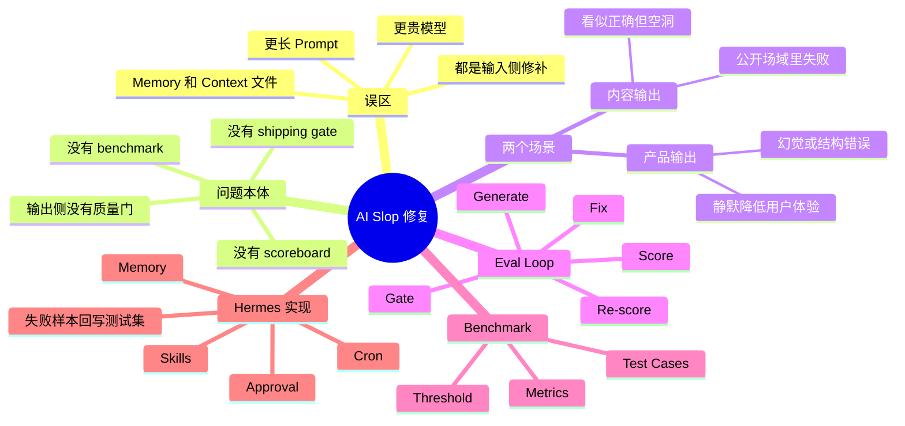

# AI 输出质量控制与 Hermes 评估循环

## 速读

这篇 X article 的核心不是介绍一组更强 prompt，而是在把“AI slop”重新定义成系统缺少输出质量层的问题。作者认为：更长提示词、更贵模型、memory、context file 都是在修输入侧；真正缺的是一个可重复的 eval loop，把每次 AI 输出拿去和明确标准比对，低于阈值就挡住、修复、回写成新测试。

对我的价值在于，它把内容生产和产品 AI 输出放进同一个质量系统里看：文章、推文、邮件、landing page 是公开可见的 slop；agent、chatbot、support responder、抽取 pipeline 是产品里静默扩散的 slop。两者都不该靠“感觉这次还行”来发货，而应靠 benchmark、metric、threshold 和持续回写的失败案例。

## 原文

如果当前 Obsidian 环境不渲染 tweet embed，请打开：https://x.com/EXM7777/status/2060736517564477901

## 内容地图

## 关键论点

| 论点 | 类型 | 依据 | 置信度 |
| --- | --- | --- | --- |
| AI slop 的根因不是单个 prompt 不够好，而是输出没有被系统性评分和拦截。 | 作者明确说法 | 文章开头把 slop 类比为工厂缺少质量控制，而不是工人问题。 | 高 |
| 内容输出和产品输出的问题同构：都是未测量的 AI 输出直接到达受众。 | 作者明确说法 | 文章明确分成 content output 与 product output，并指出修法相同。 | 高 |
| Eval loop 可以理解为面向非确定性输出的测试系统。 | 作者明确说法 | 文章用软件测试类比 eval，强调它测的是输出好不好，而不只是代码能不能跑。 | 高 |
| Benchmark 至少要有 test cases、metrics、threshold 三部分，缺一就不是质量门。 | 作者明确说法 | 文章把 benchmark 拆成这三个组件，并给出内容和产品两类例子。 | 高 |
| Hermes 在文中更像一个承载评估循环的 agent runtime，而不是 eval 产品本身。 | Agent 推断 | 作者说 Hermes 没有现成 eval dashboard，而是提供 skills、memory、cron、approval 等可组装原语。 | 中 |
| 这篇文章可转译成 AI wiki 的 agent workflow 原则：把失败样本沉淀成技能、测试或验收门槛，而不是只改提示词。 | 我的启发 | 文章的失败回写、skill 化和 regression gate 与当前 wiki 的 skills / HAT / source manifest 思路相近。 | 中 |

## 核心内容

作者先拆掉一个常见直觉：当 AI 输出变得空泛、陈词滥调、结构正确但没有价值时，人们通常会继续加 prompt、换模型、塞更多上下文或打开 memory。但这些动作只是在改善生成器的输入条件，并没有增加“出厂前检查”。所以短期会变好，随后 slop 仍会回来。

文章把 slop 分成两个落点。第一是内容输出，例如推文、文章、邮件和页面文案；它的坏处是公开、显眼、容易损害个人或品牌的质感。第二是产品输出，例如 AI feature、agent、客服回复、抽取 pipeline；它的坏处是安静扩散，用户可能不会反馈，只是体验变差或直接流失。

解决方案是 eval loop。这个循环不是神秘基础设施，而是把输出放进一个可重复测试：先生成，再用 benchmark 评分，低于线就拦住，修复后重跑，只有通过的结果才进入发布或用户路径。作者强调，质量一旦变成分数，就可以被 debug；否则所谓“感觉变差”只是一个不可操作的抱怨。

Benchmark 的最小结构有三块：

- Test cases：真实输入以及好输出的参照。内容生产可以从自己过去最强的 20-50 个作品里提取标准；产品场景应从真实日志和用户输入里找边界案例。
- Metrics：把输出转成分数的方法。分类可用 exact match，结构可用 validator，开放生成可用语义相似度加 judge，内容可用具体 rubric。
- Threshold：发布门槛。作者给了 0.7 作为起点，重点不是数字神圣，而是低于线就不能凭主观喜欢放行。

最后，作者把这个循环落到 Hermes 上：用 persistent memory 存 gold standard，用 skill 固化 rubric 和 judge，用另一个 skill 版本化 test suite，用 approval button 做发货门，用 cron 监控生产样本，并把人工标记的失败输出写回测试集。这个结构的关键是“评估系统自己也会积累经验”，不是每次从头靠人肉复盘。

## 关键洞察

最有用的洞察是：prompt 是 hypothesis，eval 才是 feedback loop。没有 eval 时，改 prompt 只是看了一次样本就宣布胜利；但非确定性模型的坏输出可能藏在后面的 30% 里。

第二个洞察是：内容质量也可以工程化，但不能用“是否好看/是否吸引人”这种松散标准。作者给的内容 rubric 指向可执行性、可理解性、结构化、可复用、是否值得收藏。这比“更像我的语气”更能成为稳定测试。

第三个洞察是：agent skill 不只适合执行任务，也适合保存评估品味。把 judge 写成 skill，本质上是把个人 taste 变成可调用、可版本化、可复用的程序性记忆。

## 对我的启发

这篇文章可以直接映射到我的 AI wiki 和 agent workflow：

- 对 wiki：source digest 和 compile 不应该只靠“看起来写得不错”，可以设计一组 rubric，例如是否区分 explicit/inferred、是否有 typed relations、是否保留 Source Manifest、是否产生可复习的概念节点。
- 对 coding agent：每次修复不只要改代码，还要把失败案例沉淀成测试、HAT 步骤、skill 注意事项或 reviewer checklist。
- 对长周期 agent：真正会复利的不是一次性 prompt，而是失败样本回写机制。失败没有进入测试集或技能，就大概率会重复发生。
- 对产品 AI：上线前 eval、运行时 gate、生产抽样监控应该是三层，不应只做离线 demo 集。

## 可以继续追的问题

- 如果把这篇文章的思想落到当前 AI wiki，source note 的质量 rubric 应该有哪些 5-7 个可评分维度？
- `ai-wiki-*` ingest skills 是否应该加一个轻量自检命令，输出 digest 是否机械、Links 是否有关系类型、External Links 是否合规？
- HAT 里的人工验收结果，怎样自动回写为 future test cases，而不是只停留在一次性 summary？
- LLM-as-judge 用于内容质量时，哪些指标适合机器评分，哪些必须保留人工 approval？

## 信息图

![[human/raw/inbox/cook-tweet/assets/2026-06-01_AI输出质量控制与Hermes评估循环_EXM7777/infographic.webp]]

## 遗漏与不确定

- 本次只使用未登录可见页面浏览器自动化读取 X 页面。
- 输入 status 页面可见完整 article 正文；但 `https://x.com/EXM7777/article/2060736517564477901` 专注模式会跳转登录页。
- 没有纳入回复区、推荐内容或无关讨论。
- 文章内媒体没有逐张打开，只记录了页面可见的 media 链接。
- 外部链接和 Hermes/Nous 相关事实没有联网核验；本文只消化 X 可见内容。

## Source Manifest

- input URL: `https://x.com/EXM7777/status/2060736517564477901`
- canonical URL: `https://x.com/EXM7777/status/2060736517564477901`
- embed URL: `https://twitter.com/EXM7777/status/2060736517564477901`
- article URL: `https://x.com/EXM7777/article/2060736517564477901`
- source_kind: `x-article`
- capture method: `visible-page browser automation only`
- browser actions: opened status URL; read visible article body; attempted article focus URL once and observed login redirect; reopened status page; captured screenshot.
- cache path: `.codex/cache/cook-tweet/2060736517564477901/capture.md`
- screenshot path: `.codex/cache/cook-tweet/2060736517564477901/screenshot.png`
- imagegen original: `.codex/cache/cook-tweet/2060736517564477901/imagegen-original.png`
- infographic path: `human/inbox/cook-tweet/assets/2026-06-01_AI输出质量控制与Hermes评估循环_EXM7777/infographic.webp`
- capture limitations: article focus URL login redirect; media and external links not opened; thread/replies excluded.
