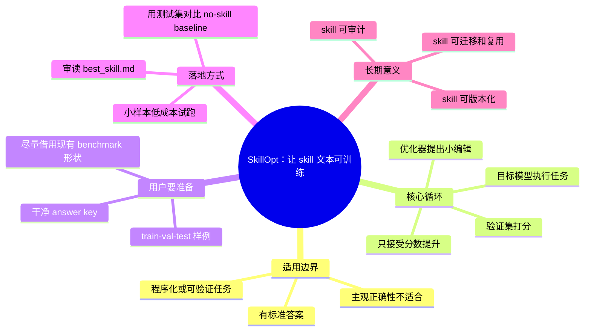

# 用 SkillOpt 训练可进化 Agent 技能

## 速读

这篇 X article 把 Microsoft SkillOpt 解释成一种“训练 skill 文本”的方法：不改模型权重，而是让目标模型带着当前 skill 跑样例，让优化器模型根据成败提出小幅文本编辑，再用验证集决定是否接受。最后部署的不是新模型，而是一份更短、更可读、经过 held-out data 检查的 `best_skill.md`。

它最有价值的提醒不是“多了一个优化工具”，而是把 skill 从手写 prompt 变成可评估资产：先定义有标准答案的任务和 answer key，再让编辑循环只保留能提高分数的变化。对 AI wiki 的技能、agent workflow、HAT 说明来说，这意味着“是否可训练”取决于我们能不能给出可复现样例和客观验收标准。

## 原文

如果当前 Obsidian 环境不渲染 tweet embed，请打开：https://x.com/hooeem/status/2061528919786791154

文章专注模式链接：https://x.com/hooeem/article/2061528919786791154

## 内容地图

## 关键论点

| 论点 | 类型 | 依据 | 置信度 |
| --- | --- | --- | --- |
| SkillOpt 优化的是 skill 文本，不是模型权重；部署产物仍是普通 `best_skill.md`。 | 作者明确说法 | article 对 text-space optimizer、frozen model 和部署文件的解释 | 高 |
| 它适合 extraction、classification、QA、可运行代码等有标准答案的任务，不适合无法定义正确性的任务。 | 作者明确说法 | article 开头的适用性筛选和限制段落 | 高 |
| answer key 是整个流程的关键输入；脏样例会让验证门优化到错误目标。 | 作者明确说法 | article 的 dataset / answer key / honest limits 部分 | 高 |
| 最务实的第一步是借用现有 benchmark 形状，小样本试跑，再决定是否扩大训练成本。 | 作者明确说法 | article 的 setup 和 run cheap first 建议 | 高 |
| 对我们自己的 agent skills，SkillOpt 的前置工作不是“写更好的提示词”，而是把技能成功标准转成可批量评分的样例集。 | Agent 推断 | 由 article 的 answer key 依赖和 AI wiki skill 工作流迁移得出 | 中 |
| AI wiki 的 cook / ingest / HAT 类技能如果要自进化，应优先挑有明确输出格式和验收脚本的子任务。 | 我的启发 | 将 SkillOpt 适用边界连接到本 wiki 的技能和工作流资产 | 中 |

## 核心内容

SkillOpt 的心智模型是“文本空间优化器”。传统提升模型表现常见两条路：改权重，或手写 prompt。SkillOpt 走第三条路：保留 frozen target model，把长期加载的 skill 文档当成可迭代对象。它每一轮只允许有限编辑，避免把有效规则一次性重写掉；然后用验证集守门，只保留确实提升分数的编辑。

作者把流程拆成四个部件：目标模型带当前 skill 跑任务，优化器模型根据成功和失败提出结构化编辑，编辑预算限制每步变化幅度，验证门用 held-out examples 判断是否接受。被拒绝的编辑也会成为训练时记忆，减少重复犯错。

实践门槛在数据，而不在命令。你要准备 `train/items.json`、`val/items.json` 和 `test/items.json`，并给每个任务配正确答案。作者建议先把自己的任务塞进最接近的内置 benchmark，例如 SearchQA 的 question / context / answers 形状；这样可以复用已有 config 和 scorer，少写甚至不写 Python。

运行策略是先便宜验证：20 到 40 个例子就能看到是否有信号，先用少量 epoch 和 batch 试跑；如果验证分数不动，先修样例和评分标准，而不是加预算。已有手写 skill 可以作为初始 skill，让 SkillOpt 从现有规则继续演化。

部署前要读 `best_skill.md`，因为它仍然是一份短文本。真正该看的数字不是训练过程里的好看分数，而是测试集上相对 no-skill 或 default-skill baseline 的提升。通过后，把这份文本放进 agent harness 加载 skill 的位置即可，不需要部署优化器，也没有额外推理时调用。

## 关键洞察

SkillOpt 把“prompt 工程”里最弱的环节显性化了：我们通常凭直觉改说明，却没有保留反例、验证集和拒绝记录。它的贡献不是让 LLM 神秘地写更好提示词，而是把 skill 修改变成一个带学习率、验证门和训练记忆的工程流程。

这也解释了它为什么更适合 procedural tasks。很多 agent 失败不是不知道答案，而是在工具使用、格式约束、检查顺序、异常处理上松散。skill 文本正好承载这些程序性纪律，所以可验证任务上的小规则编辑会很有杠杆。

它对团队协作的意义在于可审计。模型权重不可读，但 `best_skill.md` 可以读、改、提交、review、回滚。一个通过测试集的 skill，比“某人觉得这样写更好”的 prompt 更适合作为团队资产。

## 对我的启发

如果要把本 AI wiki 的技能做成“可自进化”，第一步不是直接套 SkillOpt，而是挑出能被样例评分的窄任务。例如：frontmatter 是否完整、Source Manifest 是否列出 cache path、cook note 是否没有写入 `index.md`、某类输出是否包含必需章节。这些都可以形成 answer key 或脚本化验收。

第二步是把失败样例保存下来。现在很多 skill 改进来自聊天里的经验，但没有稳定进入 train/val/test 集。SkillOpt 暗示一个更硬的工作流：每次 agent 做错边界或格式，就把那次任务转成 regression example，再让 skill 训练或至少人工修订时必须通过。

第三步是把 HAT 和 skill 训练连接起来。HAT 产物本来就在描述“人类如何判断完成”。如果能把其中一部分变成自动评分样例，就能从“验收一次”升级成“持续训练技能资产”。

## 可以继续追的问题

- 本 wiki 哪些 skill 的输出最容易做成 train/val/test 样例？
- `cook-tweet` 这类内容消化任务有多少判断是客观可评分，多少必须保留人工 review？
- 是否可以为 Source Manifest、frontmatter、边界不越权建立一组通用 regression examples？
- 对主观质量较高的 note，能否只优化结构和边界，不优化观点内容？
- SkillOpt 的 rejected-edit buffer 能否映射到 agent workflow 的“失败修订记忆”？

## 信息图

![[human/raw/inbox/cook-tweet/assets/2026-06-03_用SkillOpt训练可进化Agent技能_SkillOpt/infographic.webp]]

## 遗漏与不确定

- 捕获只使用未登录可见页面浏览器自动化；X 页面显示登录/注册入口和底部登录提示。
- 第一次打开 status 页时正文不足，第二次 reopen 同一 URL 后 article 正文可见。
- 没有打开 replies、推荐内容、趋势栏或无关讨论。
- 没有打开或联网核验 article 中的 GitHub、项目站点、arXiv 链接。
- 页面中的媒体图只按可见上下文理解，没有逐张打开检查。
- X article 渲染可能受懒加载和未登录状态影响；本笔记基于 2026-06-03 捕获时可见内容。

## Source Manifest

- input URL: https://x.com/hooeem/status/2061528919786791154
- canonical URL: https://x.com/hooeem/status/2061528919786791154
- embed URL: https://twitter.com/hooeem/status/2061528919786791154
- article URL: https://x.com/hooeem/article/2061528919786791154
- source_kind: x-article
- capture method: visible-page browser automation only
- browser actions: opened input status URL in an isolated `agent-browser` session; first load showed insufficient article body; reopened same URL once; captured visible article body; scrolled six screens; saved screenshot.
- cache path: `.codex/cache/cook-tweet/2061528919786791154/capture.md`
- screenshot path: `.codex/cache/cook-tweet/2061528919786791154/screenshot.png`
- imagegen original: `.codex/cache/cook-tweet/2061528919786791154/imagegen-original.png`
- infographic path: `human/inbox/cook-tweet/assets/2026-06-03_用SkillOpt训练可进化Agent技能_SkillOpt/infographic.webp`
- external links observed: `https://github.com/microsoft/SkillOpt`, `https://microsoft.github.io/SkillOpt/`, `https://arxiv.org/pdf/2605.23904`；均未联网核验。
- capture limitations: no API, no third-party mirror, no search cache, no logged-in Chrome profile, no cookies, no token; thread/replies not consumed; media not opened in detail.
